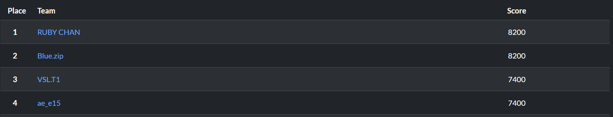
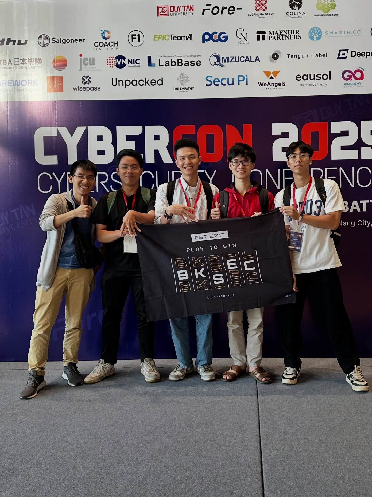

## Intro
I had the privilege of participating in the CyberCon CTF 2025 at Duy Tan University in Da Nang, Vietnam, from September 12th to 14th. Our team achieved a decent result, finishing in fourth place.

    
     
    <em>ae_e15 is my team</em>

    
     
    <em>I am in the middle</em>

The venue was great, with enough room for every team and a nice view of the city. We were provided with lunch and water as well, which was pretty neat.

Although most of the challenges were great, there was one faulty challenge.

We explored Da Nang for a few days, enjoyed some local cuisine, and then headed back to Hanoi for a new semester.

