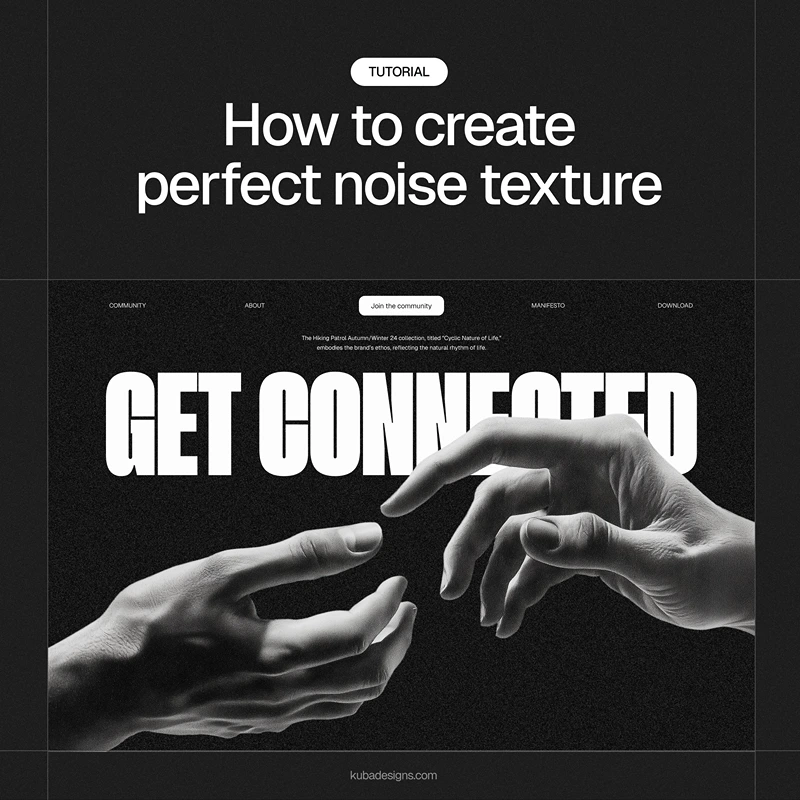

import { NoiseOverlay } from '../../../components/Noise'

Scrolling through X (Twitter) the other day, I came across a designer showing some landing page concepts he had made with Figma. They all featured this aesthetically pleasing, grainy effect that softened the sharpness of the images.

The basic concept was that he had prompted his way to creating these clean, high-definition image outputs from Midjourney, applied headings, buttons, and marketing copy, then finished it off with this "noise" effect. The result was an accessible approach to quickly designing landing page ideas that got him a few leads to his business without having to even create the actual site.



Unfortunately, for design illiterate devs like me, the process involved a Figma plugin called "Shumi Noise", but it seemed like an easy CSS solution must exist. If you're interested in the original twitter thread, you can <a href="https://x.com/kubadesign/status/1883884665448325356" rel="nofollow noreferrer" target='_blank'>find it here</a>.

Below is a simple proof of concept for an overlay that applies the effect to an image or any element the class is applied to. Simple adjust the opacity or base frequency to produce the desired level of graininess. Coupled with some crisp photography, AI artwork, or other design, the effect can make for some pretty epic landing pages with little effort.

<NoiseOverlay image="/noise-css-cover.png" className="w-full" client:load />

```css title="noise-overlay.css" caption="Add this class to an element to apply noise"
.noise::before {
  content: '';
  position: absolute;
  inset: 0;
  background: url("data:image/svg+xml,%3Csvg xmlns='http://www.w3.org/2000/svg' width='100%25' height='100%25'%3E%3Cfilter id='noise'%3E%3CfeTurbulence type='fractalNoise' baseFrequency='0.75' numOctaves='3' stitchTiles='stitch'/%3E%3C/filter%3E%3Crect width='100%25' height='100%25' filter='url(%23noise)' opacity='0.3'/%3E%3C/svg%3E");
  pointer-events: none;
}
```

The effect generally looks best when applied to an entire hero section rather than just an image, and most designers pair it with a gradient effect to taper off the graininess towards the edges of the page. Its a clean way to soften up the bold colors and visual sharpness you usually get from AI image outputs in tools like Midjourney.
