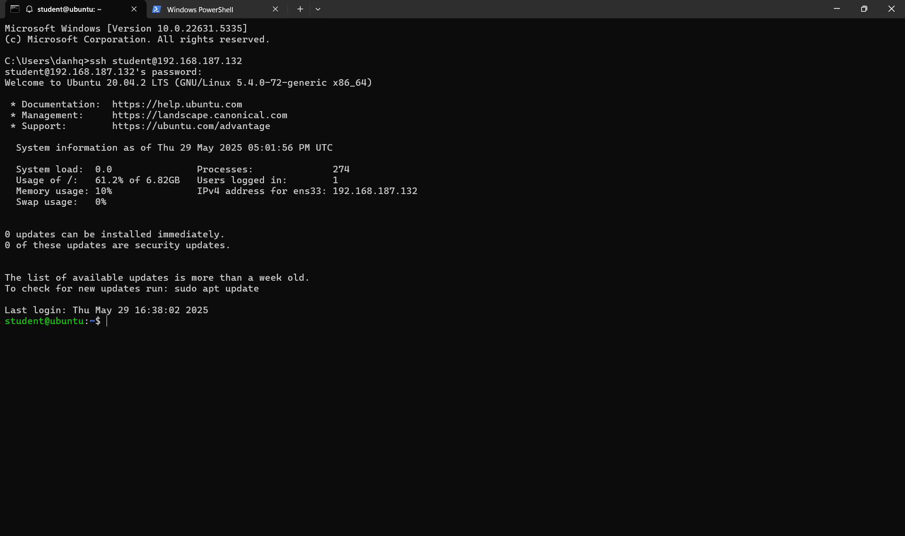

## Introduction

My mentor @teebowie provided me with a `.vdi` file and asked me to investigate what happened and write a comprehensive report about the incident. This document presents my forensic analysis findings (probably)

## Initial Setup and Reconnaissance

Since I'm using VMware, I first needed to convert the `.vdi` file to `.vmdk` format using the following command:

```bash
qemu-img convert -f vdi -O vmdk ubuntu2004_1.vdi ubuntu2004_1.vmdk
```

After converting the disk image, I set up a new VM in VMware to mount and boot from the converted disk image.

Upon startup, we are greeted with a login page. I logged in using the provided credentials: `student/password`


Working directly within the VM environment can be cumbersome and limits my ability to extract files efficiently for analysis. Let me check if this machine has SSH enabled for remote access:

```bash
sudo systemctl status ssh
```


Great! SSH is enabled. Now let's obtain this machine's IP address:

```bash
ip a
```


The machine is not yet connected to the network. I can see that `ens33` (the Ethernet interface) is currently disabled. Let me enable it so I can SSH to this machine from my host system:

```bash
sudo ip link set ens33 up
sudo dhclient ens33
```


Perfect! The network interface is now up and has received an IP address. I can now SSH to this machine from my local system for more efficient analysis.



Running `sudo -l` shows that the `student` user has full `sudo` privileges:

```bash
student@ubuntu:~$ sudo -l
[sudo] password for student:
Matching Defaults entries for student on ubuntu:
    env_reset, mail_badpass, secure_path=/usr/local/sbin\:/usr/local/bin\:/usr/sbin\:/usr/bin\:/sbin\:/bin\:/snap/bin

User student may run the following commands on ubuntu:
    (ALL : ALL) ALL
```

In the home directory, there are two user folders present:

```bash
student@ubuntu:~$ ls
student@ubuntu:~$ pwd
/home/student
student@ubuntu:~$ cd ../
student@ubuntu:/home$ ls -lah
total 16K
drwxr-xr-x  4 root    root    4.0K Apr 28  2021 .
drwxr-xr-x 21 root    root    4.0K Apr 27  2021 ..
drwxr-xr-x  3 student student 4.0K May 27 09:06 student
drwxr-xr-x  5 vagrant vagrant 4.0K Apr 28  2021 vagrant
``` 

I can see there's another user called `vagrant`. Checking `lastlog` confirms this user's existence and activity:

```bash
student@ubuntu:/home$ lastlog
Username         Port     From             Latest
root                                       **Never logged in**
daemon                                     **Never logged in**
bin                                        **Never logged in**
sys                                        **Never logged in**
sync                                       **Never logged in**
games                                      **Never logged in**
man                                        **Never logged in**
lp                                         **Never logged in**
mail                                       **Never logged in**
news                                       **Never logged in**
uucp                                       **Never logged in**
proxy                                      **Never logged in**
www-data                                   **Never logged in**
backup                                     **Never logged in**
list                                       **Never logged in**
irc                                        **Never logged in**
gnats                                      **Never logged in**
nobody                                     **Never logged in**
systemd-network                            **Never logged in**
systemd-resolve                            **Never logged in**
systemd-timesync                           **Never logged in**
messagebus                                 **Never logged in**
syslog                                     **Never logged in**
_apt                                       **Never logged in**
tss                                        **Never logged in**
uuidd                                      **Never logged in**
tcpdump                                    **Never logged in**
landscape                                  **Never logged in**
pollinate                                  **Never logged in**
sshd                                       **Never logged in**
systemd-coredump                           **Never logged in**
vagrant          pts/0    192.168.122.1    Wed Apr 28 17:26:27 +0000 2021
lxd                                        **Never logged in**
student          pts/0    192.168.187.1    Thu May 29 17:01:57 +0000 2025
```

The `vagrant` user was last logged in on Wednesday, April 28, 2021. Let's examine the contents of the vagrant home directory:

```bash
student@ubuntu:/home/vagrant$ ls -lah
total 32K
drwxr-xr-x 5 vagrant vagrant 4.0K Apr 28  2021 .
drwxr-xr-x 4 root    root    4.0K Apr 28  2021 ..
drwx------ 3 vagrant vagrant 4.0K Apr 27  2021 .ansible
-rw------- 1 vagrant vagrant    0 Apr 28  2021 .bash_history
-rw-r--r-- 1 vagrant vagrant  220 Feb 25  2020 .bash_logout
-rw-r--r-- 1 vagrant vagrant 3.7K Feb 25  2020 .bashrc
drwx------ 2 vagrant vagrant 4.0K Apr 27  2021 .cache
-rw-r--r-- 1 vagrant vagrant  807 Feb 25  2020 .profile
drwx------ 2 vagrant vagrant 4.0K Apr 27  2021 .ssh
-rw-r--r-- 1 vagrant vagrant    0 Apr 27  2021 .sudo_as_admin_successful
```
Several suspicious files and folders are present. After examining each of them individually, I found no useful evidence - even the `.bash_history` file is empty. This suggests that the perpetrator may have deleted their traces. Let's investigate other areas of the system.

Accesing `/` and see what I having on hand.

```bash
student@ubuntu:/$ ls -lah
total 1.3G
drwxr-xr-x  21 root     root     4.0K Apr 27  2021 .
drwxr-xr-x  21 root     root     4.0K Apr 27  2021 ..
lrwxrwxrwx   1 root     root        7 Feb  1  2021 bin -> usr/bin
drwxr-xr-x   4 root     root     4.0K Apr 28  2021 boot
drwxr-xr-x   2 root     root     4.0K Apr 27  2021 cdrom
drwxr-xr-x  19 root     root     4.1K May 29 16:24 dev
drwxr-xr-x  95 root     root     4.0K May 28 01:19 etc
drwxr-xr-x   4 root     root     4.0K Apr 28  2021 home
lrwxrwxrwx   1 root     root        7 Feb  1  2021 lib -> usr/lib
lrwxrwxrwx   1 root     root        9 Feb  1  2021 lib32 -> usr/lib32
lrwxrwxrwx   1 root     root        9 Feb  1  2021 lib64 -> usr/lib64
lrwxrwxrwx   1 root     root       10 Feb  1  2021 libx32 -> usr/libx32
drwx------   2 root     root      16K Apr 27  2021 lost+found
drwxr-xr-x   2 root     root     4.0K Feb  1  2021 media
drwxr-xr-x   2 root     root     4.0K Feb  1  2021 mnt
drwxrwx---   6 www-data www-data 4.0K Apr 28  2021 nextcloud
drwxr-xr-x   2 root     root     4.0K Feb  1  2021 opt
dr-xr-xr-x 327 root     root        0 May 29 16:24 proc
drwx------   5 root     root     4.0K May 27 10:32 root
drwxr-xr-x  28 root     root      880 May 29 17:01 run
lrwxrwxrwx   1 root     root        8 Feb  1  2021 sbin -> usr/sbin
drwxr-xr-x   7 root     root     4.0K May 29 14:19 snap
drwxr-xr-x   2 root     root     4.0K Feb  1  2021 srv
-rw-------   1 root     root     1.3G Apr 27  2021 swap.img
dr-xr-xr-x  13 root     root        0 May 29 16:24 sys
drwxrwxrwt  12 root     root      40K May 29 18:03 tmp
drwxr-xr-x  15 root     root     4.0K Apr 28  2021 usr
drwxr-xr-x  14 root     root     4.0K Apr 27  2021 var
```

I notice several interesting items in the root directory:
- `/tmp` directory (common location for temporary files and potential staging area)
- `/nextcloud` directory owned by `www-data` (indicates a web application installation)
- `swap.img` file that is 1.3GB in size

While these are normal system components, attackers often leverage these locations to carry out their attacks. I'll investigate these areas first.

## Nextcloud Directory Investigation

I decided to investigate the `/nextcloud` folder more thoroughly:

```bash
student@ubuntu:/$ sudo ls -lah nextcloud
total 964K
drwxrwx---  6 www-data www-data 4.0K Apr 28  2021 .
drwxr-xr-x 21 root     root     4.0K Apr 27  2021 ..
drwxrwxr-x  3 www-data www-data 4.0K Apr 27  2021 admin
drwxrwxr-x  8 www-data www-data 4.0K Apr 27  2021 appdata_ocn1o6zi4yg4
drwxrwxr-x  2 www-data www-data 4.0K Apr 27  2021 files_external
-rw-rw-r--  1 www-data www-data  324 Apr 27  2021 .htaccess
-rw-rw-r--  1 www-data www-data    0 Apr 27  2021 index.html
-rw-r-----  1 www-data www-data  91K Apr 27  2021 nextcloud.log
-rw-rw-r--  1 www-data www-data    0 Apr 27  2021 .ocdata
-rw-r--r--  1 www-data www-data 836K Apr 27  2021 owncloud.db
drwxrwxr-x  6 www-data www-data 4.0K Apr 27  2021 philip
```

I noticed there's a `nextcloud.log` and `owncloud.db` as well as a folder called `philip` that could contain valuable forensic information. To analyze it more efficiently, I'll extract it to my local machine for convenient analysis.

However, I realized that using SCP won't work since this folder is only accessible by the `www-data` user. Instead, I'll use SSH with `cat` to retrieve the file:

```bash
ssh student@192.168.187.132 "echo 'password' | sudo -S cat /nextcloud/nextcloud.log" > nextcloud.log
ssh student@192.168.187.132 "echo 'password' | sudo -S cat /nextcloud/owncloud.db" > owncloud.db
```
### Log Analysis 
#### RCE 
Examining the Nextcloud log file revealed several concerning patterns that immediately caught my attention. The log entries showed evidence of multiple unauthorized access attempts and potential exploitation activities.


The log analysis revealed several concerning patterns:

- **Repeated PUT Requests**: 
    - User: philip 
    - File: `datei.txt` was edited and re-saved multiple times
    - App: files_texteditor (built-in web-based text editor in Nextcloud)
- **Suspicious GET Request to status.php**:
    - User: -- (unauthenticated)
    - URL: `/status.php/PHP_VALUE%0Ainclude_path=/tmp;;;;;;?a=/bin/sh+-c+'which+which'&QQQQQQQQ...`

The GET request contained URL-encoded parameters that appeared to be attempting code injection, specifically trying to modify the include path to `/tmp` and execute shell commands.

Multiple similar GET requests were found in the logs with what appeared to be attempts to gain unauthorized system access through the web application. These requests showed patterns consistent with exploitation attempts targeting the web service.

The timestamps in these log entries correlated with the last known activity of the `vagrant` user, suggesting a potential connection between the compromised account and the web application exploitation attempts.
#### Post RCE
After successfully executing `/tmp/a`, the attacker issued the following commands via the same method (using the `a=...` parameter in GET requests):

- `ls /nextcloud/`
- `ls /nextcloud/philip/`
- `ls /nextcloud/philip/files/`
- `ls /nextcloud/philip/files/bank-clients`
- `cat /nextcloud/philip/files/bank-clients/clients_bank_data.xml`
- `openssl enc -aes256 -base64 --pass pass:d0nt_cry_n3xt -in /nextcloud/philip/files/employee/Employee_Salary_List.xlsx`

The attacker attempted to encrypt `Employee_Salary_List.xlsx` using OpenSSL in `/nextcloud/philip/files/employee/`, which suggests a potential ransomware attack or data exfiltration preparation.

Upon examining the directory path, I discovered that while the file had been encrypted, the original file remained in place.

```bash
root@ubuntu:/nextcloud/philip/files/employee# ls -lah
total 96K
drwxrwxr-x 2 www-data www-data 4.0K Apr 28  2021 .
drwxrwxr-x 9 www-data www-data 4.0K Apr 27  2021 ..
-rw-rw-r-- 1 www-data www-data  18K Apr 28  2021 Employee_contact_list.xlsx
-rw-r--r-- 1 www-data www-data  24K Apr 27  2021 Employee_contact_list.xlsx.cry
-rw-rw-r-- 1 www-data www-data  18K Apr 28  2021 Employee_Salary_List.xlsx
-rw-r--r-- 1 www-data www-data  24K Apr 27  2021 Employee_Salary_List.xlsx.cry
```

wip