## Forensic 1

### Description

I don't recall the exact description. The scenario involved a web server that was attacked, and I needed to find the exact time of the attack and the CVE used.

### Thought process

I received a folder containing multiple log files.

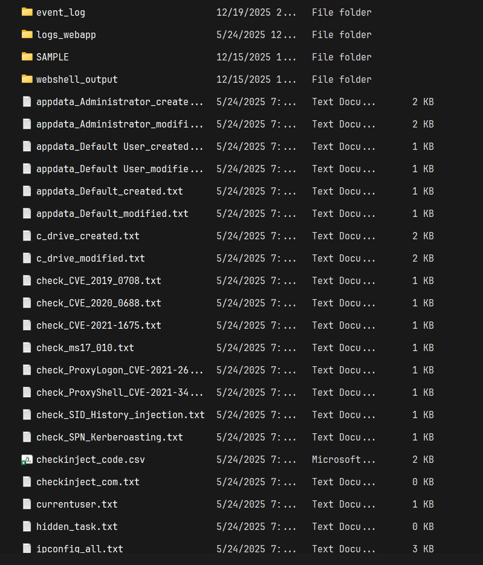

I sorted the files by size. After checking files like `log_autoruns.arn`, `processes_list.txt`, and `log_processes.txt`, I spotted the following in `log_processes.txt`:

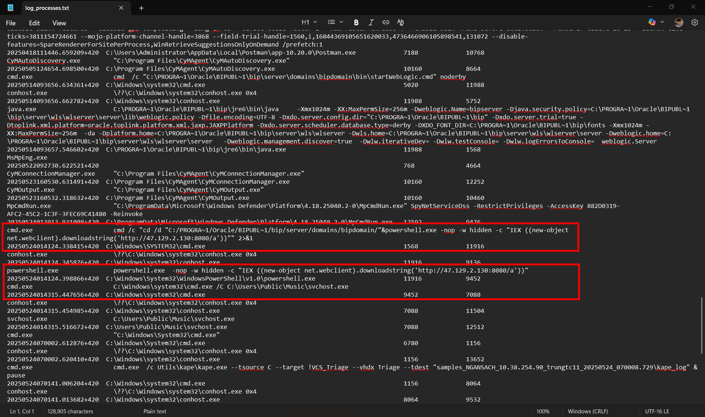

A PowerShell command was executed using the `IEX` (Invoke-Expression) alias, downloading a string from `http://47.129.2.130:8080/a`, and executing an executable named `svchost.exe` in the `C:\Users\Public\Music\` folder. 

The challenge also provided an `event_log` folder containing numerous `.evtx` files, including `Microsoft-Windows-PowerShell%4Operational.evtx`. This helped me understand what the PowerShell command was doing.

Using `EvtxECmd` and `Timeline Explorer`, I parsed the log to determine when the script was executed and to retrieve its content.

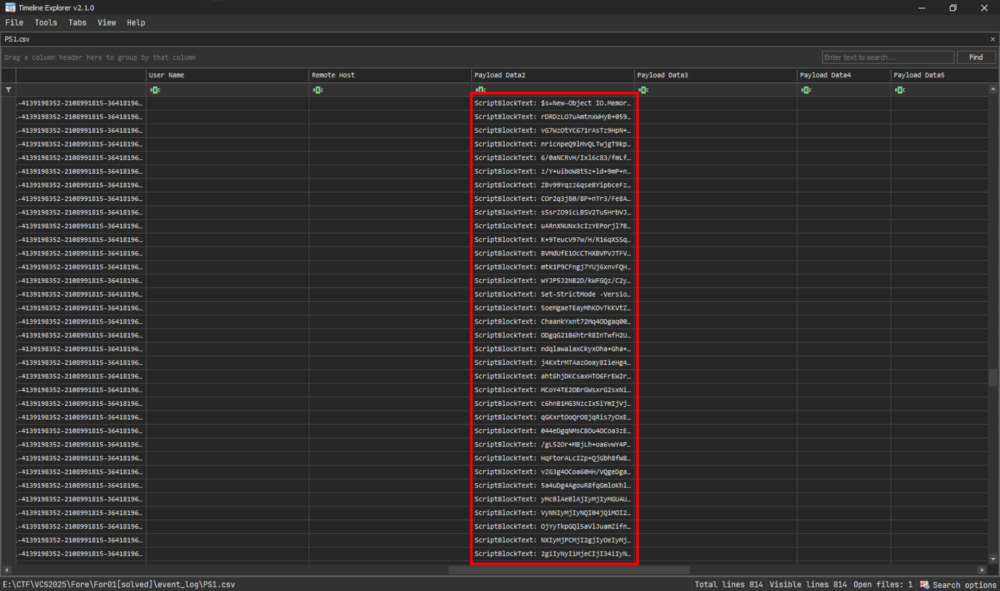

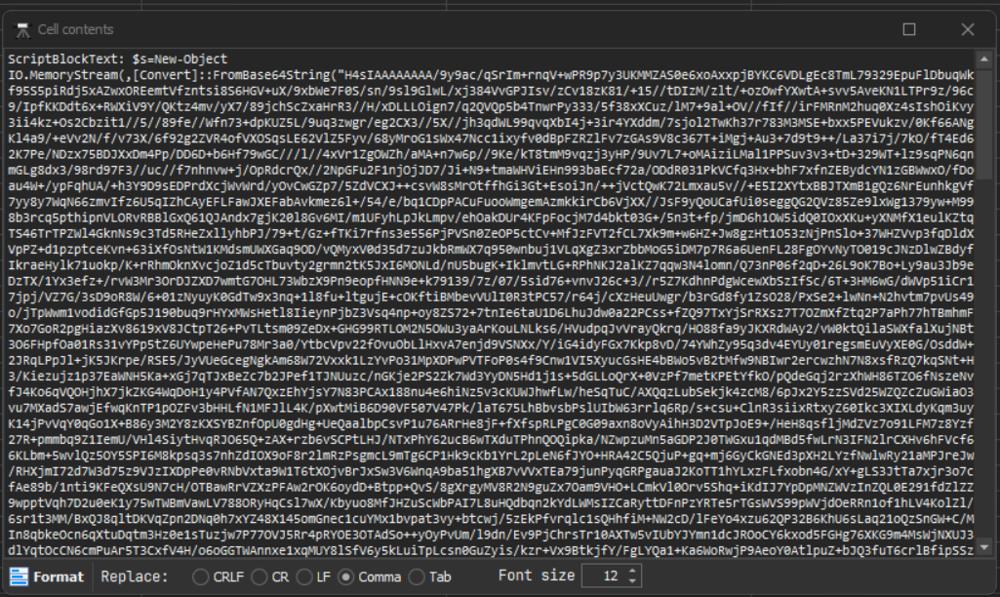

The script was Base64 encoded. Decoding it revealed a Gzip file.

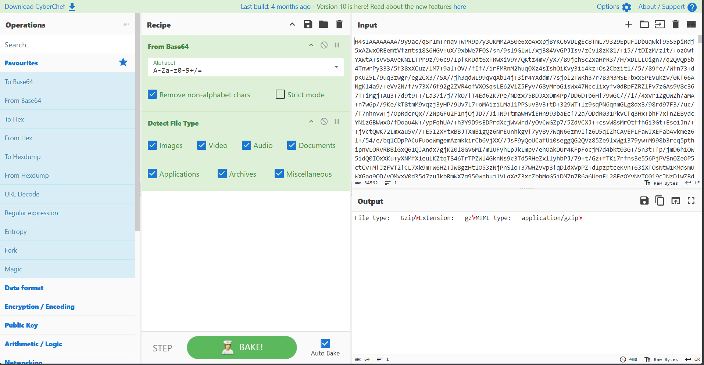

Downloading and extracting it yielded the following:

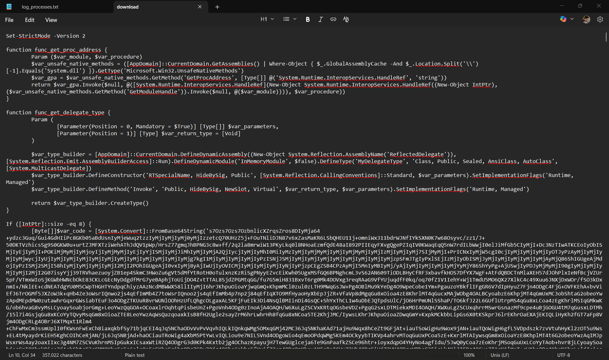

A quick Google search for the function `function func_get_proc_address` revealed it to be a Cobalt Strike beacon, confirming this was the attacker's method for planting a C2 beacon.

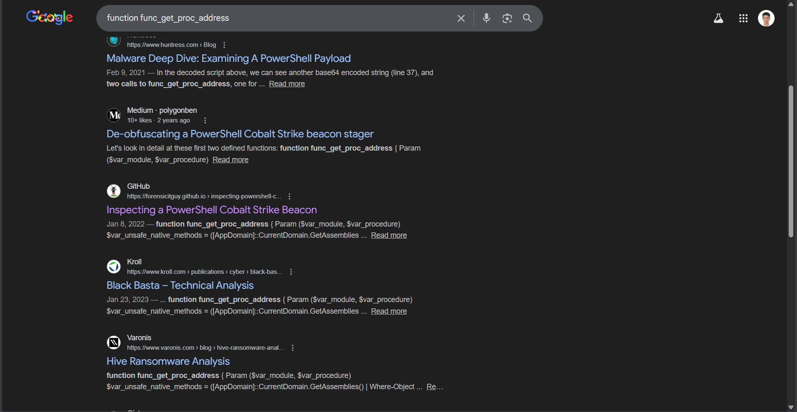

Further research on the shellcode indicated it wouldn't provide additional information on the attack vector, so I returned my attention to `log_processes.txt`.

Checking the Parent PID of the suspicious command traced back to `java.exe`, which led to `startWebLogic.cmd`.

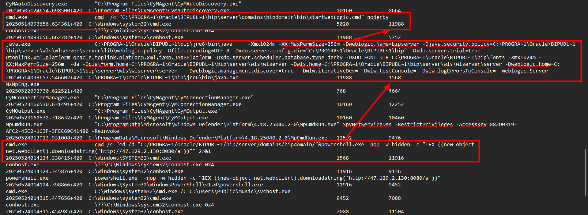

From this, I suspected the attacker abused Oracle WebLogic to gain remote control of the web server.

Checking the folder again, I identified the Oracle WebLogic version as `10.3.6.0`.

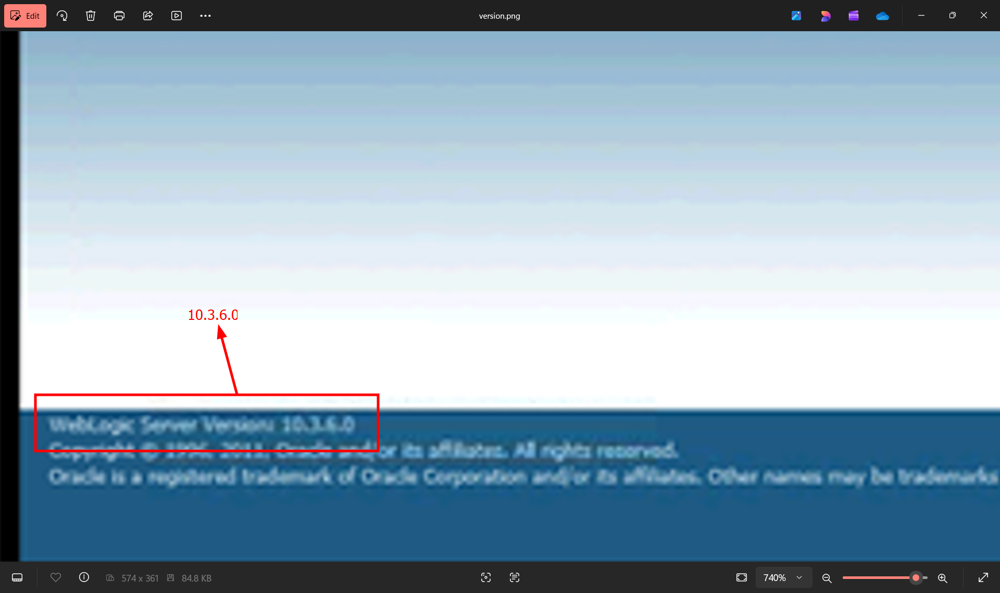

The remaining `.txt` files didn't appear to offer any valuable information regarding the attack vector, so I switched to exploring the `logs_webapp` folder.

Most access logs contained `POST` requests to the endpoint `/xmlpserver/convert`, but `access.log00754` contained a single `GET` request, which was denied. At the time, I believed this was the key to finding the CVE.

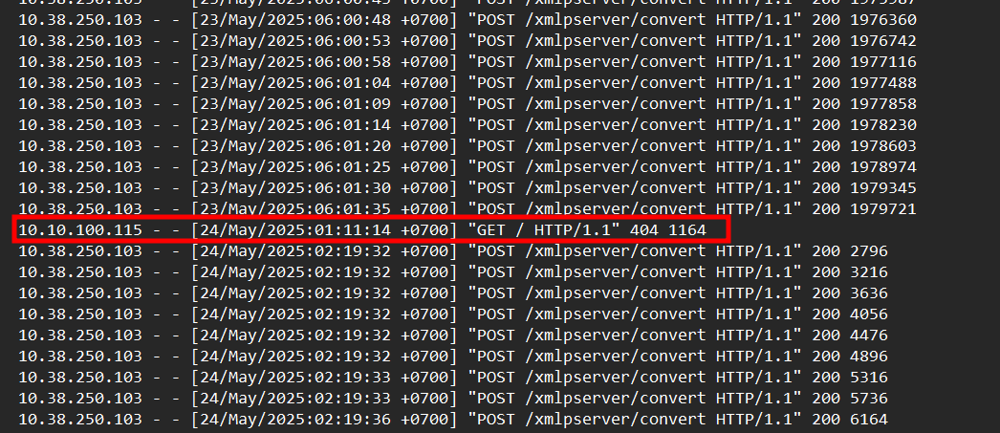

I performed a quick search and found `CVE-2021-14882`, matching the time of the `GET` request. However, this turned out to be incorrect.

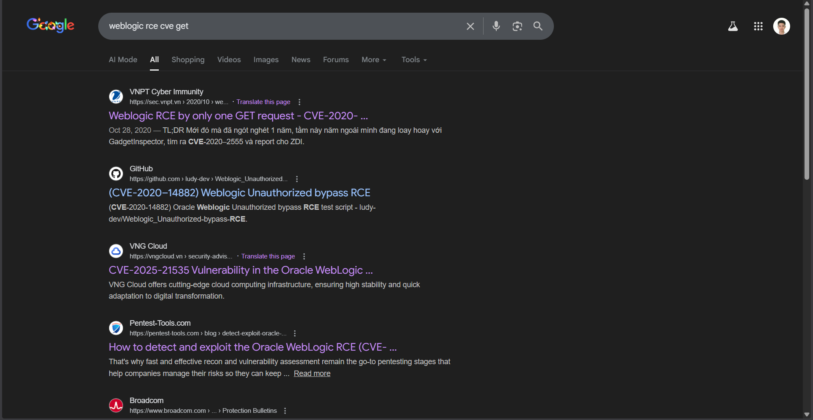

(Reflecting on the IOCs for CVE-2021-14882, I realize I was stubborn. The IOCs I found didn't match anything.)

I concluded that the access logs wouldn't provide further assistance. Checking `bipdomain.log` didn't reveal anything. However, checking `bipserver.log` revealed something interesting.

Recalling that the PowerShell script executed on `24-May-2025` around 1 AM (ICT), I cross-referenced that time with `bipserver.log` and found the following:

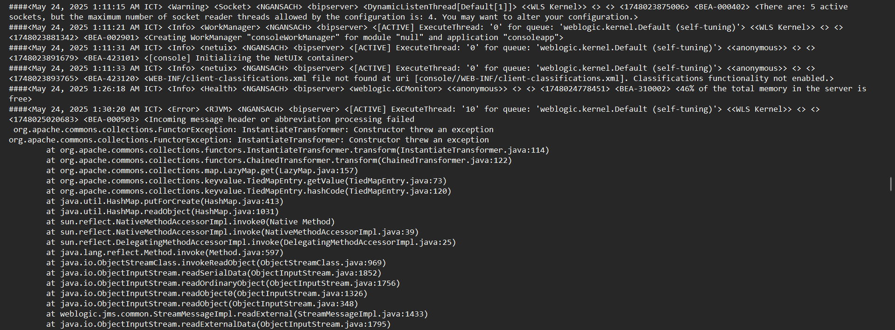

The server began encountering errors at `24-May-2025 1:30:20 AM ICT`. Checking the error messages and searching Google for "CVE" led to this article:

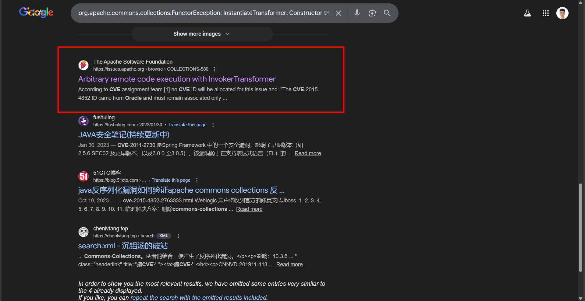

Thinking this might be the correct answer (having nothing to lose after 8 tries), I attempted `VCS{24052025_013020_CVE-2015-4852}`. I hesitated for nearly half a minute before submitting, and it was correct.

The author's flag format initially confused me. The format `VCS{ddMMyy_hhmmss_CVE-xxxx-xxxxx}` suggested a specific number of digits for the CVE, leading me to search for a matching pattern. 

