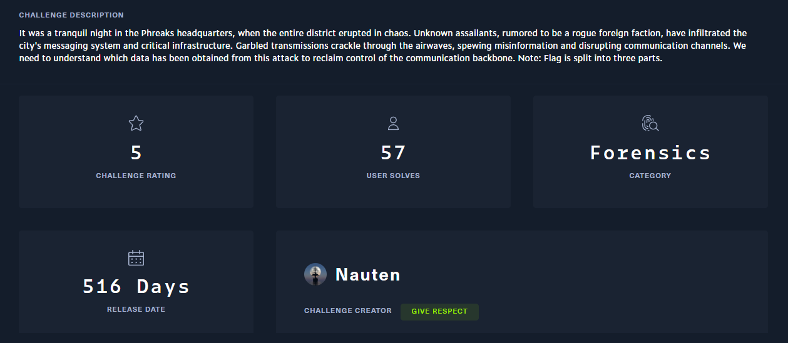

## Description



## Thought Process

### PCAP File Analysis

Extracting the zip file provided a `pcap` file. Upon opening it, I followed the HTTP stream and noticed an `Invoke-WebRequest` command in the third stream.


A suspicious file named `aQ4caZ.exe` was downloaded to the `Temp` folder.

I extracted the downloaded file using the `Export Objects` function in Wireshark.


### Executable Analysis

Using DiE (Detect It Easy) to examine the executable, I confirmed it was a `.NET` executable.


I then used `dnSpy` to decompile the executable.


The executable is called `EZRATClient`. Examining the main function revealed this is a C2 agent.

Analyzing the `Encrypt` and `Decrypt` functions:

**Encrypt**

```cs
public static string Encrypt(string clearText)
    {
        string result;
        try
        {
        string encryptKey = Constantes.EncryptKey;
        byte[] bytes = Encoding.Default.GetBytes(clearText);
        using (Aes aes = Aes.Create())
        {
            Rfc2898DeriveBytes rfc2898DeriveBytes = new Rfc2898DeriveBytes(encryptKey, new byte[]
            {
            86,
            101,
            114,
            121,
            95,
            83,
            51,
            99,
            114,
            51,
            116,
            95,
            83
            });
            aes.Key = rfc2898DeriveBytes.GetBytes(32);
            aes.IV = rfc2898DeriveBytes.GetBytes(16);
            using (MemoryStream memoryStream = new MemoryStream())
            {
            using (CryptoStream cryptoStream = new CryptoStream(memoryStream, aes.CreateEncryptor(), CryptoStreamMode.Write))
            {
                cryptoStream.Write(bytes, 0, bytes.Length);
                cryptoStream.Close();
            }
            clearText = Convert.ToBase64String(memoryStream.ToArray());
            }
        }
        result = clearText;
        }
        catch (Exception)
        {
        result = clearText;
        }
        return result;
    }
```

**Decrypt**

```cs
public static string Decrypt(string cipherText)
    {
        string result;
        try
        {
        string encryptKey = Constantes.EncryptKey;
        byte[] array = Convert.FromBase64String(cipherText);
        using (Aes aes = Aes.Create())
        {
            Rfc2898DeriveBytes rfc2898DeriveBytes = new Rfc2898DeriveBytes(encryptKey, new byte[]
            {
            86,
            101,
            114,
            121,
            95,
            83,
            51,
            99,
            114,
            51,
            116,
            95,
            83
            });
            aes.Key = rfc2898DeriveBytes.GetBytes(32);
            aes.IV = rfc2898DeriveBytes.GetBytes(16);
            using (MemoryStream memoryStream = new MemoryStream())
            {
            using (CryptoStream cryptoStream = new CryptoStream(memoryStream, aes.CreateDecryptor(), CryptoStreamMode.Write))
            {
                cryptoStream.Write(array, 0, array.Length);
                cryptoStream.Close();
            }
            cipherText = Encoding.Default.GetString(memoryStream.ToArray());
            }
        }
        result = cipherText;
        }
        catch (Exception ex)
        {
        Console.WriteLine(ex.Message);
        Console.WriteLine("Cipher Text: " + cipherText);
        result = "error";
        }
        return result;
    }
```

The encryption algorithm works as follows:
- Uses PBKDF2 with the salt `Very_S3cr3t_S` and the password `Constantes.EncryptKey` to derive the AES key
- Applies AES-CBC with the derived key and IV
- Encodes the result as Base64

I searched for the constant `Constantes.EncryptKey` in the decompiled code.


The Server→Client response has the format `<number>.<base64>` and the Client→Server format is `<base64>`.

Next, I wrote a script to decrypt the network traffic:

```python 
import base64
import re
from Crypto.Cipher import AES
from Crypto.Protocol.KDF import PBKDF2

ENCRYPT_KEY = "VYAemVeO3zUDTL6N62kVA"
SALT = bytes([86, 101, 114, 121, 95, 83, 51, 99, 114, 51, 116, 95, 83])  # b'Very_S3cr3t_S'

def decrypt(ciphertext_b64):
    data = base64.b64decode(ciphertext_b64)
    key_iv = PBKDF2(ENCRYPT_KEY, SALT, dkLen=48, count=1000)
    key = key_iv[:32]
    iv = key_iv[32:]
    cipher = AES.new(key, AES.MODE_CBC, iv)
    decrypted = cipher.decrypt(data)
    pad_len = decrypted[-1]
    decrypted = decrypted[:-pad_len]
    return decrypted.decode('latin-1')

with open("response.txt", "r") as f:
    for line in f:
    line = line.strip()
    if line:
        m = re.match(r'(\d+)[.§](\S+)', line)
        cmd_b64 = m.group(2) if m else line
        print(decrypt(cmd_b64))
```


However, I was still missing the third part of the flag. I noticed in the traffic there was a PowerShell command.


Decoding the blob revealed the final part of the flag.

  
