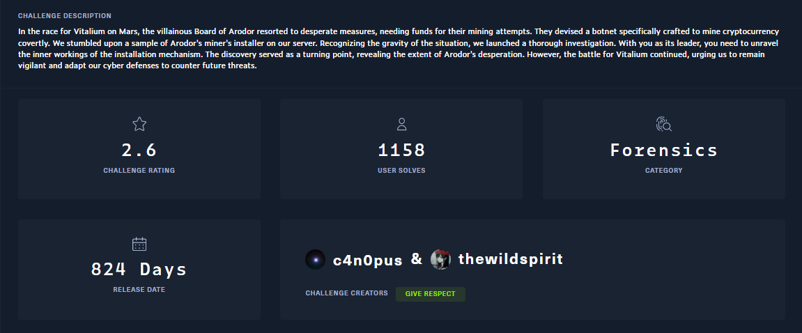

## Description

## Thought process

Extracting the archive gave me a `.sh` file.

Opening the file suggested that this is a miner installed for a specific computer.

Scrolling through the file, I noticed a strange Base64 blob at the end of the script.

Decoding it yielded the first part of the flag.

I then searched the entire script for Base64 blobs and found three more.

Decoding all of these gave me the complete flag.

