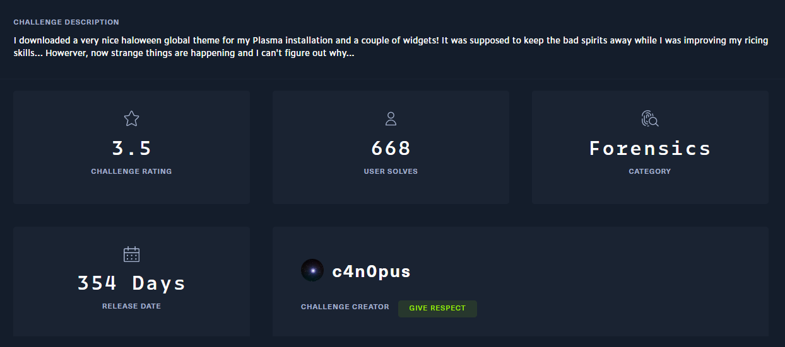

## Description

## Thought process

I downloaded and extracted the archive. It contained a directory with many files, so I opened it in VS Code to inspect them.

Reading the `metadata.json`, I realized this is a plugin for KDE Plasma — a desktop environment similar to GNOME on Ubuntu — from the original repository.

The idea here is a backdoor is installed but we only have the source code. So we can do a quick search (Ctrl+Shift+F) with keyword such as `shell`, `bash`, `whoami`, ...

Reverse and decode the base64 blob

